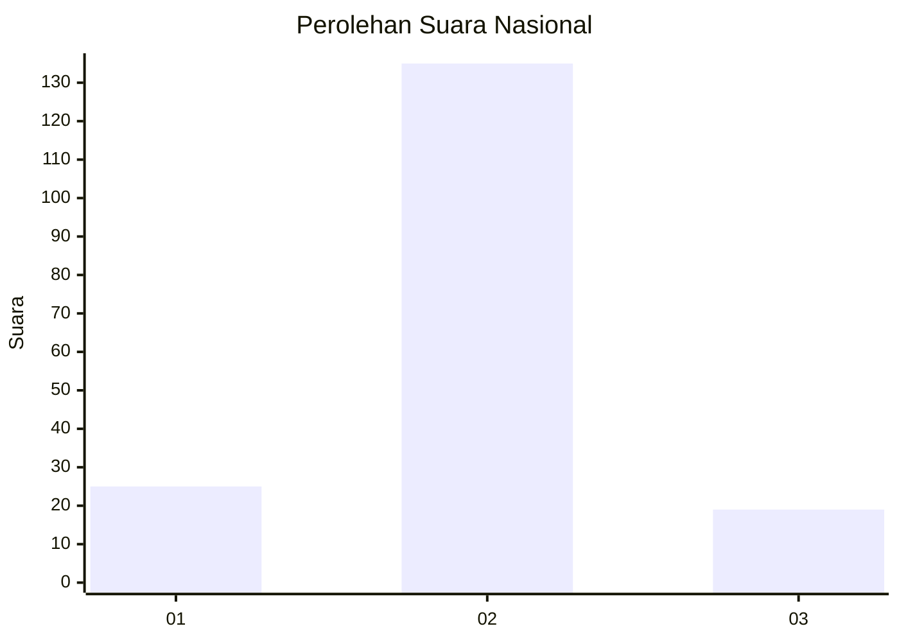
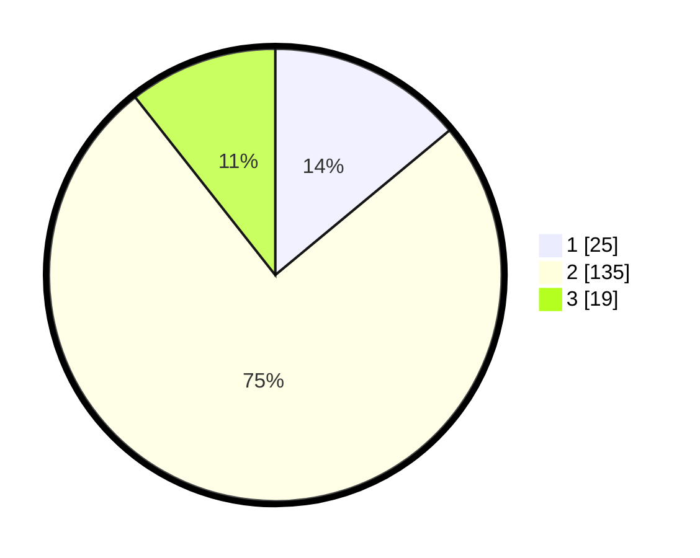

# Hasil

## Grafik

## Tabel

| No. | Nama Paslon    | Suara | Suara (raw) | Persentase |
|:--- |:-------------- | -----:| -----------:| ----------:|
| 1   | ANIES MUHAIMIN | 25    | [25][p-1]   | 13,97      |
| 2   | PRABOWO GIBRAN | 135   | [135][p-2]  | 75,42      |
| 3   | GANJAR MAHFUD  | 19    | [19][p-3]   | 10,61      |

[p-1]: https://github.com/gigit-pemilu/pemilu-2024/blob/main/pilpres/hitung-suara/sub/91-papua/sub/06-biak-numfor/sub/12-samofa/sub/1014-anjareuw/sub/004-tps/sub/paslon-1.txt
[p-2]: https://github.com/gigit-pemilu/pemilu-2024/blob/main/pilpres/hitung-suara/sub/91-papua/sub/06-biak-numfor/sub/12-samofa/sub/1014-anjareuw/sub/004-tps/sub/paslon-2.txt
[p-3]: https://github.com/gigit-pemilu/pemilu-2024/blob/main/pilpres/hitung-suara/sub/91-papua/sub/06-biak-numfor/sub/12-samofa/sub/1014-anjareuw/sub/004-tps/sub/paslon-3.txt

## Foto C Plano

https://sirekap-obj-formc.kpu.go.id/b44b/pemilu/ppwp/91/06/12/10/14/9106121014004-20240215-153952--5d01801f-9005-43db-97b4-4571c4e002fd.jpg

https://sirekap-obj-formc.kpu.go.id/b44b/pemilu/ppwp/91/06/12/10/14/9106121014004-20240215-154120--35ffd1a2-150d-4ee2-a1ac-094fd1927046.jpg

https://sirekap-obj-formc.kpu.go.id/b44b/pemilu/ppwp/91/06/12/10/14/9106121014004-20240215-154333--48e111e4-1bf7-4ffe-88f4-9e0831bb2b7c.jpg

## Metadata

| Key        | Value               |
| ---------- | ------------------- |
| Time Stamp | 2024-02-25 22:00:00 |

