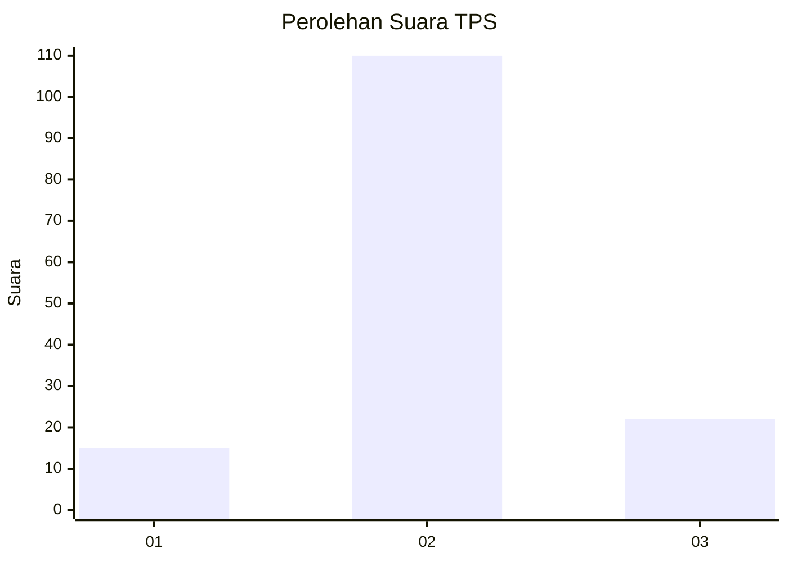

# Hasil

## Grafik

## Tabel

| No. | Nama Paslon    | Suara | Suara (raw) | Persentase |
|:--- |:-------------- | -----:| -----------:| ----------:|
| 1   | ANIES MUHAIMIN | 15    | [15][p-1]   | 10,20      |
| 2   | PRABOWO GIBRAN | 110   | [110][p-2]  | 74,83      |
| 3   | GANJAR MAHFUD  | 22    | [22][p-3]   | 14,97      |

[p-1]: https://github.com/gigit-pemilu/pemilu-2024-91-papua/blob/main/pilpres/hitung-suara/sub/91-papua/sub/06-biak-numfor/sub/12-samofa/sub/1014-anjareuw/sub/005-tps/sub/paslon-1.txt
[p-2]: https://github.com/gigit-pemilu/pemilu-2024-91-papua/blob/main/pilpres/hitung-suara/sub/91-papua/sub/06-biak-numfor/sub/12-samofa/sub/1014-anjareuw/sub/005-tps/sub/paslon-2.txt
[p-3]: https://github.com/gigit-pemilu/pemilu-2024-91-papua/blob/main/pilpres/hitung-suara/sub/91-papua/sub/06-biak-numfor/sub/12-samofa/sub/1014-anjareuw/sub/005-tps/sub/paslon-3.txt

## Foto C Plano

https://sirekap-obj-formc.kpu.go.id/1250/pemilu/ppwp/91/06/12/10/14/9106121014005-20240215-092540--a7d24f85-7f7d-41d8-a19b-0cf5144f4a56.jpg

https://sirekap-obj-formc.kpu.go.id/1250/pemilu/ppwp/91/06/12/10/14/9106121014005-20240215-092735--14b81565-4db6-4d5f-b505-08e4aa4c9aec.jpg

https://sirekap-obj-formc.kpu.go.id/1250/pemilu/ppwp/91/06/12/10/14/9106121014005-20240214-141703--c5d67acd-2fee-40fd-a930-eda67075ded5.jpg

## Metadata

| Key        | Value               |
| ---------- | ------------------- |
| Time Stamp | 2024-02-25 12:00:00 |

