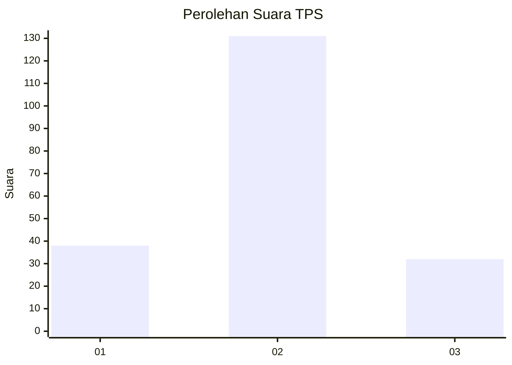
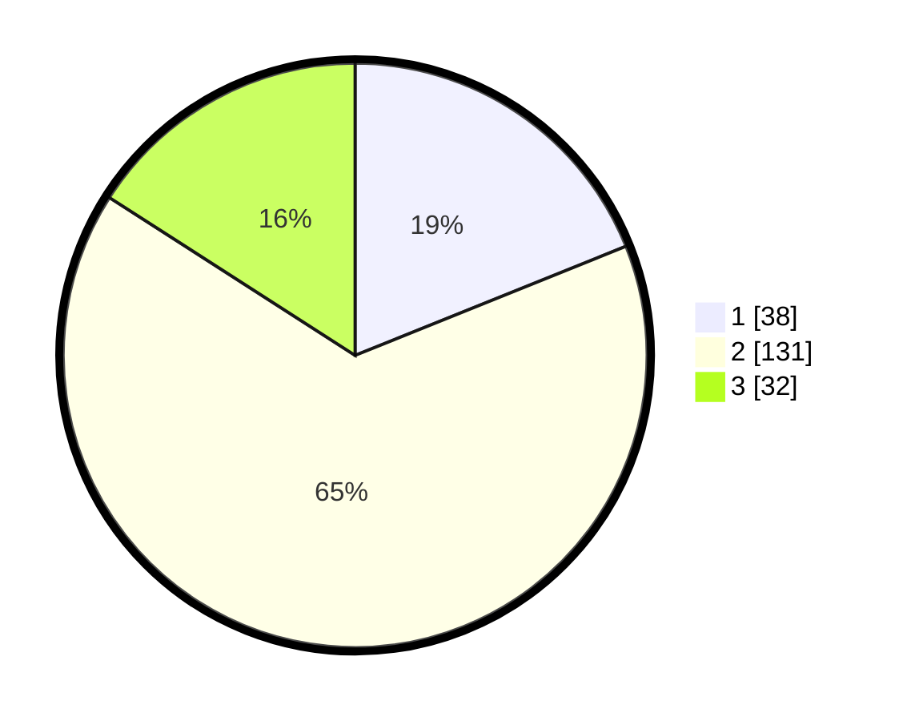

# Hasil

## Grafik

## Tabel

| No. | Nama Paslon    | Suara | Suara (raw) | Persentase |
|:--- |:-------------- | -----:| -----------:| ----------:|
| 1   | ANIES MUHAIMIN | 38    | [38][p-1]   | 18,91      |
| 2   | PRABOWO GIBRAN | 131   | [131][p-2]  | 65,17      |
| 3   | GANJAR MAHFUD  | 32    | [32][p-3]   | 15,92      |

[p-1]: https://github.com/gigit-pemilu/pemilu-2024-91-papua/blob/main/pilpres/hitung-suara/sub/91-papua/sub/06-biak-numfor/sub/12-samofa/sub/2003-mandouw/sub/003-tps/sub/paslon-1.txt
[p-2]: https://github.com/gigit-pemilu/pemilu-2024-91-papua/blob/main/pilpres/hitung-suara/sub/91-papua/sub/06-biak-numfor/sub/12-samofa/sub/2003-mandouw/sub/003-tps/sub/paslon-2.txt
[p-3]: https://github.com/gigit-pemilu/pemilu-2024-91-papua/blob/main/pilpres/hitung-suara/sub/91-papua/sub/06-biak-numfor/sub/12-samofa/sub/2003-mandouw/sub/003-tps/sub/paslon-3.txt

## Foto C Plano

https://sirekap-obj-formc.kpu.go.id/1889/pemilu/ppwp/91/06/12/20/03/9106122003003-20240215-155341--60d590c4-4988-43dc-9976-aafb313f58c6.jpg

https://sirekap-obj-formc.kpu.go.id/1889/pemilu/ppwp/91/06/12/20/03/9106122003003-20240215-155610--cc63a2d6-575f-4668-bf8d-c1c4c2aaaef0.jpg

https://sirekap-obj-formc.kpu.go.id/1889/pemilu/ppwp/91/06/12/20/03/9106122003003-20240215-160021--ca3138e6-38b2-491f-8605-753dc20d8ba3.jpg

## Metadata

| Key        | Value               |
| ---------- | ------------------- |
| Time Stamp | 2024-02-25 23:00:00 |

