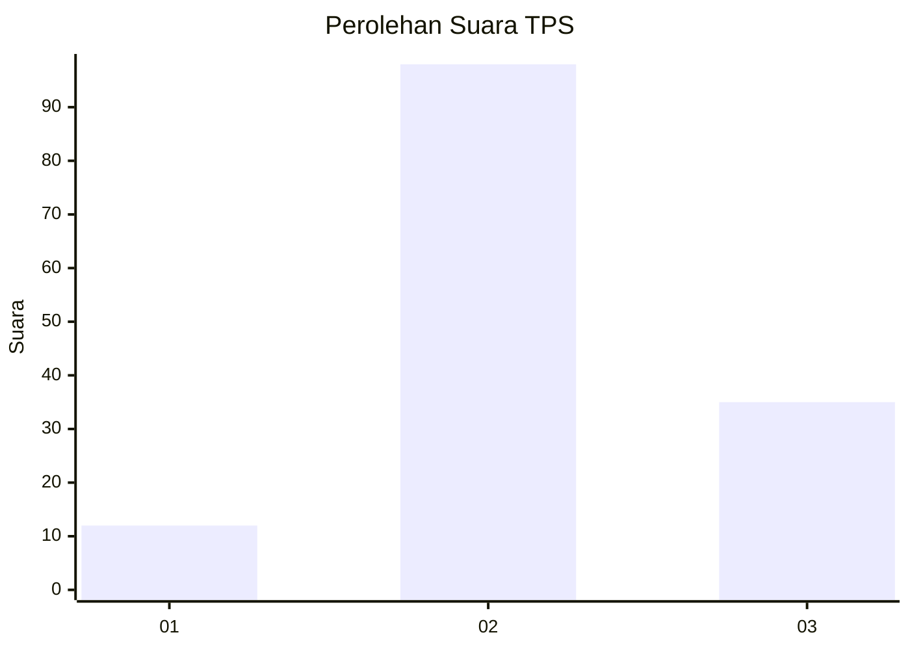
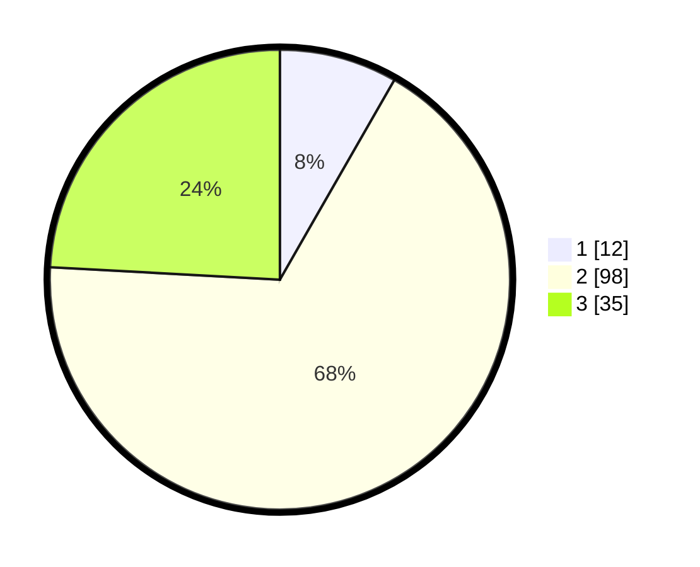

# Hasil

## Grafik

## Tabel

| No. | Nama Paslon    | Suara | Suara (raw) | Persentase |
|:--- |:-------------- | -----:| -----------:| ----------:|
| 1   | ANIES MUHAIMIN | 12    | [12][p-1]   | 8,28       |
| 2   | PRABOWO GIBRAN | 98    | [98][p-2]   | 67,59      |
| 3   | GANJAR MAHFUD  | 35    | [35][p-3]   | 24,14      |

[p-1]: https://github.com/gigit-pemilu/pemilu-2024-91-papua/blob/main/pilpres/hitung-suara/sub/91-papua/sub/06-biak-numfor/sub/12-samofa/sub/2004-sumberker/sub/001-tps/sub/paslon-1.txt
[p-2]: https://github.com/gigit-pemilu/pemilu-2024-91-papua/blob/main/pilpres/hitung-suara/sub/91-papua/sub/06-biak-numfor/sub/12-samofa/sub/2004-sumberker/sub/001-tps/sub/paslon-2.txt
[p-3]: https://github.com/gigit-pemilu/pemilu-2024-91-papua/blob/main/pilpres/hitung-suara/sub/91-papua/sub/06-biak-numfor/sub/12-samofa/sub/2004-sumberker/sub/001-tps/sub/paslon-3.txt

## Foto C Plano

https://sirekap-obj-formc.kpu.go.id/75c0/pemilu/ppwp/91/06/12/20/04/9106122004001-20240215-120734--d9af248a-7693-42a2-8013-60f25f190a3c.jpg

https://sirekap-obj-formc.kpu.go.id/75c0/pemilu/ppwp/91/06/12/20/04/9106122004001-20240215-121130--4186d88b-f389-49e0-a119-030e54915fd3.jpg

https://sirekap-obj-formc.kpu.go.id/75c0/pemilu/ppwp/91/06/12/20/04/9106122004001-20240215-121256--fc485701-4043-4866-ad40-18b1d429e4b2.jpg

## Metadata

| Key        | Value               |
| ---------- | ------------------- |
| Time Stamp | 2024-02-24 22:31:28 |

