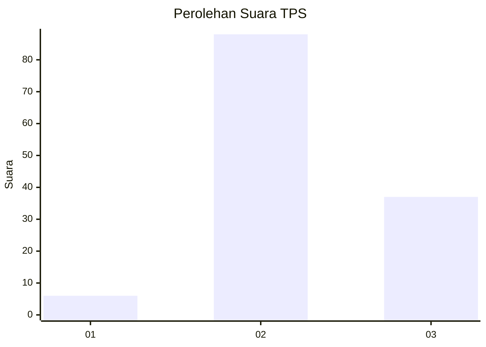
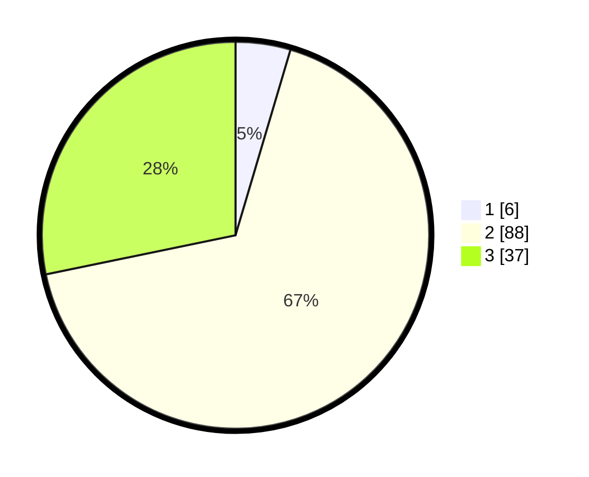

# Hasil

## Grafik

## Tabel

| No. | Nama Paslon    | Suara | Suara (raw) | Persentase |
|:--- |:-------------- | -----:| -----------:| ----------:|
| 1   | ANIES MUHAIMIN | 6     | [6][p-1]    | 4,58       |
| 2   | PRABOWO GIBRAN | 88    | [88][p-2]   | 67,18      |
| 3   | GANJAR MAHFUD  | 37    | [37][p-3]   | 28,24      |

[p-1]: https://github.com/gigit-pemilu/pemilu-2024-91-papua/blob/main/pilpres/hitung-suara/sub/91-papua/sub/06-biak-numfor/sub/12-samofa/sub/2008-adainasnosen/sub/001-tps/sub/paslon-1.txt
[p-2]: https://github.com/gigit-pemilu/pemilu-2024-91-papua/blob/main/pilpres/hitung-suara/sub/91-papua/sub/06-biak-numfor/sub/12-samofa/sub/2008-adainasnosen/sub/001-tps/sub/paslon-2.txt
[p-3]: https://github.com/gigit-pemilu/pemilu-2024-91-papua/blob/main/pilpres/hitung-suara/sub/91-papua/sub/06-biak-numfor/sub/12-samofa/sub/2008-adainasnosen/sub/001-tps/sub/paslon-3.txt

## Foto C Plano

https://sirekap-obj-formc.kpu.go.id/d9c3/pemilu/ppwp/91/06/12/20/08/9106122008001-20240215-225403--f034bb04-8f67-415a-8504-aa11bf181218.jpg

https://sirekap-obj-formc.kpu.go.id/d9c3/pemilu/ppwp/91/06/12/20/08/9106122008001-20240215-224848--4b1c6fd7-395a-4ce0-9509-0b19afb417d0.jpg

https://sirekap-obj-formc.kpu.go.id/d9c3/pemilu/ppwp/91/06/12/20/08/9106122008001-20240215-220703--70873855-89bd-4028-af13-ce7e2104bc69.jpg

## Metadata

| Key        | Value               |
| ---------- | ------------------- |
| Time Stamp | 2024-02-24 22:31:28 |

