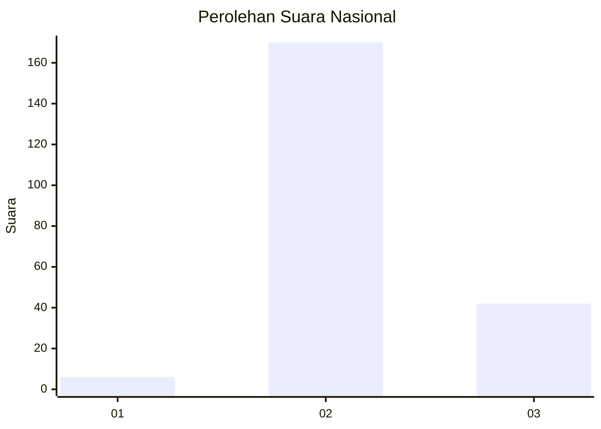
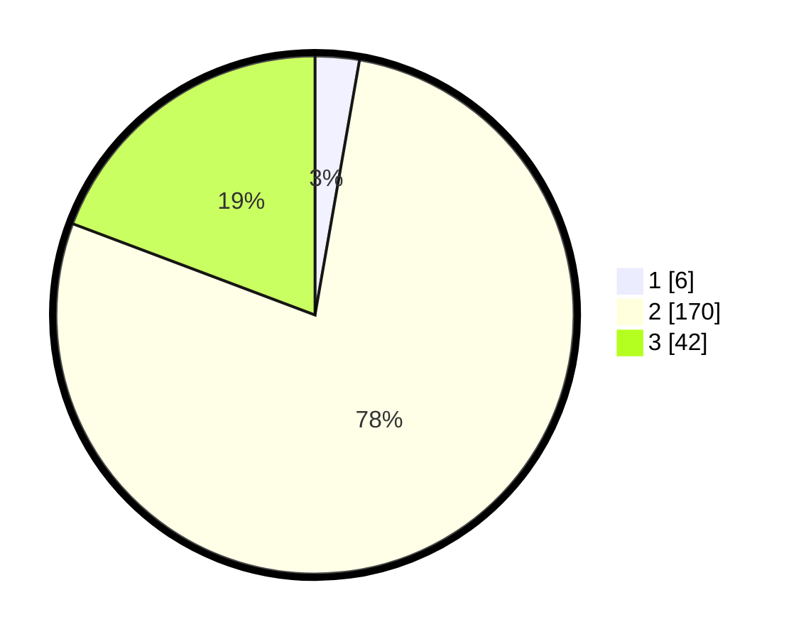

# Hasil

## Grafik

## Tabel

| No. | Nama Paslon    | Suara | Suara (raw) | Persentase |
|:--- |:-------------- | -----:| -----------:| ----------:|
| 1   | ANIES MUHAIMIN | 6     | [6][p-1]    | 2,75       |
| 2   | PRABOWO GIBRAN | 170   | [170][p-2]  | 77,98      |
| 3   | GANJAR MAHFUD  | 42    | [42][p-3]   | 19,27      |

[p-1]: https://github.com/gigit-pemilu/pemilu-2024/blob/main/pilpres/hitung-suara/sub/91-papua/sub/06-biak-numfor/sub/12-samofa/sub/2015-kamorfuar/sub/001-tps/sub/paslon-1.txt
[p-2]: https://github.com/gigit-pemilu/pemilu-2024/blob/main/pilpres/hitung-suara/sub/91-papua/sub/06-biak-numfor/sub/12-samofa/sub/2015-kamorfuar/sub/001-tps/sub/paslon-2.txt
[p-3]: https://github.com/gigit-pemilu/pemilu-2024/blob/main/pilpres/hitung-suara/sub/91-papua/sub/06-biak-numfor/sub/12-samofa/sub/2015-kamorfuar/sub/001-tps/sub/paslon-3.txt

## Foto C Plano

https://sirekap-obj-formc.kpu.go.id/7eb7/pemilu/ppwp/91/06/12/20/15/9106122015001-20240215-092859--cd467434-7777-4162-9150-8592e3a5d13c.jpg

https://sirekap-obj-formc.kpu.go.id/7eb7/pemilu/ppwp/91/06/12/20/15/9106122015001-20240215-093224--5f9ffe36-7633-4a39-8ebc-4f340a8a0706.jpg

https://sirekap-obj-formc.kpu.go.id/7eb7/pemilu/ppwp/91/06/12/20/15/9106122015001-20240215-093448--d490209a-06b4-476d-9a70-9acdac17cfce.jpg

## Metadata

| Key        | Value               |
| ---------- | ------------------- |
| Time Stamp | 2024-02-25 16:00:00 |

