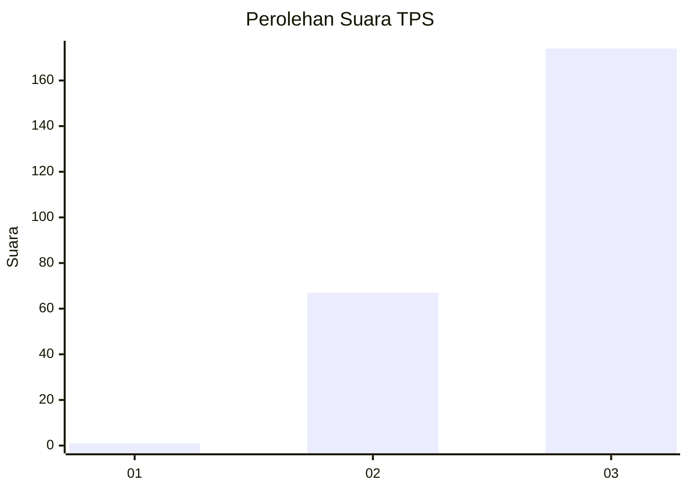
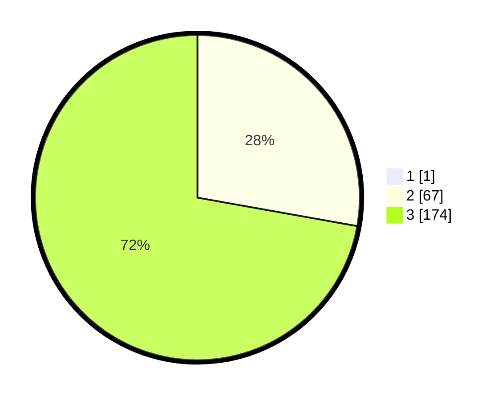

# Hasil

## Grafik

## Tabel

| No. | Nama Paslon    | Suara | Suara (raw) | Persentase |
|:--- |:-------------- | -----:| -----------:| ----------:|
| 1   | ANIES MUHAIMIN | 1     | [1][p-1]    | 0,41       |
| 2   | PRABOWO GIBRAN | 67    | [67][p-2]   | 27,69      |
| 3   | GANJAR MAHFUD  | 174   | [174][p-3]  | 71,90      |

[p-1]: https://github.com/gigit-pemilu/pemilu-2024-91-papua/blob/main/pilpres/hitung-suara/sub/91-papua/sub/06-biak-numfor/sub/12-samofa/sub/2018-kinmom/sub/001-tps/sub/paslon-1.txt
[p-2]: https://github.com/gigit-pemilu/pemilu-2024-91-papua/blob/main/pilpres/hitung-suara/sub/91-papua/sub/06-biak-numfor/sub/12-samofa/sub/2018-kinmom/sub/001-tps/sub/paslon-2.txt
[p-3]: https://github.com/gigit-pemilu/pemilu-2024-91-papua/blob/main/pilpres/hitung-suara/sub/91-papua/sub/06-biak-numfor/sub/12-samofa/sub/2018-kinmom/sub/001-tps/sub/paslon-3.txt

## Foto C Plano

https://sirekap-obj-formc.kpu.go.id/9caf/pemilu/ppwp/91/06/12/20/18/9106122018001-20240215-023144--43f4b930-85a2-4284-b1ef-941cf9ea0697.jpg

https://sirekap-obj-formc.kpu.go.id/9caf/pemilu/ppwp/91/06/12/20/18/9106122018001-20240215-023301--ee28fb60-0b47-4b6c-9952-e52177f7937b.jpg

https://sirekap-obj-formc.kpu.go.id/9caf/pemilu/ppwp/91/06/12/20/18/9106122018001-20240215-023428--950b66dd-e39c-4dca-a3fe-0ff951bf9820.jpg

## Metadata

| Key        | Value               |
| ---------- | ------------------- |
| Time Stamp | 2024-02-24 22:31:28 |

