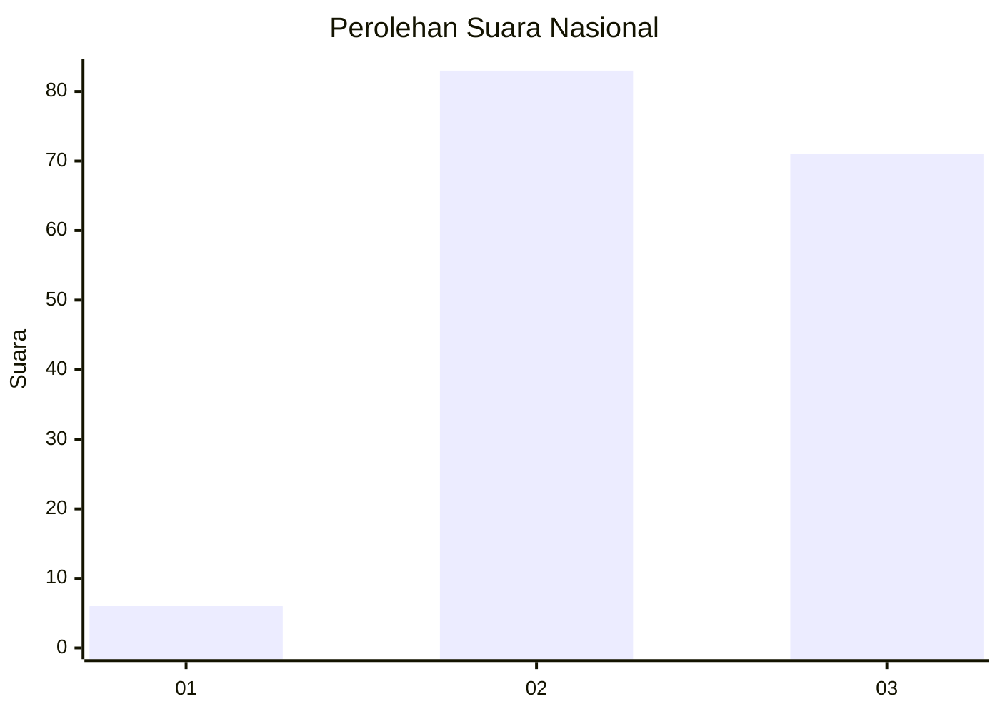
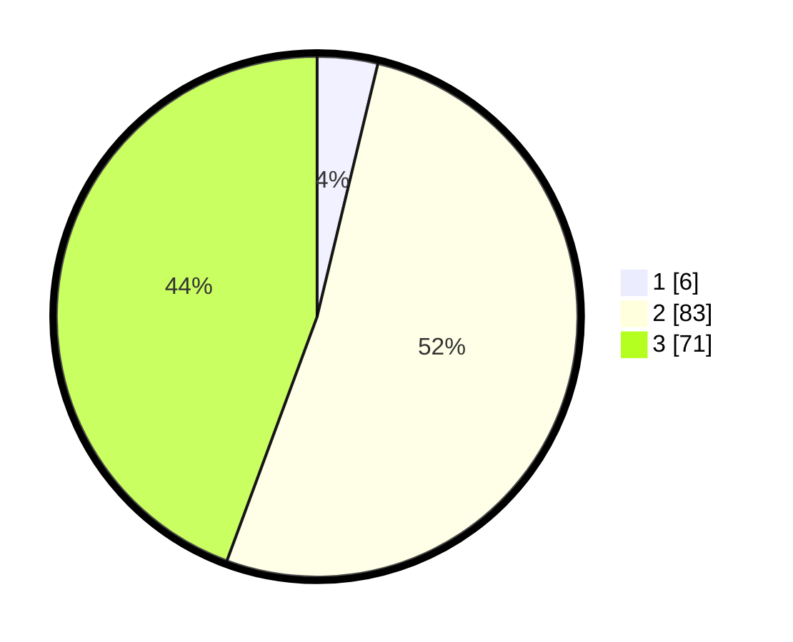

# Hasil

## Grafik

## Tabel

| No. | Nama Paslon    | Suara | Suara (raw) | Persentase |
|:--- |:-------------- | -----:| -----------:| ----------:|
| 1   | ANIES MUHAIMIN | 6     | [6][p-1]    | 3,75       |
| 2   | PRABOWO GIBRAN | 83    | [83][p-2]   | 51,88      |
| 3   | GANJAR MAHFUD  | 71    | [71][p-3]   | 44,38      |

[p-1]: https://github.com/gigit-pemilu/pemilu-2024/blob/main/pilpres/hitung-suara/sub/91-papua/sub/06-biak-numfor/sub/12-samofa/sub/2018-kinmom/sub/002-tps/sub/paslon-1.txt
[p-2]: https://github.com/gigit-pemilu/pemilu-2024/blob/main/pilpres/hitung-suara/sub/91-papua/sub/06-biak-numfor/sub/12-samofa/sub/2018-kinmom/sub/002-tps/sub/paslon-2.txt
[p-3]: https://github.com/gigit-pemilu/pemilu-2024/blob/main/pilpres/hitung-suara/sub/91-papua/sub/06-biak-numfor/sub/12-samofa/sub/2018-kinmom/sub/002-tps/sub/paslon-3.txt

## Foto C Plano

https://sirekap-obj-formc.kpu.go.id/887c/pemilu/ppwp/91/06/12/20/18/9106122018002-20240215-051119--c5c018ba-0e58-42f3-8720-16341ebb4f0c.jpg

https://sirekap-obj-formc.kpu.go.id/887c/pemilu/ppwp/91/06/12/20/18/9106122018002-20240215-051436--b3fa9d3e-2ce1-4746-bef1-562ce5105201.jpg

https://sirekap-obj-formc.kpu.go.id/887c/pemilu/ppwp/91/06/12/20/18/9106122018002-20240215-051544--826c0540-5842-4e05-8c79-4c4c8002335b.jpg

## Metadata

| Key        | Value               |
| ---------- | ------------------- |
| Time Stamp | 2024-02-25 18:00:00 |

