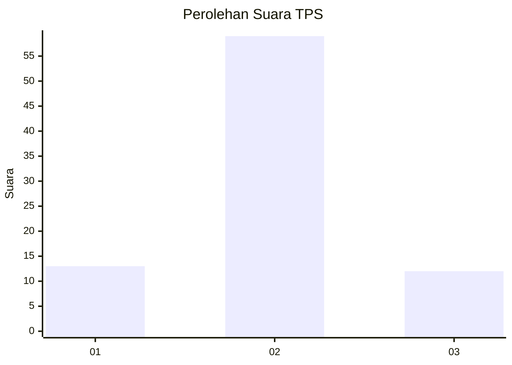
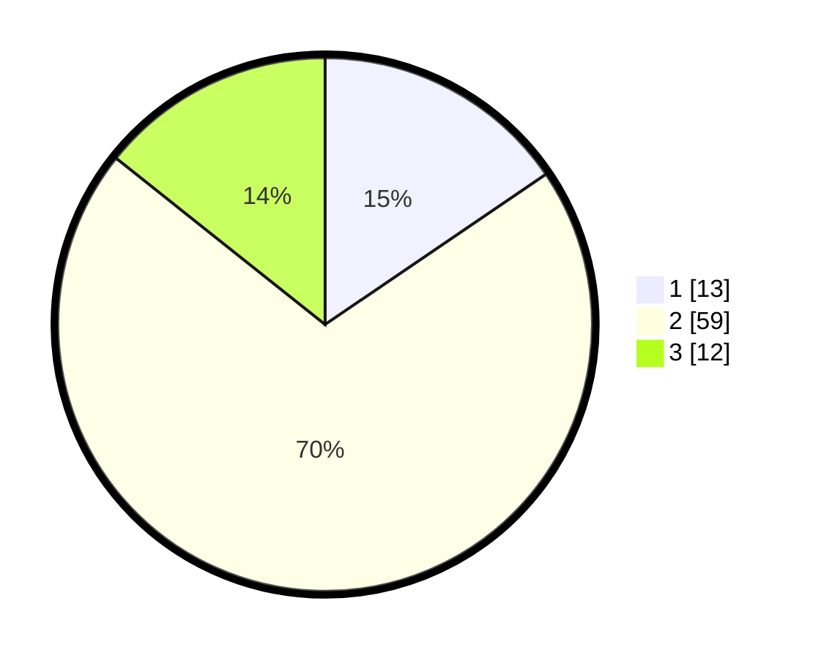

# Hasil

## Grafik

## Tabel

| No. | Nama Paslon    | Suara | Suara (raw) | Persentase |
|:--- |:-------------- | -----:| -----------:| ----------:|
| 1   | ANIES MUHAIMIN | 13    | [13][p-1]   | 15,48      |
| 2   | PRABOWO GIBRAN | 59    | [59][p-2]   | 70,24      |
| 3   | GANJAR MAHFUD  | 12    | [12][p-3]   | 14,29      |

[p-1]: https://github.com/gigit-pemilu/pemilu-2024-91-papua/blob/main/pilpres/hitung-suara/sub/91-papua/sub/06-biak-numfor/sub/13-yawosi/sub/2005-karmon/sub/001-tps/sub/paslon-1.txt
[p-2]: https://github.com/gigit-pemilu/pemilu-2024-91-papua/blob/main/pilpres/hitung-suara/sub/91-papua/sub/06-biak-numfor/sub/13-yawosi/sub/2005-karmon/sub/001-tps/sub/paslon-2.txt
[p-3]: https://github.com/gigit-pemilu/pemilu-2024-91-papua/blob/main/pilpres/hitung-suara/sub/91-papua/sub/06-biak-numfor/sub/13-yawosi/sub/2005-karmon/sub/001-tps/sub/paslon-3.txt

## Foto C Plano

https://sirekap-obj-formc.kpu.go.id/dc3b/pemilu/ppwp/91/06/13/20/05/9106132005001-20240218-141616--9d2679b1-a0df-4cc7-b752-d04316d80962.jpg

https://sirekap-obj-formc.kpu.go.id/dc3b/pemilu/ppwp/91/06/13/20/05/9106132005001-20240218-141617--20b23ba4-b2cb-4953-92f6-df679b04b810.jpg

https://sirekap-obj-formc.kpu.go.id/dc3b/pemilu/ppwp/91/06/13/20/05/9106132005001-20240218-141617--dfbd338d-31b1-47b3-ba14-0b653870ba71.jpg

## Metadata

| Key        | Value               |
| ---------- | ------------------- |
| Time Stamp | 2024-02-24 22:31:28 |

## DATA PEMILIH TETAP

Jumlah pemilih dalam DPT: **122**.
 * L: **62**.
 * P: **60**.

## DATA PENGGUNA HAK PILIH

Jumlah pengguna hak pilih dalam DPT: **82**.
 * L: **43**.
 * P: **39**.

Jumlah pengguna hak pilih dalam DPTb: **2**.
 * L: **2**.
 * P: **0**.

Jumlah pengguna hak pilih dalam DPK: **3**.
 * L: **1**.
 * P: **2**.

Jumlah pengguna hak pilih: **87**.
 * L: **46**.
 * P: **41**.

## JUMLAH SUARA SAH DAN TIDAK SAH

JUMLAH SELURUH SUARA SAH: **87**.

JUMLAH SUARA TIDAK SAH: **0**.

JUMLAH SELURUH SUARA SAH DAN SUARA TIDAK SAH: **87**.

