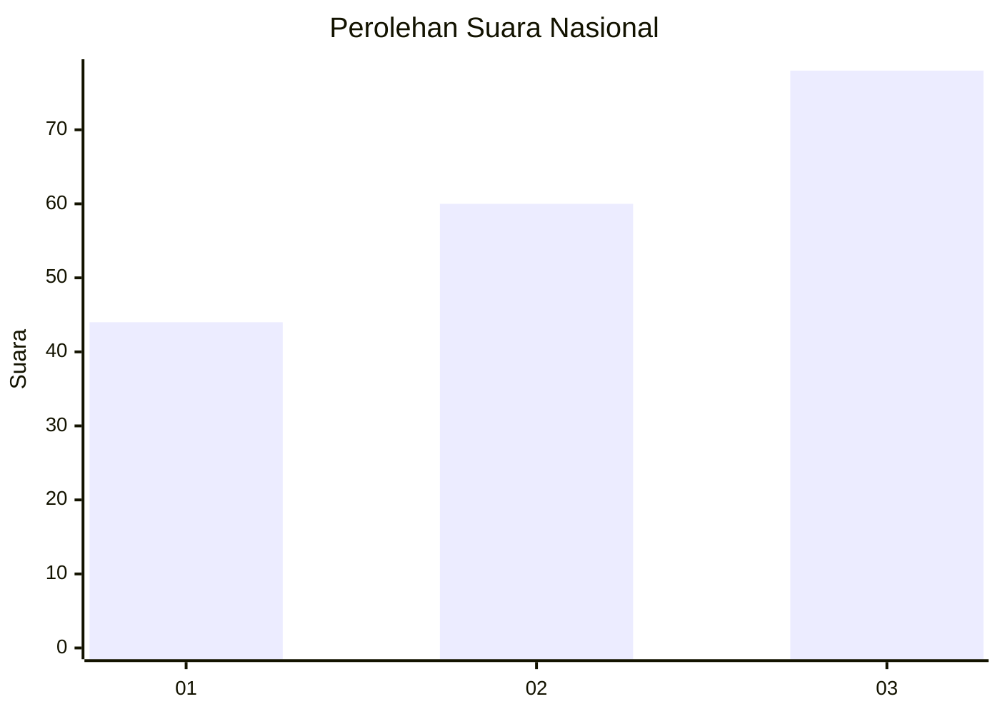
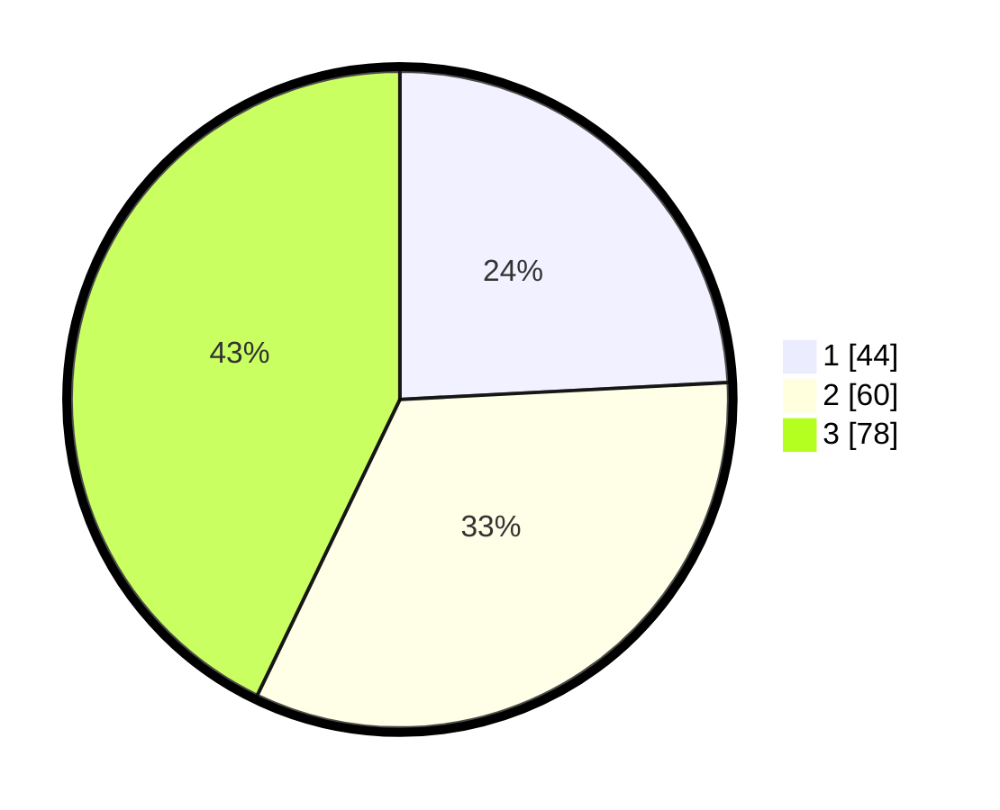

# Hasil

## Grafik

## Tabel

| No. | Nama Paslon    | Suara | Suara (raw) | Persentase |
|:--- |:-------------- | -----:| -----------:| ----------:|
| 1   | ANIES MUHAIMIN | 44    | [44][p-1]   | 24,18      |
| 2   | PRABOWO GIBRAN | 60    | [60][p-2]   | 32,97      |
| 3   | GANJAR MAHFUD  | 78    | [78][p-3]   | 42,86      |

[p-1]: https://github.com/gigit-pemilu/pemilu-2024/blob/main/pilpres/hitung-suara/sub/91-papua/sub/06-biak-numfor/sub/14-andey/sub/2003-rodifu/sub/001-tps/sub/paslon-1.txt
[p-2]: https://github.com/gigit-pemilu/pemilu-2024/blob/main/pilpres/hitung-suara/sub/91-papua/sub/06-biak-numfor/sub/14-andey/sub/2003-rodifu/sub/001-tps/sub/paslon-2.txt
[p-3]: https://github.com/gigit-pemilu/pemilu-2024/blob/main/pilpres/hitung-suara/sub/91-papua/sub/06-biak-numfor/sub/14-andey/sub/2003-rodifu/sub/001-tps/sub/paslon-3.txt

## Foto C Plano

https://sirekap-obj-formc.kpu.go.id/ca6e/pemilu/ppwp/91/06/14/20/03/9106142003001-20240215-092547--11f01b49-4adf-4f3f-b644-55990731f111.jpg

https://sirekap-obj-formc.kpu.go.id/ca6e/pemilu/ppwp/91/06/14/20/03/9106142003001-20240215-093001--ede41623-cfc5-43f1-b95c-e02621a6f226.jpg

https://sirekap-obj-formc.kpu.go.id/ca6e/pemilu/ppwp/91/06/14/20/03/9106142003001-20240215-093239--57d00e86-540f-47d3-b898-14e77185db40.jpg

## Metadata

| Key        | Value               |
| ---------- | ------------------- |
| Time Stamp | 2024-02-24 22:31:28 |

