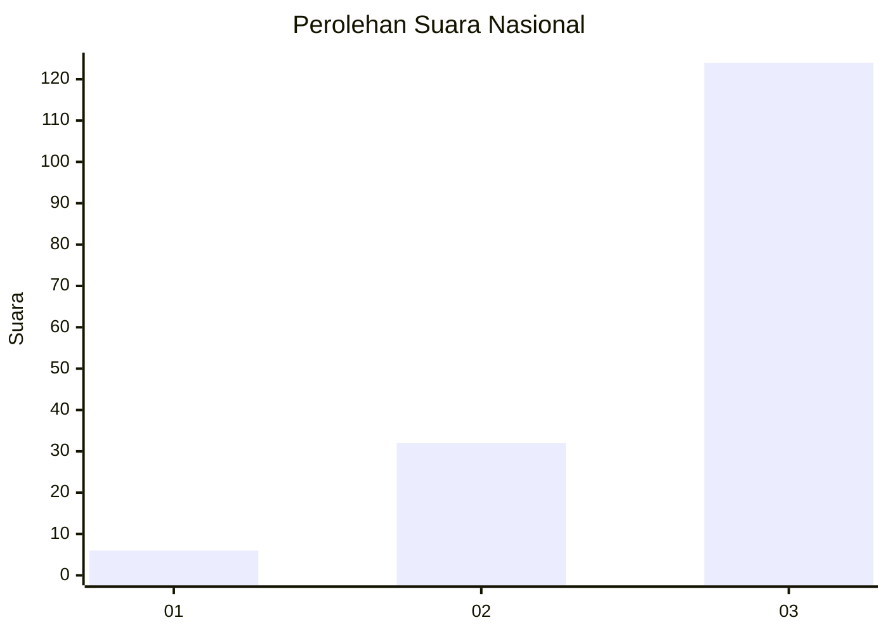
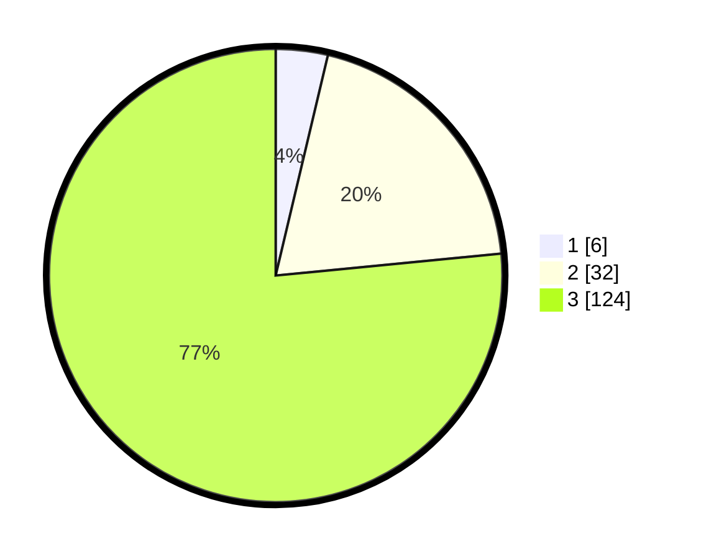

# Hasil

## Grafik

## Tabel

| No. | Nama Paslon    | Suara | Suara (raw) | Persentase |
|:--- |:-------------- | -----:| -----------:| ----------:|
| 1   | ANIES MUHAIMIN | 6     | [6][p-1]    | 3,70       |
| 2   | PRABOWO GIBRAN | 32    | [32][p-2]   | 19,75      |
| 3   | GANJAR MAHFUD  | 124   | [124][p-3]  | 76,54      |

[p-1]: https://github.com/gigit-pemilu/pemilu-2024/blob/main/pilpres/hitung-suara/sub/91-papua/sub/06-biak-numfor/sub/14-andey/sub/2004-wonabraidi/sub/001-tps/sub/paslon-1.txt
[p-2]: https://github.com/gigit-pemilu/pemilu-2024/blob/main/pilpres/hitung-suara/sub/91-papua/sub/06-biak-numfor/sub/14-andey/sub/2004-wonabraidi/sub/001-tps/sub/paslon-2.txt
[p-3]: https://github.com/gigit-pemilu/pemilu-2024/blob/main/pilpres/hitung-suara/sub/91-papua/sub/06-biak-numfor/sub/14-andey/sub/2004-wonabraidi/sub/001-tps/sub/paslon-3.txt

## Foto C Plano

https://sirekap-obj-formc.kpu.go.id/ac85/pemilu/ppwp/91/06/14/20/04/9106142004001-20240217-170338--b0d5dab6-4750-4449-9f43-2d8a8ebc4d0c.jpg

https://sirekap-obj-formc.kpu.go.id/ac85/pemilu/ppwp/91/06/14/20/04/9106142004001-20240217-170339--fa415361-c131-4fbb-b27e-8bb3e7db4274.jpg

https://sirekap-obj-formc.kpu.go.id/ac85/pemilu/ppwp/91/06/14/20/04/9106142004001-20240217-170338--7099f0a1-b070-431f-9350-fb2e2f730b5f.jpg

## Metadata

| Key        | Value               |
| ---------- | ------------------- |
| Time Stamp | 2024-02-24 22:31:28 |

## DATA PEMILIH TETAP

Jumlah pemilih dalam DPT: **205**.
 * L: **110**.
 * P: **95**.

## DATA PENGGUNA HAK PILIH

Jumlah pengguna hak pilih dalam DPT: **140**.
 * L: **78**.
 * P: **62**.

Jumlah pengguna hak pilih dalam DPTb: **20**.
 * L: **9**.
 * P: **11**.

Jumlah pengguna hak pilih dalam DPK: **2**.
 * L: **0**.
 * P: **2**.

Jumlah pengguna hak pilih: **162**.
 * L: **87**.
 * P: **75**.

## JUMLAH SUARA SAH DAN TIDAK SAH

JUMLAH SELURUH SUARA SAH: **0**.

JUMLAH SUARA TIDAK SAH: **0**.

JUMLAH SELURUH SUARA SAH DAN SUARA TIDAK SAH: **0**.

