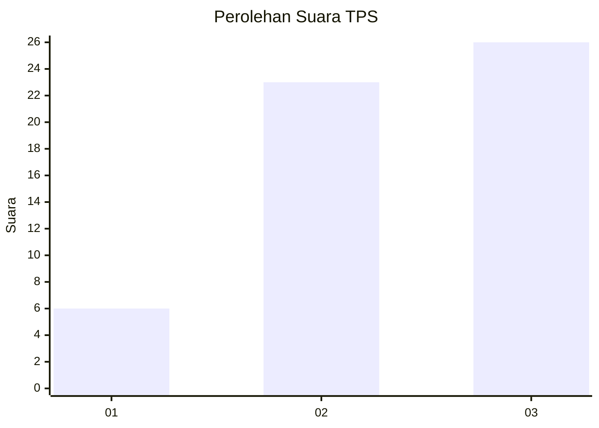
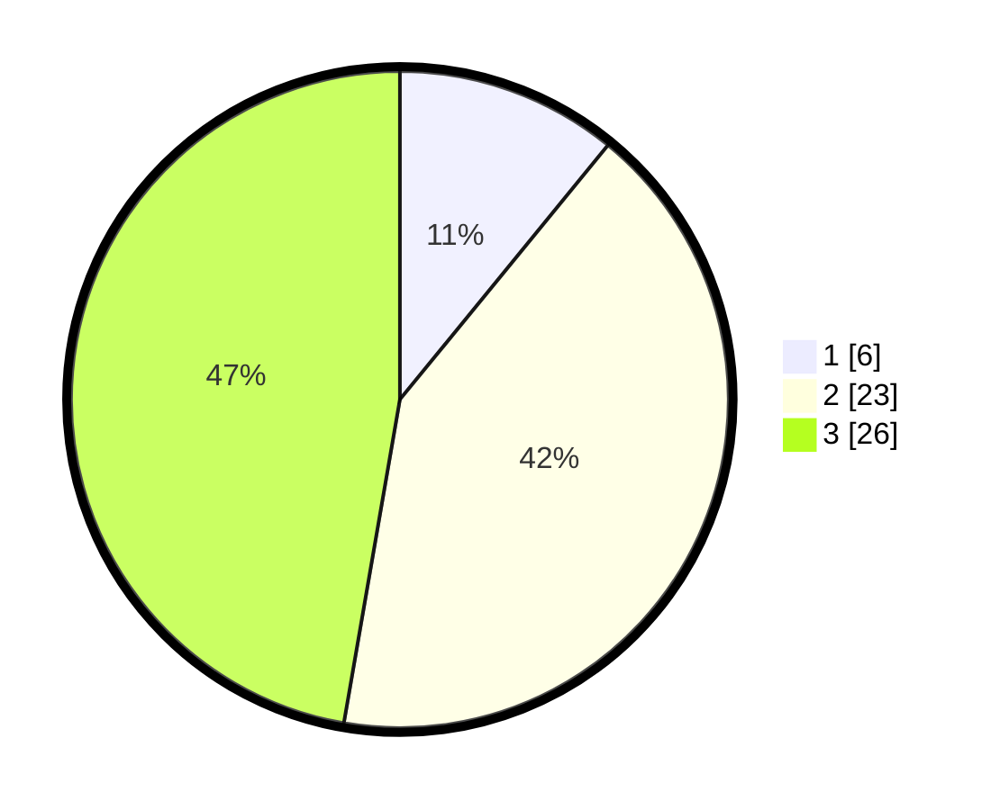

# Hasil

## Grafik

## Tabel

| No. | Nama Paslon    | Suara | Suara (raw) | Persentase |
|:--- |:-------------- | -----:| -----------:| ----------:|
| 1   | ANIES MUHAIMIN | 6     | [6][p-1]    | 10,91      |
| 2   | PRABOWO GIBRAN | 23    | [23][p-2]   | 41,82      |
| 3   | GANJAR MAHFUD  | 26    | [26][p-3]   | 47,27      |

[p-1]: https://github.com/gigit-pemilu/pemilu-2024-91-papua/blob/main/pilpres/hitung-suara/sub/91-papua/sub/06-biak-numfor/sub/14-andey/sub/2011-wodu/sub/001-tps/sub/paslon-1.txt
[p-2]: https://github.com/gigit-pemilu/pemilu-2024-91-papua/blob/main/pilpres/hitung-suara/sub/91-papua/sub/06-biak-numfor/sub/14-andey/sub/2011-wodu/sub/001-tps/sub/paslon-2.txt
[p-3]: https://github.com/gigit-pemilu/pemilu-2024-91-papua/blob/main/pilpres/hitung-suara/sub/91-papua/sub/06-biak-numfor/sub/14-andey/sub/2011-wodu/sub/001-tps/sub/paslon-3.txt

## Foto C Plano

https://sirekap-obj-formc.kpu.go.id/02fd/pemilu/ppwp/91/06/14/20/11/9106142011001-20240219-152037--f02edf1c-fef2-4356-a020-3092acf70ea3.jpg

https://sirekap-obj-formc.kpu.go.id/02fd/pemilu/ppwp/91/06/14/20/11/9106142011001-20240215-063707--37078ac2-fcf3-4067-bec0-328f663b8dec.jpg

## Metadata

| Key        | Value               |
| ---------- | ------------------- |
| Time Stamp | 2024-02-28 10:00:00 |

