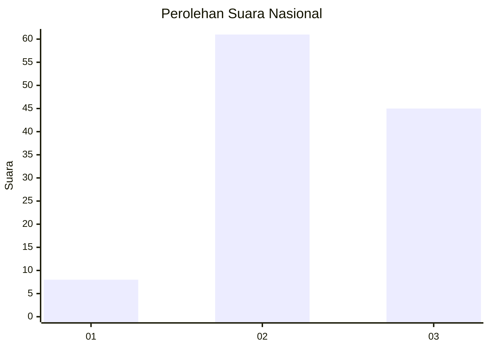
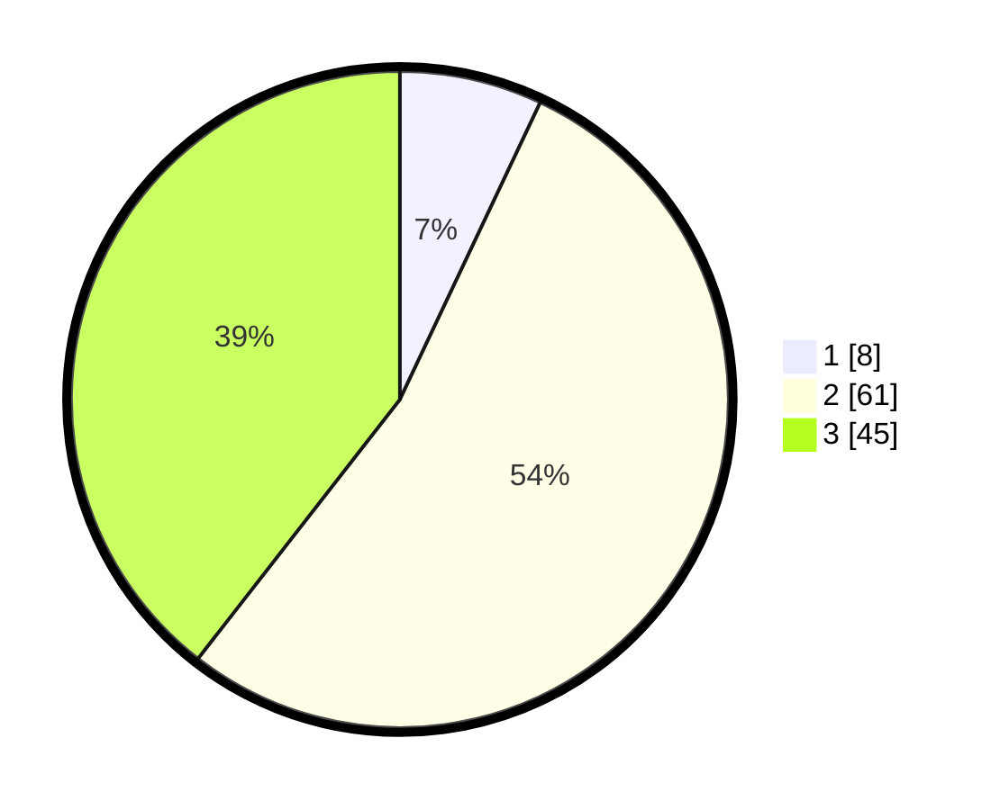

# Hasil

## Grafik

## Tabel

| No. | Nama Paslon    | Suara | Suara (raw) | Persentase |
|:--- |:-------------- | -----:| -----------:| ----------:|
| 1   | ANIES MUHAIMIN | 8     | [8][p-1]    | 7,02       |
| 2   | PRABOWO GIBRAN | 61    | [61][p-2]   | 53,51      |
| 3   | GANJAR MAHFUD  | 45    | [45][p-3]   | 39,47      |

[p-1]: https://github.com/gigit-pemilu/pemilu-2024/blob/main/pilpres/hitung-suara/sub/91-papua/sub/06-biak-numfor/sub/14-andey/sub/2011-wodu/sub/002-tps/sub/paslon-1.txt
[p-2]: https://github.com/gigit-pemilu/pemilu-2024/blob/main/pilpres/hitung-suara/sub/91-papua/sub/06-biak-numfor/sub/14-andey/sub/2011-wodu/sub/002-tps/sub/paslon-2.txt
[p-3]: https://github.com/gigit-pemilu/pemilu-2024/blob/main/pilpres/hitung-suara/sub/91-papua/sub/06-biak-numfor/sub/14-andey/sub/2011-wodu/sub/002-tps/sub/paslon-3.txt

## Foto C Plano

https://sirekap-obj-formc.kpu.go.id/7ce0/pemilu/ppwp/91/06/14/20/11/9106142011002-20240219-130938--371265d7-9e52-478f-bfa2-dfb99038c3c8.jpg

https://sirekap-obj-formc.kpu.go.id/7ce0/pemilu/ppwp/91/06/14/20/11/9106142011002-20240219-122641--e6f9789f-d87f-46e8-96d7-b6963e695875.jpg

https://sirekap-obj-formc.kpu.go.id/7ce0/pemilu/ppwp/91/06/14/20/11/9106142011002-20240219-123630--11eab5e8-a3a8-4697-a0eb-f98811b6ccd7.jpg

## Metadata

| Key        | Value               |
| ---------- | ------------------- |
| Time Stamp | 2024-02-25 16:00:00 |

