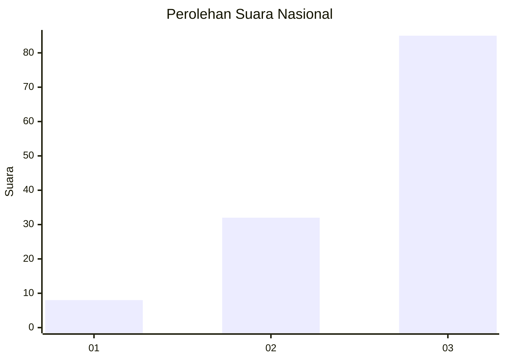
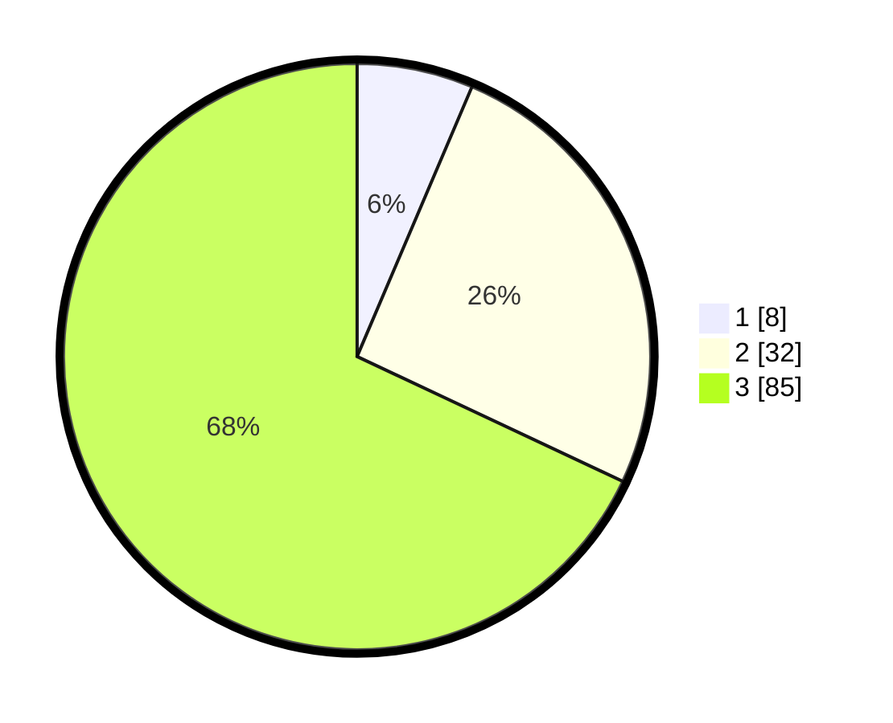

# Hasil

## Grafik

## Tabel

| No. | Nama Paslon    | Suara | Suara (raw) | Persentase |
|:--- |:-------------- | -----:| -----------:| ----------:|
| 1   | ANIES MUHAIMIN | 8     | [8][p-1]    | 6,40       |
| 2   | PRABOWO GIBRAN | 32    | [32][p-2]   | 25,60      |
| 3   | GANJAR MAHFUD  | 85    | [85][p-3]   | 68,00      |

[p-1]: https://github.com/gigit-pemilu/pemilu-2024/blob/main/pilpres/hitung-suara/sub/91-papua/sub/06-biak-numfor/sub/15-swandiwe/sub/2003-swainober/sub/001-tps/sub/paslon-1.txt
[p-2]: https://github.com/gigit-pemilu/pemilu-2024/blob/main/pilpres/hitung-suara/sub/91-papua/sub/06-biak-numfor/sub/15-swandiwe/sub/2003-swainober/sub/001-tps/sub/paslon-2.txt
[p-3]: https://github.com/gigit-pemilu/pemilu-2024/blob/main/pilpres/hitung-suara/sub/91-papua/sub/06-biak-numfor/sub/15-swandiwe/sub/2003-swainober/sub/001-tps/sub/paslon-3.txt

## Foto C Plano

https://sirekap-obj-formc.kpu.go.id/ae46/pemilu/ppwp/91/06/15/20/03/9106152003001-20240216-144032--610fa36c-6fab-4c30-8a88-39a50338e46f.jpg

https://sirekap-obj-formc.kpu.go.id/ae46/pemilu/ppwp/91/06/15/20/03/9106152003001-20240216-130728--026b6237-08ec-4d58-ae76-b52158b55b27.jpg

https://sirekap-obj-formc.kpu.go.id/ae46/pemilu/ppwp/91/06/15/20/03/9106152003001-20240216-140005--b6c06efd-44fd-43a1-962f-96b50f9ce013.jpg

## Metadata

| Key        | Value               |
| ---------- | ------------------- |
| Time Stamp | 2024-02-16 16:25:10 |

## DATA PEMILIH TETAP

Jumlah pemilih dalam DPT: **125**.
 * L: **68**.
 * P: **57**.

## DATA PENGGUNA HAK PILIH

Jumlah pengguna hak pilih dalam DPT: **128**.
 * L: **68**.
 * P: **57**.

Jumlah pengguna hak pilih dalam DPTb: **1**.
 * L: **0**.
 * P: **1**.

Jumlah pengguna hak pilih dalam DPK: **2**.
 * L: **1**.
 * P: **1**.

Jumlah pengguna hak pilih: **128**.
 * L: **69**.
 * P: **59**.

## JUMLAH SUARA SAH DAN TIDAK SAH

JUMLAH SELURUH SUARA SAH: **125**.

JUMLAH SUARA TIDAK SAH: **3**.

JUMLAH SELURUH SUARA SAH DAN SUARA TIDAK SAH: **128**.

