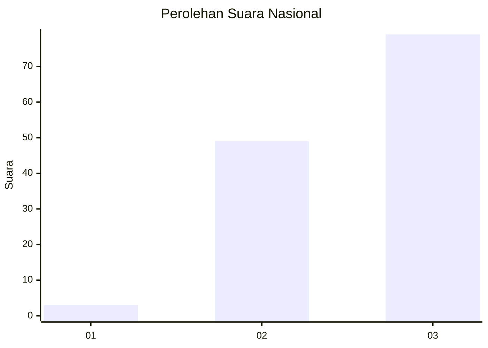
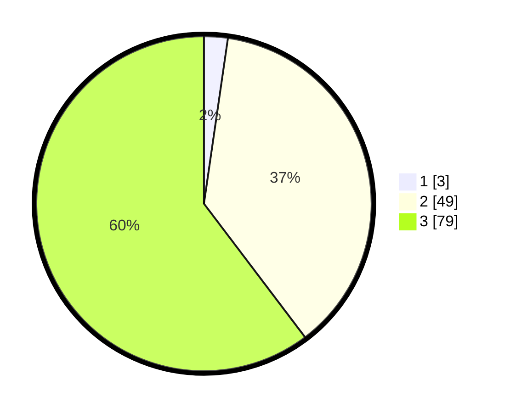

# Hasil

## Grafik

## Tabel

| No. | Nama Paslon    | Suara | Suara (raw) | Persentase |
|:--- |:-------------- | -----:| -----------:| ----------:|
| 1   | ANIES MUHAIMIN | 3     | [3][p-1]    | 2,29       |
| 2   | PRABOWO GIBRAN | 49    | [49][p-2]   | 37,40      |
| 3   | GANJAR MAHFUD  | 79    | [79][p-3]   | 60,31      |

[p-1]: https://github.com/gigit-pemilu/pemilu-2024/blob/main/pilpres/hitung-suara/sub/91-papua/sub/06-biak-numfor/sub/15-swandiwe/sub/2011-wombrisau/sub/002-tps/sub/paslon-1.txt
[p-2]: https://github.com/gigit-pemilu/pemilu-2024/blob/main/pilpres/hitung-suara/sub/91-papua/sub/06-biak-numfor/sub/15-swandiwe/sub/2011-wombrisau/sub/002-tps/sub/paslon-2.txt
[p-3]: https://github.com/gigit-pemilu/pemilu-2024/blob/main/pilpres/hitung-suara/sub/91-papua/sub/06-biak-numfor/sub/15-swandiwe/sub/2011-wombrisau/sub/002-tps/sub/paslon-3.txt

## Foto C Plano

https://sirekap-obj-formc.kpu.go.id/cb8c/pemilu/ppwp/91/06/15/20/11/9106152011002-20240215-073919--214f933e-552a-4e3a-9444-f15048037dc0.jpg

https://sirekap-obj-formc.kpu.go.id/cb8c/pemilu/ppwp/91/06/15/20/11/9106152011002-20240215-074517--07f16e3e-bb56-4c4b-9e72-a44fb4d19a47.jpg

https://sirekap-obj-formc.kpu.go.id/cb8c/pemilu/ppwp/91/06/15/20/11/9106152011002-20240216-072440--8db5f800-33f5-4891-846e-5eceed481569.jpg

## Metadata

| Key        | Value               |
| ---------- | ------------------- |
| Time Stamp | 2024-02-16 08:00:28 |

