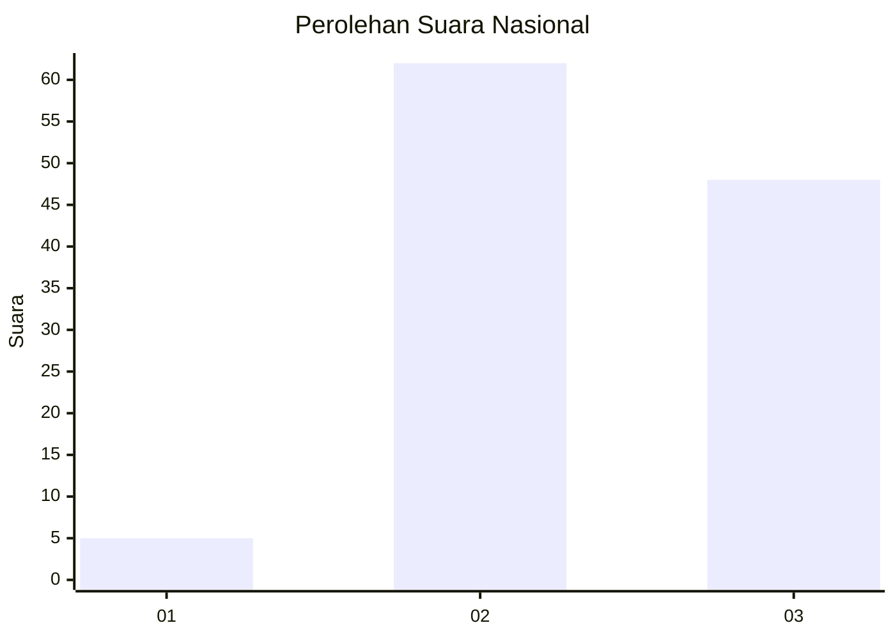
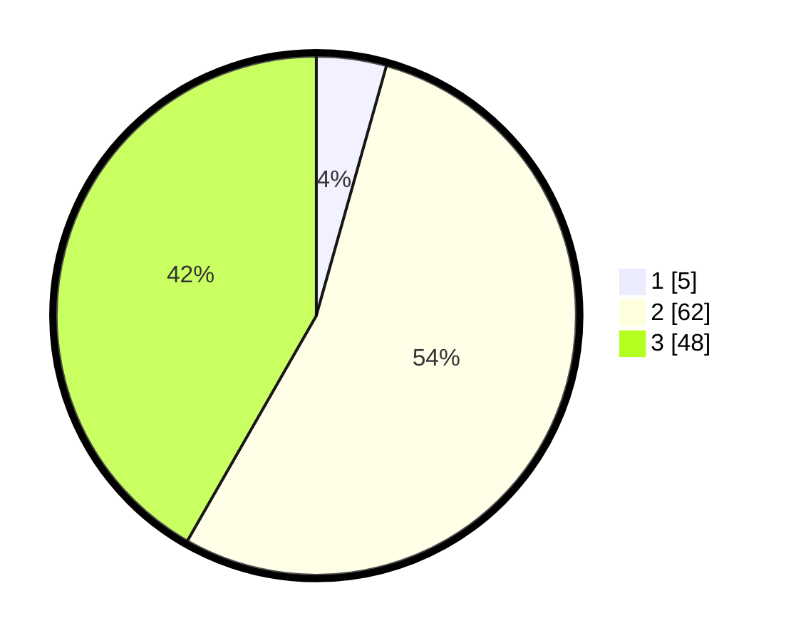

# Hasil

## Grafik

## Tabel

| No. | Nama Paslon    | Suara | Suara (raw) | Persentase |
|:--- |:-------------- | -----:| -----------:| ----------:|
| 1   | ANIES MUHAIMIN | 5     | [5][p-1]    | 4,35       |
| 2   | PRABOWO GIBRAN | 62    | [62][p-2]   | 53,91      |
| 3   | GANJAR MAHFUD  | 48    | [48][p-3]   | 41,74      |

[p-1]: https://github.com/gigit-pemilu/pemilu-2024/blob/main/pilpres/hitung-suara/sub/91-papua/sub/06-biak-numfor/sub/15-swandiwe/sub/2015-insusbari/sub/001-tps/sub/paslon-1.txt
[p-2]: https://github.com/gigit-pemilu/pemilu-2024/blob/main/pilpres/hitung-suara/sub/91-papua/sub/06-biak-numfor/sub/15-swandiwe/sub/2015-insusbari/sub/001-tps/sub/paslon-2.txt
[p-3]: https://github.com/gigit-pemilu/pemilu-2024/blob/main/pilpres/hitung-suara/sub/91-papua/sub/06-biak-numfor/sub/15-swandiwe/sub/2015-insusbari/sub/001-tps/sub/paslon-3.txt

## Foto C Plano

https://sirekap-obj-formc.kpu.go.id/b468/pemilu/ppwp/91/06/15/20/15/9106152015001-20240215-184806--02f0e392-c4ef-4414-8291-aaa884274833.jpg

https://sirekap-obj-formc.kpu.go.id/b468/pemilu/ppwp/91/06/15/20/15/9106152015001-20240215-110914--a7df0e3a-800f-41c2-a30d-c721b4363995.jpg

https://sirekap-obj-formc.kpu.go.id/b468/pemilu/ppwp/91/06/15/20/15/9106152015001-20240215-111144--645f376d-bd64-448d-8ffe-bdd5ca82c61a.jpg

## Metadata

| Key        | Value               |
| ---------- | ------------------- |
| Time Stamp | 2024-02-25 15:00:00 |

