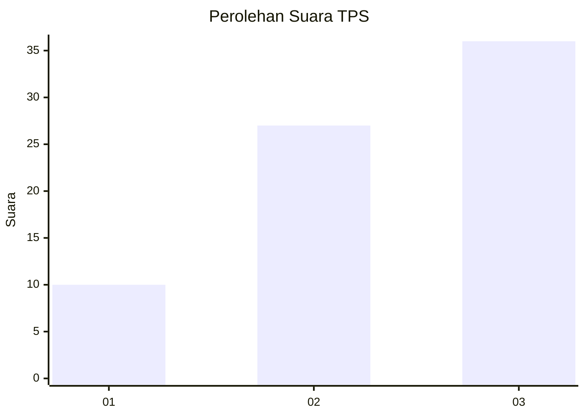
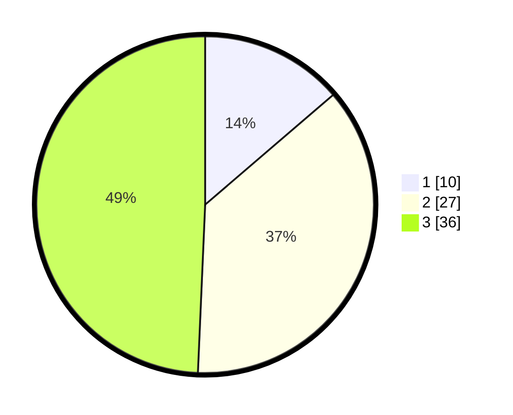

# Hasil

## Grafik

## Tabel

| No. | Nama Paslon    | Suara | Suara (raw) | Persentase |
|:--- |:-------------- | -----:| -----------:| ----------:|
| 1   | ANIES MUHAIMIN | 10    | [10][p-1]   | 13,70      |
| 2   | PRABOWO GIBRAN | 27    | [27][p-2]   | 36,99      |
| 3   | GANJAR MAHFUD  | 36    | [36][p-3]   | 49,32      |

[p-1]: https://github.com/gigit-pemilu/pemilu-2024-91-papua/blob/main/pilpres/hitung-suara/sub/91-papua/sub/06-biak-numfor/sub/16-bruyadori/sub/2004-amberparem/sub/001-tps/sub/paslon-1.txt
[p-2]: https://github.com/gigit-pemilu/pemilu-2024-91-papua/blob/main/pilpres/hitung-suara/sub/91-papua/sub/06-biak-numfor/sub/16-bruyadori/sub/2004-amberparem/sub/001-tps/sub/paslon-2.txt
[p-3]: https://github.com/gigit-pemilu/pemilu-2024-91-papua/blob/main/pilpres/hitung-suara/sub/91-papua/sub/06-biak-numfor/sub/16-bruyadori/sub/2004-amberparem/sub/001-tps/sub/paslon-3.txt

## Foto C Plano

https://sirekap-obj-formc.kpu.go.id/c8bb/pemilu/ppwp/91/06/16/20/04/9106162004001-20240215-173411--8fa5e318-7db6-4992-a7a8-7c45cffb2830.jpg

https://sirekap-obj-formc.kpu.go.id/c8bb/pemilu/ppwp/91/06/16/20/04/9106162004001-20240215-173918--83664601-5482-4520-9ee4-c866f9d62ff1.jpg

https://sirekap-obj-formc.kpu.go.id/c8bb/pemilu/ppwp/91/06/16/20/04/9106162004001-20240215-174303--20dea90f-96fc-42e9-8218-0ffdaf659fec.jpg

## Metadata

| Key        | Value               |
| ---------- | ------------------- |
| Time Stamp | 2024-02-25 12:00:00 |

