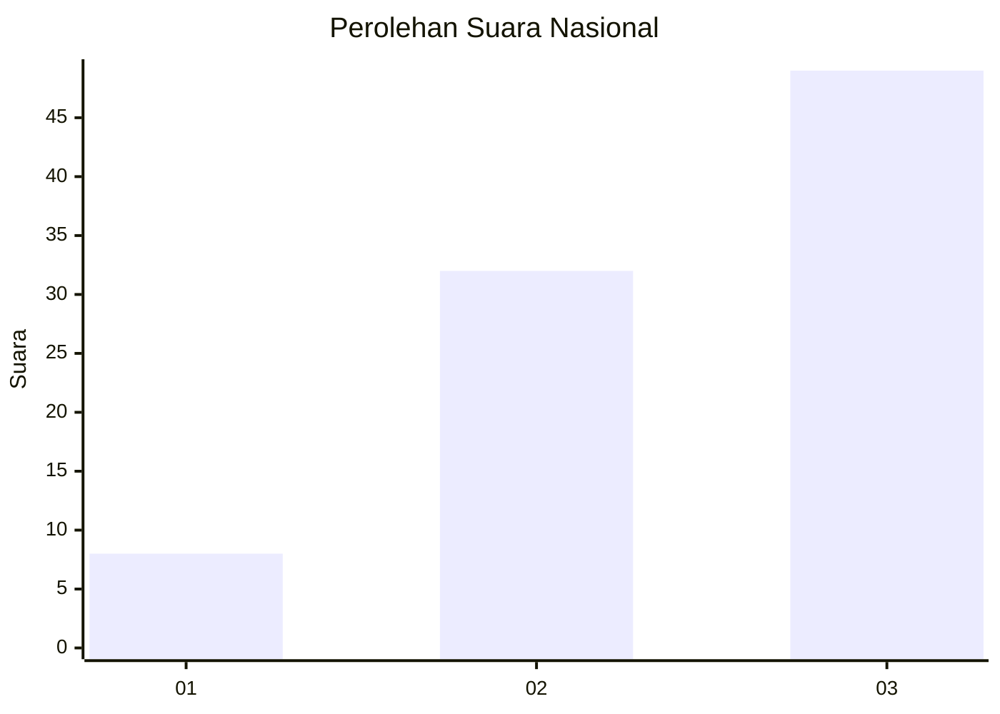
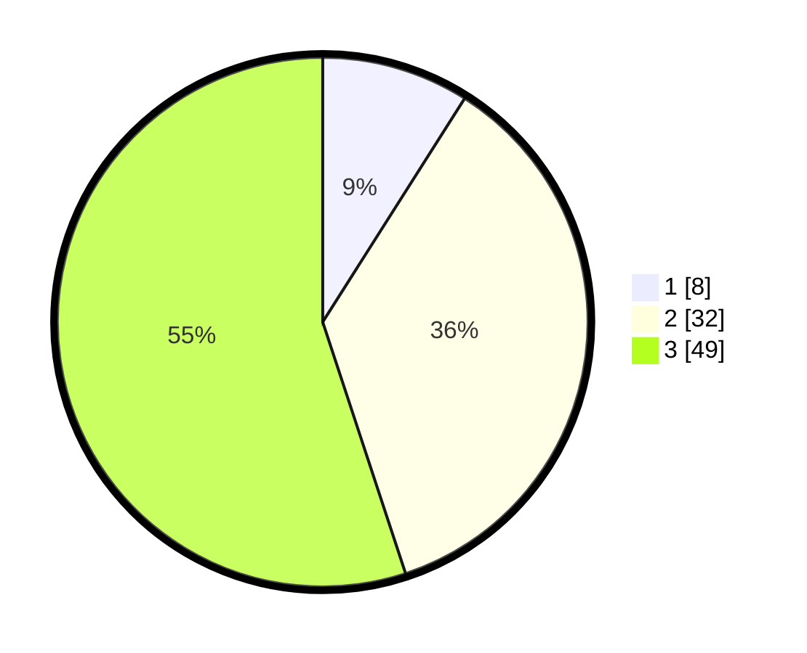

# Hasil

## Grafik

## Tabel

| No. | Nama Paslon    | Suara | Suara (raw) | Persentase |
|:--- |:-------------- | -----:| -----------:| ----------:|
| 1   | ANIES MUHAIMIN | 8     | [8][p-1]    | 8,99       |
| 2   | PRABOWO GIBRAN | 32    | [32][p-2]   | 35,96      |
| 3   | GANJAR MAHFUD  | 49    | [49][p-3]   | 55,06      |

[p-1]: https://github.com/gigit-pemilu/pemilu-2024/blob/main/pilpres/hitung-suara/sub/91-papua/sub/06-biak-numfor/sub/16-bruyadori/sub/2006-duai/sub/001-tps/sub/paslon-1.txt
[p-2]: https://github.com/gigit-pemilu/pemilu-2024/blob/main/pilpres/hitung-suara/sub/91-papua/sub/06-biak-numfor/sub/16-bruyadori/sub/2006-duai/sub/001-tps/sub/paslon-2.txt
[p-3]: https://github.com/gigit-pemilu/pemilu-2024/blob/main/pilpres/hitung-suara/sub/91-papua/sub/06-biak-numfor/sub/16-bruyadori/sub/2006-duai/sub/001-tps/sub/paslon-3.txt

## Foto C Plano

https://sirekap-obj-formc.kpu.go.id/8c8f/pemilu/ppwp/91/06/16/20/06/9106162006001-20240217-175720--154321fa-005f-48b2-863d-14c46ef36561.jpg

https://sirekap-obj-formc.kpu.go.id/8c8f/pemilu/ppwp/91/06/16/20/06/9106162006001-20240217-180037--4fcd8e8b-a22a-40cb-89e8-74f4d6ea3d48.jpg

https://sirekap-obj-formc.kpu.go.id/8c8f/pemilu/ppwp/91/06/16/20/06/9106162006001-20240217-175847--bd535616-c94c-4950-9ae9-1fec99a2292d.jpg

## Metadata

| Key        | Value               |
| ---------- | ------------------- |
| Time Stamp | 2024-02-25 16:00:00 |

