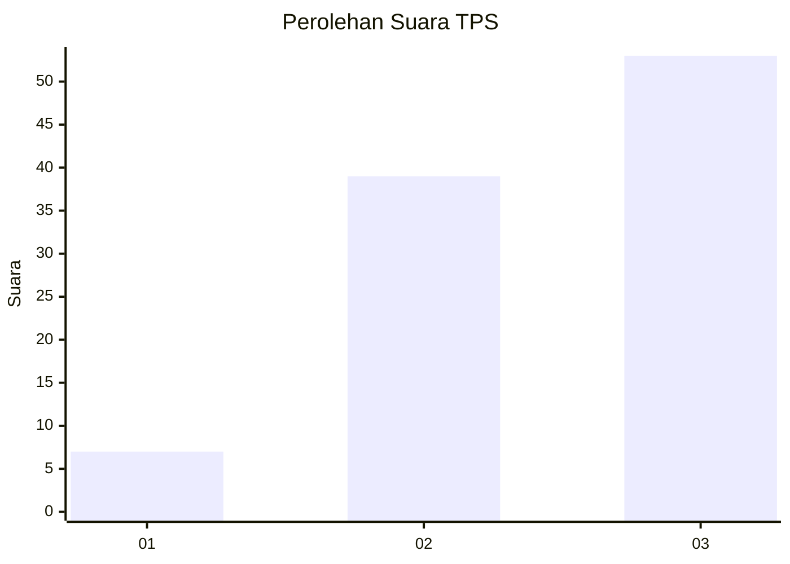
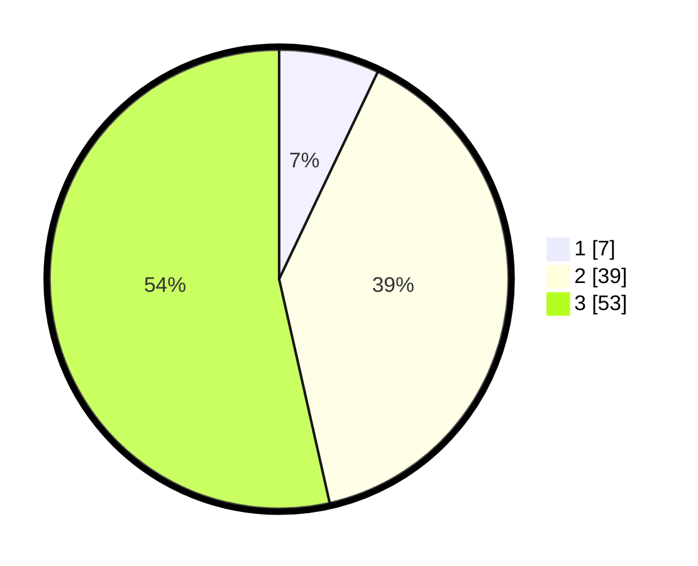

# Hasil

## Grafik

## Tabel

| No. | Nama Paslon    | Suara | Suara (raw) | Persentase |
|:--- |:-------------- | -----:| -----------:| ----------:|
| 1   | ANIES MUHAIMIN | 7     | [7][p-1]    | 7,07       |
| 2   | PRABOWO GIBRAN | 39    | [39][p-2]   | 39,39      |
| 3   | GANJAR MAHFUD  | 53    | [53][p-3]   | 53,54      |

[p-1]: https://github.com/gigit-pemilu/pemilu-2024-91-papua/blob/main/pilpres/hitung-suara/sub/91-papua/sub/06-biak-numfor/sub/16-bruyadori/sub/2007-mandori-sup/sub/001-tps/sub/paslon-1.txt
[p-2]: https://github.com/gigit-pemilu/pemilu-2024-91-papua/blob/main/pilpres/hitung-suara/sub/91-papua/sub/06-biak-numfor/sub/16-bruyadori/sub/2007-mandori-sup/sub/001-tps/sub/paslon-2.txt
[p-3]: https://github.com/gigit-pemilu/pemilu-2024-91-papua/blob/main/pilpres/hitung-suara/sub/91-papua/sub/06-biak-numfor/sub/16-bruyadori/sub/2007-mandori-sup/sub/001-tps/sub/paslon-3.txt

## Foto C Plano

https://sirekap-obj-formc.kpu.go.id/2aaa/pemilu/ppwp/91/06/16/20/07/9106162007001-20240215-195610--d4c780a5-413e-4c6d-bec1-0ad60ed797e8.jpg

https://sirekap-obj-formc.kpu.go.id/2aaa/pemilu/ppwp/91/06/16/20/07/9106162007001-20240215-195827--151ffafa-fbd5-434b-90ea-a18d86ddc460.jpg

## Metadata

| Key        | Value               |
| ---------- | ------------------- |
| Time Stamp | 2024-02-25 00:00:00 |

