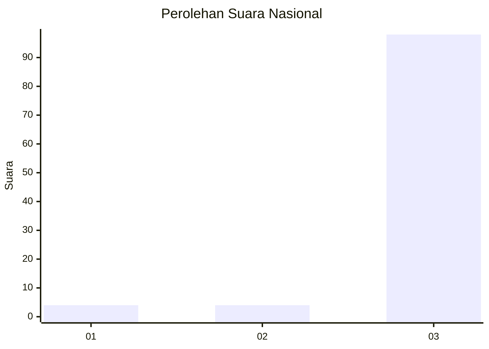
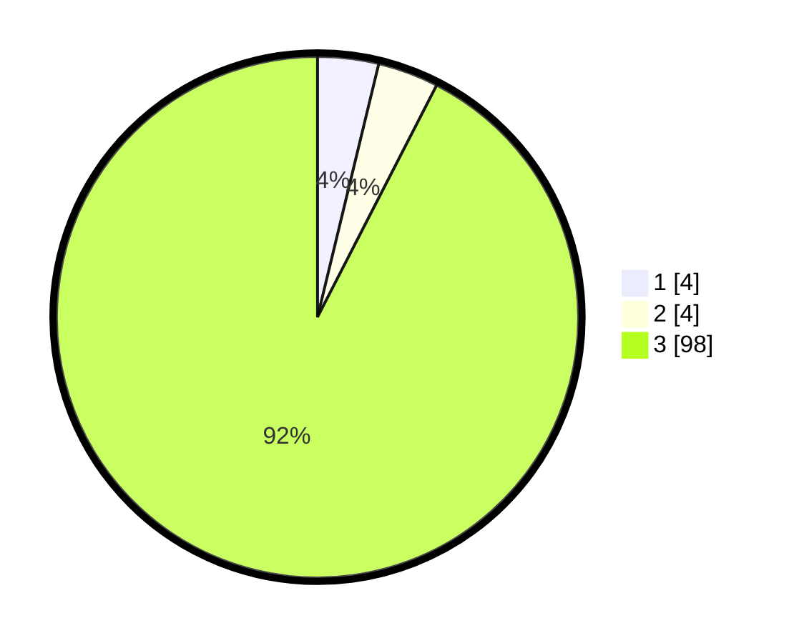

# Hasil

## Grafik

## Tabel

| No. | Nama Paslon    | Suara | Suara (raw) | Persentase |
|:--- |:-------------- | -----:| -----------:| ----------:|
| 1   | ANIES MUHAIMIN | 4     | [4][p-1]    | 3,77       |
| 2   | PRABOWO GIBRAN | 4     | [4][p-2]    | 3,77       |
| 3   | GANJAR MAHFUD  | 98    | [98][p-3]   | 92,45      |

[p-1]: https://github.com/gigit-pemilu/pemilu-2024/blob/main/pilpres/hitung-suara/sub/91-papua/sub/06-biak-numfor/sub/16-bruyadori/sub/2009-arimi-jaya/sub/001-tps/sub/paslon-1.txt
[p-2]: https://github.com/gigit-pemilu/pemilu-2024/blob/main/pilpres/hitung-suara/sub/91-papua/sub/06-biak-numfor/sub/16-bruyadori/sub/2009-arimi-jaya/sub/001-tps/sub/paslon-2.txt
[p-3]: https://github.com/gigit-pemilu/pemilu-2024/blob/main/pilpres/hitung-suara/sub/91-papua/sub/06-biak-numfor/sub/16-bruyadori/sub/2009-arimi-jaya/sub/001-tps/sub/paslon-3.txt

## Foto C Plano

https://sirekap-obj-formc.kpu.go.id/be16/pemilu/ppwp/91/06/16/20/09/9106162009001-20240217-125047--69841882-4527-4713-89d4-ff5bf5b16701.jpg

https://sirekap-obj-formc.kpu.go.id/be16/pemilu/ppwp/91/06/16/20/09/9106162009001-20240217-130224--03debde9-53bb-414a-b161-3ab418543ff2.jpg

https://sirekap-obj-formc.kpu.go.id/be16/pemilu/ppwp/91/06/16/20/09/9106162009001-20240217-131146--f4be2b4a-a54e-4dd1-9da6-b15e91ffd860.jpg

## Metadata

| Key        | Value               |
| ---------- | ------------------- |
| Time Stamp | 2024-02-17 13:37:34 |

## DATA PEMILIH TETAP

Jumlah pemilih dalam DPT: **106**.
 * L: **58**.
 * P: **48**.

## DATA PENGGUNA HAK PILIH

Jumlah pengguna hak pilih dalam DPT: **106**.
 * L: **58**.
 * P: **48**.

Jumlah pengguna hak pilih dalam DPTb: **0**.
 * L: **0**.
 * P: **0**.

Jumlah pengguna hak pilih dalam DPK: **0**.
 * L: **0**.
 * P: **0**.

Jumlah pengguna hak pilih: **106**.
 * L: **58**.
 * P: **48**.

## JUMLAH SUARA SAH DAN TIDAK SAH

JUMLAH SELURUH SUARA SAH: **106**.

JUMLAH SUARA TIDAK SAH: **0**.

JUMLAH SELURUH SUARA SAH DAN SUARA TIDAK SAH: **106**.

