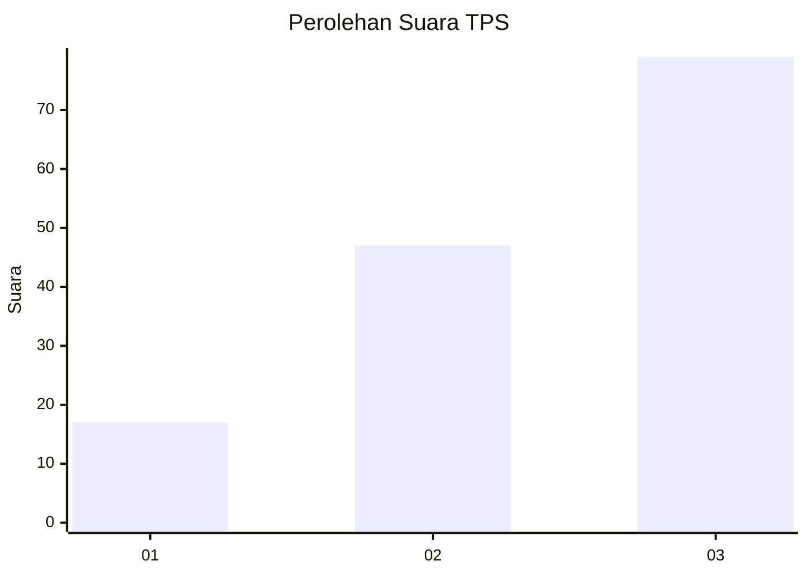
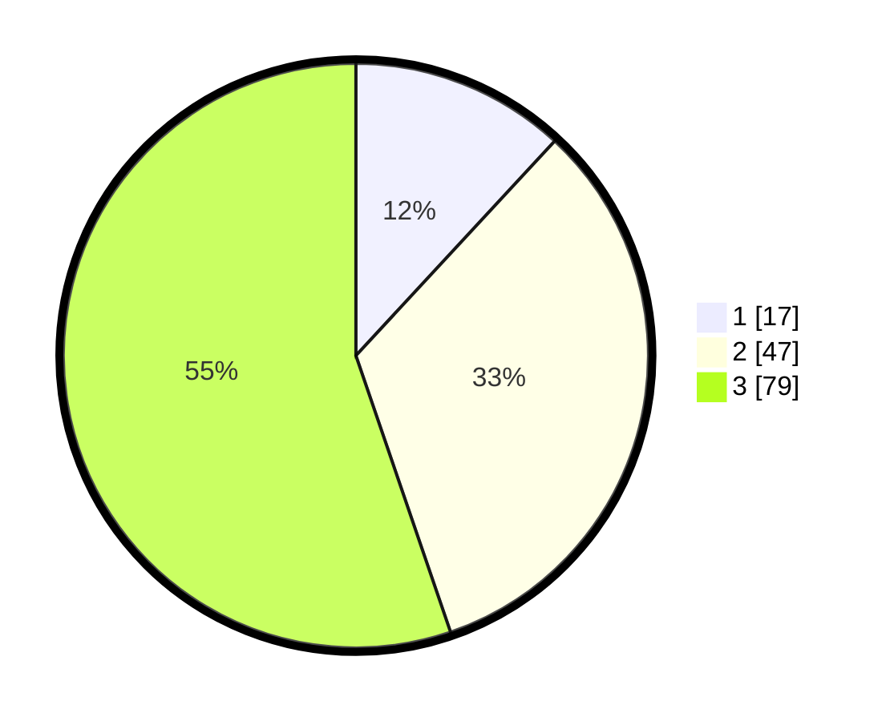

# Hasil

## Grafik

## Tabel

| No. | Nama Paslon    | Suara | Suara (raw) | Persentase |
|:--- |:-------------- | -----:| -----------:| ----------:|
| 1   | ANIES MUHAIMIN | 17    | [17][p-1]   | 11,89      |
| 2   | PRABOWO GIBRAN | 47    | [47][p-2]   | 32,87      |
| 3   | GANJAR MAHFUD  | 79    | [79][p-3]   | 55,24      |

[p-1]: https://github.com/gigit-pemilu/pemilu-2024-91-papua/blob/main/pilpres/hitung-suara/sub/91-papua/sub/06-biak-numfor/sub/17-orkeri/sub/2002-yenbepon/sub/001-tps/sub/paslon-1.txt
[p-2]: https://github.com/gigit-pemilu/pemilu-2024-91-papua/blob/main/pilpres/hitung-suara/sub/91-papua/sub/06-biak-numfor/sub/17-orkeri/sub/2002-yenbepon/sub/001-tps/sub/paslon-2.txt
[p-3]: https://github.com/gigit-pemilu/pemilu-2024-91-papua/blob/main/pilpres/hitung-suara/sub/91-papua/sub/06-biak-numfor/sub/17-orkeri/sub/2002-yenbepon/sub/001-tps/sub/paslon-3.txt

## Foto C Plano

https://sirekap-obj-formc.kpu.go.id/6f7c/pemilu/ppwp/91/06/17/20/02/9106172002001-20240215-104705--db300a46-e7d9-4152-b179-bb437602caae.jpg

https://sirekap-obj-formc.kpu.go.id/6f7c/pemilu/ppwp/91/06/17/20/02/9106172002001-20240215-104821--40aa3233-100f-4117-a3f5-92eb543327ff.jpg

https://sirekap-obj-formc.kpu.go.id/6f7c/pemilu/ppwp/91/06/17/20/02/9106172002001-20240215-101502--7836c9c1-cf96-4c81-9c62-66df8da6b548.jpg

## Metadata

| Key        | Value               |
| ---------- | ------------------- |
| Time Stamp | 2024-02-25 18:00:00 |

