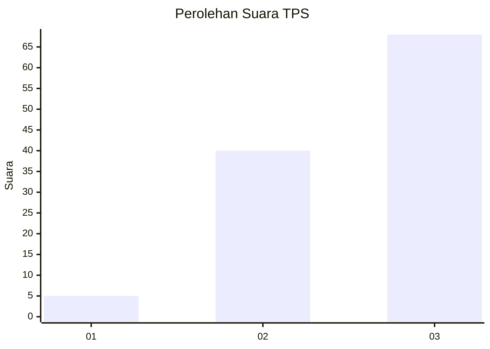
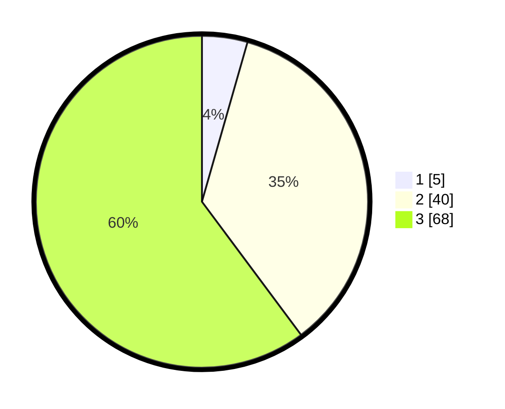

# Hasil

## Grafik

## Tabel

| No. | Nama Paslon    | Suara | Suara (raw) | Persentase |
|:--- |:-------------- | -----:| -----------:| ----------:|
| 1   | ANIES MUHAIMIN | 5     | [5][p-1]    | 4,42       |
| 2   | PRABOWO GIBRAN | 40    | [40][p-2]   | 35,40      |
| 3   | GANJAR MAHFUD  | 68    | [68][p-3]   | 60,18      |

[p-1]: https://github.com/gigit-pemilu/pemilu-2024-91-papua/blob/main/pilpres/hitung-suara/sub/91-papua/sub/06-biak-numfor/sub/18-poiru/sub/2001-andei/sub/001-tps/sub/paslon-1.txt
[p-2]: https://github.com/gigit-pemilu/pemilu-2024-91-papua/blob/main/pilpres/hitung-suara/sub/91-papua/sub/06-biak-numfor/sub/18-poiru/sub/2001-andei/sub/001-tps/sub/paslon-2.txt
[p-3]: https://github.com/gigit-pemilu/pemilu-2024-91-papua/blob/main/pilpres/hitung-suara/sub/91-papua/sub/06-biak-numfor/sub/18-poiru/sub/2001-andei/sub/001-tps/sub/paslon-3.txt

## Foto C Plano

https://sirekap-obj-formc.kpu.go.id/e5de/pemilu/ppwp/91/06/18/20/01/9106182001001-20240215-221930--2329cbf7-d7e0-4066-8d8d-627b19018952.jpg

https://sirekap-obj-formc.kpu.go.id/e5de/pemilu/ppwp/91/06/18/20/01/9106182001001-20240215-223602--8a90ba15-de88-4d58-a84a-15441be4550b.jpg

## Metadata

| Key        | Value               |
| ---------- | ------------------- |
| Time Stamp | 2024-02-28 11:00:00 |

