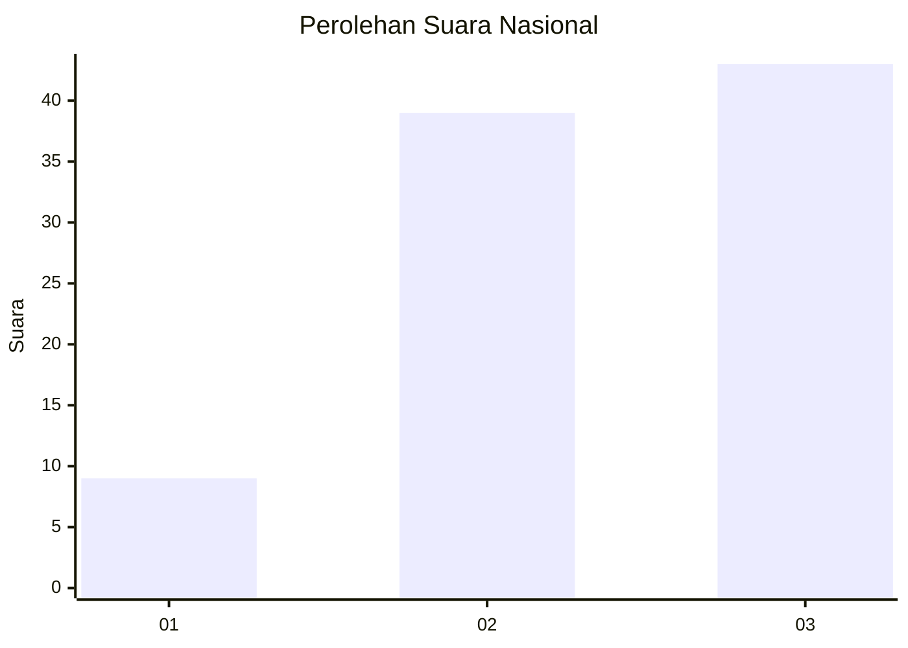
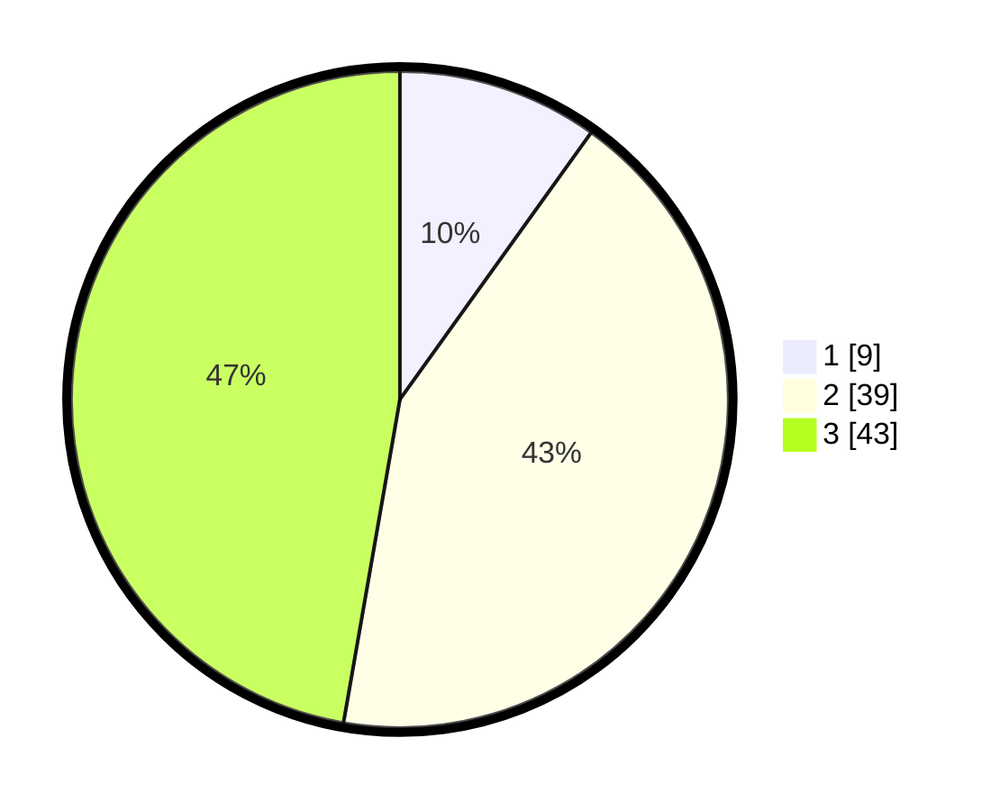

# Hasil

## Grafik

## Tabel

| No. | Nama Paslon    | Suara | Suara (raw) | Persentase |
|:--- |:-------------- | -----:| -----------:| ----------:|
| 1   | ANIES MUHAIMIN | 9     | [9][p-1]    | 9,89       |
| 2   | PRABOWO GIBRAN | 39    | [39][p-2]   | 42,86      |
| 3   | GANJAR MAHFUD  | 43    | [43][p-3]   | 47,25      |

[p-1]: https://github.com/gigit-pemilu/pemilu-2024/blob/main/pilpres/hitung-suara/sub/91-papua/sub/06-biak-numfor/sub/18-poiru/sub/2002-syoribo/sub/001-tps/sub/paslon-1.txt
[p-2]: https://github.com/gigit-pemilu/pemilu-2024/blob/main/pilpres/hitung-suara/sub/91-papua/sub/06-biak-numfor/sub/18-poiru/sub/2002-syoribo/sub/001-tps/sub/paslon-2.txt
[p-3]: https://github.com/gigit-pemilu/pemilu-2024/blob/main/pilpres/hitung-suara/sub/91-papua/sub/06-biak-numfor/sub/18-poiru/sub/2002-syoribo/sub/001-tps/sub/paslon-3.txt

## Foto C Plano

https://sirekap-obj-formc.kpu.go.id/400f/pemilu/ppwp/91/06/18/20/02/9106182002001-20240215-114427--f50730ec-29a1-48df-bfd3-b2a1b337a03f.jpg

https://sirekap-obj-formc.kpu.go.id/400f/pemilu/ppwp/91/06/18/20/02/9106182002001-20240215-115550--98cd1405-ba10-4402-b8df-87a68f74ac54.jpg

https://sirekap-obj-formc.kpu.go.id/400f/pemilu/ppwp/91/06/18/20/02/9106182002001-20240215-120009--5c4a598d-f7cd-4750-8338-b5f5a16a0622.jpg

## Metadata

| Key        | Value               |
| ---------- | ------------------- |
| Time Stamp | 2024-02-25 12:00:00 |

