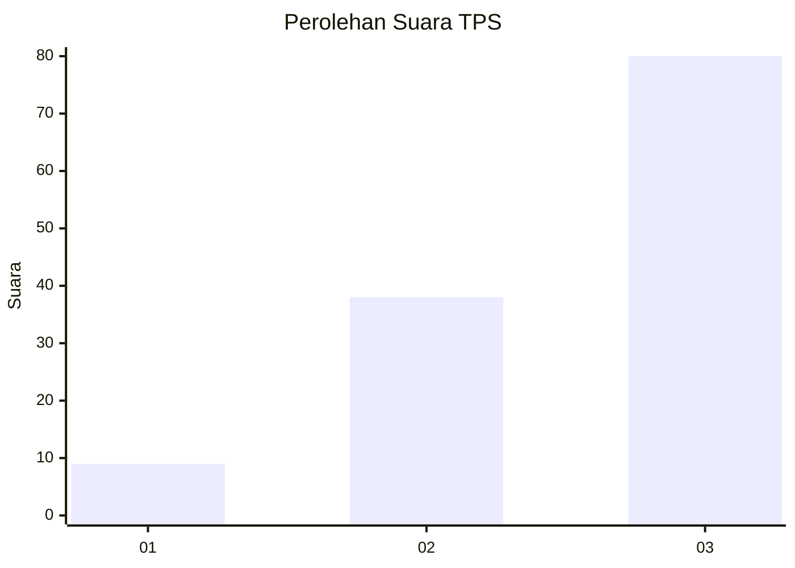
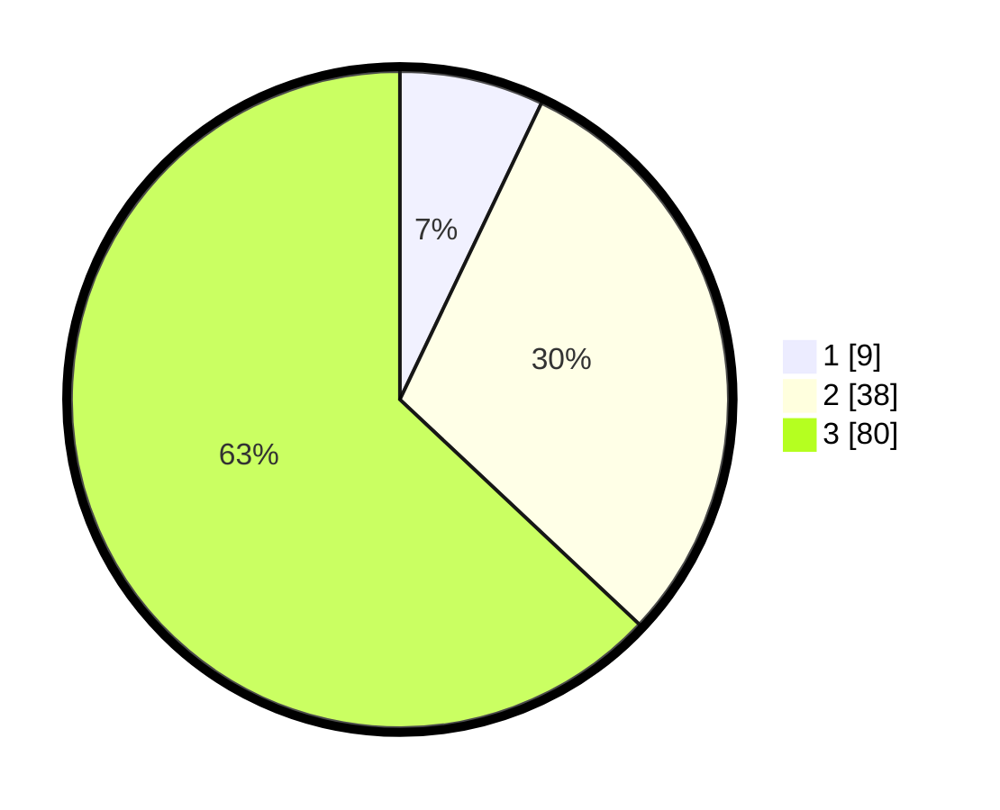

# Hasil

## Grafik

## Tabel

| No. | Nama Paslon    | Suara | Suara (raw) | Persentase |
|:--- |:-------------- | -----:| -----------:| ----------:|
| 1   | ANIES MUHAIMIN | 9     | [9][p-1]    | 7,09       |
| 2   | PRABOWO GIBRAN | 38    | [38][p-2]   | 29,92      |
| 3   | GANJAR MAHFUD  | 80    | [80][p-3]   | 62,99      |

[p-1]: https://github.com/gigit-pemilu/pemilu-2024-91-papua/blob/main/pilpres/hitung-suara/sub/91-papua/sub/06-biak-numfor/sub/18-poiru/sub/2003-sauribru/sub/001-tps/sub/paslon-1.txt
[p-2]: https://github.com/gigit-pemilu/pemilu-2024-91-papua/blob/main/pilpres/hitung-suara/sub/91-papua/sub/06-biak-numfor/sub/18-poiru/sub/2003-sauribru/sub/001-tps/sub/paslon-2.txt
[p-3]: https://github.com/gigit-pemilu/pemilu-2024-91-papua/blob/main/pilpres/hitung-suara/sub/91-papua/sub/06-biak-numfor/sub/18-poiru/sub/2003-sauribru/sub/001-tps/sub/paslon-3.txt

## Foto C Plano

https://sirekap-obj-formc.kpu.go.id/d131/pemilu/ppwp/91/06/18/20/03/9106182003001-20240215-082914--9217f56c-5220-48ef-9c5a-1f421ceef886.jpg

https://sirekap-obj-formc.kpu.go.id/d131/pemilu/ppwp/91/06/18/20/03/9106182003001-20240215-083443--242f9eb0-3ffa-4270-a8c3-8f913a45eb07.jpg

https://sirekap-obj-formc.kpu.go.id/d131/pemilu/ppwp/91/06/18/20/03/9106182003001-20240215-083322--13eaba86-ead9-44eb-9fbe-c4f0d4f5a91e.jpg

## Metadata

| Key        | Value               |
| ---------- | ------------------- |
| Time Stamp | 2024-02-24 22:31:28 |

