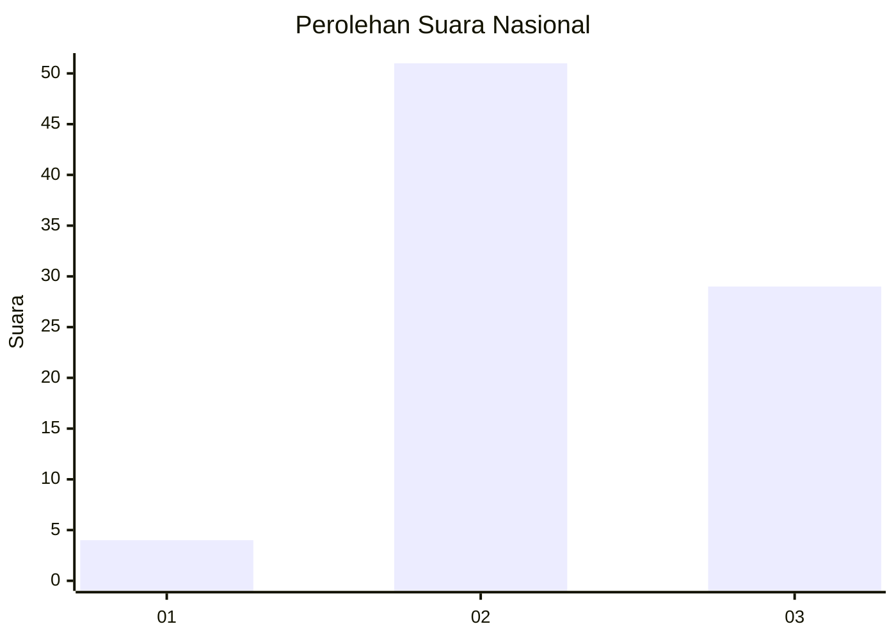
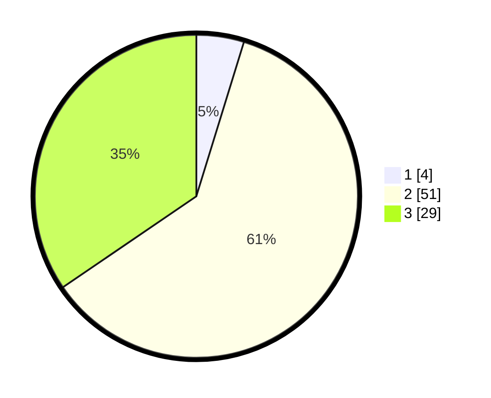

# Hasil

## Grafik

## Tabel

| No. | Nama Paslon    | Suara | Suara (raw) | Persentase |
|:--- |:-------------- | -----:| -----------:| ----------:|
| 1   | ANIES MUHAIMIN | 4     | [4][p-1]    | 4,76       |
| 2   | PRABOWO GIBRAN | 51    | [51][p-2]   | 60,71      |
| 3   | GANJAR MAHFUD  | 29    | [29][p-3]   | 34,52      |

[p-1]: https://github.com/gigit-pemilu/pemilu-2024/blob/main/pilpres/hitung-suara/sub/91-papua/sub/06-biak-numfor/sub/18-poiru/sub/2007-andei-sup/sub/001-tps/sub/paslon-1.txt
[p-2]: https://github.com/gigit-pemilu/pemilu-2024/blob/main/pilpres/hitung-suara/sub/91-papua/sub/06-biak-numfor/sub/18-poiru/sub/2007-andei-sup/sub/001-tps/sub/paslon-2.txt
[p-3]: https://github.com/gigit-pemilu/pemilu-2024/blob/main/pilpres/hitung-suara/sub/91-papua/sub/06-biak-numfor/sub/18-poiru/sub/2007-andei-sup/sub/001-tps/sub/paslon-3.txt

## Foto C Plano

https://sirekap-obj-formc.kpu.go.id/c485/pemilu/ppwp/91/06/18/20/07/9106182007001-20240215-162041--0af6bee6-e165-48a5-ad46-0720e247a1d8.jpg

https://sirekap-obj-formc.kpu.go.id/c485/pemilu/ppwp/91/06/18/20/07/9106182007001-20240215-162230--270e6752-7860-4b71-8f51-2244db33b70b.jpg

https://sirekap-obj-formc.kpu.go.id/c485/pemilu/ppwp/91/06/18/20/07/9106182007001-20240215-162806--d731588c-d205-47c5-ae3f-4abaf9fe1b41.jpg

## Metadata

| Key        | Value               |
| ---------- | ------------------- |
| Time Stamp | 2024-02-25 14:00:00 |

