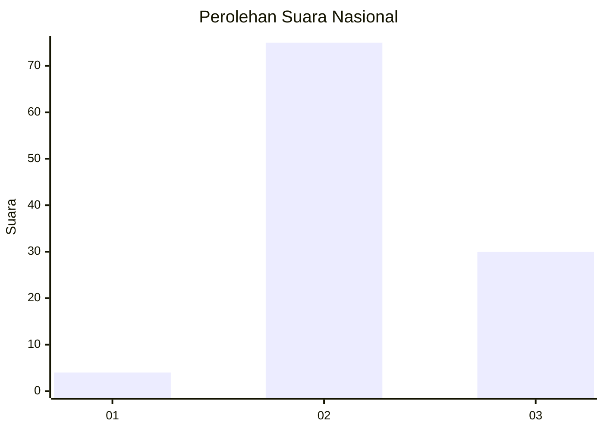
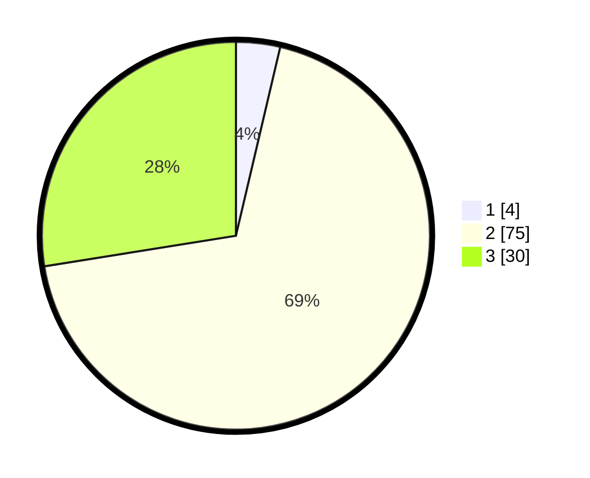

# Hasil

## Grafik

## Tabel

| No. | Nama Paslon    | Suara | Suara (raw) | Persentase |
|:--- |:-------------- | -----:| -----------:| ----------:|
| 1   | ANIES MUHAIMIN | 4     | [4][p-1]    | 3,67       |
| 2   | PRABOWO GIBRAN | 75    | [75][p-2]   | 68,81      |
| 3   | GANJAR MAHFUD  | 30    | [30][p-3]   | 27,52      |

[p-1]: https://github.com/gigit-pemilu/pemilu-2024/blob/main/pilpres/hitung-suara/sub/91-papua/sub/06-biak-numfor/sub/18-poiru/sub/2008-surdori/sub/001-tps/sub/paslon-1.txt
[p-2]: https://github.com/gigit-pemilu/pemilu-2024/blob/main/pilpres/hitung-suara/sub/91-papua/sub/06-biak-numfor/sub/18-poiru/sub/2008-surdori/sub/001-tps/sub/paslon-2.txt
[p-3]: https://github.com/gigit-pemilu/pemilu-2024/blob/main/pilpres/hitung-suara/sub/91-papua/sub/06-biak-numfor/sub/18-poiru/sub/2008-surdori/sub/001-tps/sub/paslon-3.txt

## Foto C Plano

https://sirekap-obj-formc.kpu.go.id/e191/pemilu/ppwp/91/06/18/20/08/9106182008001-20240215-190830--d28d729b-ddfa-4cf1-9bec-fa4446901e74.jpg

https://sirekap-obj-formc.kpu.go.id/e191/pemilu/ppwp/91/06/18/20/08/9106182008001-20240215-173403--80f43211-a820-4a61-8fc8-0bdb7c4e4672.jpg

https://sirekap-obj-formc.kpu.go.id/e191/pemilu/ppwp/91/06/18/20/08/9106182008001-20240215-203750--7601b7a3-4d25-4ad5-87bf-59bf8ee1de57.jpg

## Metadata

| Key        | Value               |
| ---------- | ------------------- |
| Time Stamp | 2024-02-25 11:00:00 |

