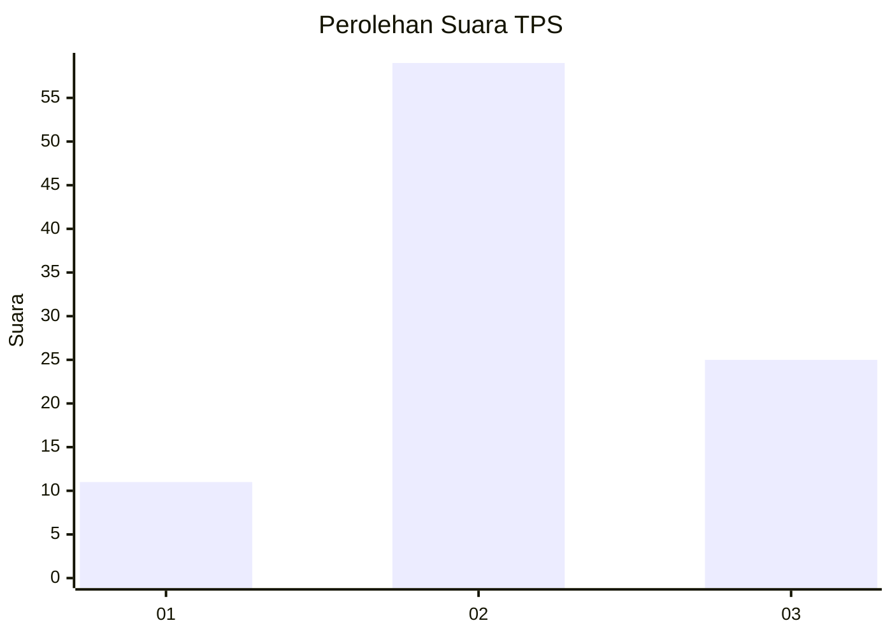
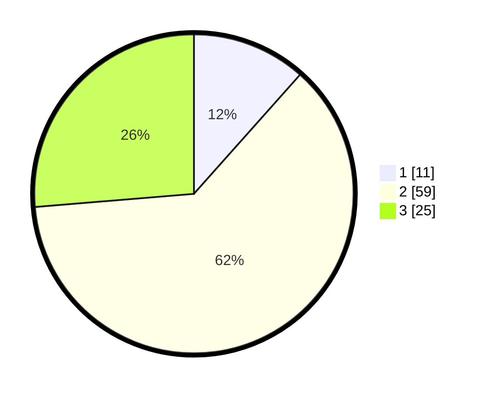

# Hasil

## Grafik

## Tabel

| No. | Nama Paslon    | Suara | Suara (raw) | Persentase |
|:--- |:-------------- | -----:| -----------:| ----------:|
| 1   | ANIES MUHAIMIN | 11    | [11][p-1]   | 11,58      |
| 2   | PRABOWO GIBRAN | 59    | [59][p-2]   | 62,11      |
| 3   | GANJAR MAHFUD  | 25    | [25][p-3]   | 26,32      |

[p-1]: https://github.com/gigit-pemilu/pemilu-2024-91-papua/blob/main/pilpres/hitung-suara/sub/91-papua/sub/06-biak-numfor/sub/19-aimando-padaido/sub/2001-mios-mangguandi/sub/001-tps/sub/paslon-1.txt
[p-2]: https://github.com/gigit-pemilu/pemilu-2024-91-papua/blob/main/pilpres/hitung-suara/sub/91-papua/sub/06-biak-numfor/sub/19-aimando-padaido/sub/2001-mios-mangguandi/sub/001-tps/sub/paslon-2.txt
[p-3]: https://github.com/gigit-pemilu/pemilu-2024-91-papua/blob/main/pilpres/hitung-suara/sub/91-papua/sub/06-biak-numfor/sub/19-aimando-padaido/sub/2001-mios-mangguandi/sub/001-tps/sub/paslon-3.txt

## Foto C Plano

https://sirekap-obj-formc.kpu.go.id/ac0f/pemilu/ppwp/91/06/19/20/01/9106192001001-20240215-180727--eb880abe-10b7-4bbb-b339-7c0f57a0a866.jpg

https://sirekap-obj-formc.kpu.go.id/ac0f/pemilu/ppwp/91/06/19/20/01/9106192001001-20240215-181102--1ae57e94-9782-4afe-bece-2421022841df.jpg

https://sirekap-obj-formc.kpu.go.id/ac0f/pemilu/ppwp/91/06/19/20/01/9106192001001-20240215-181253--ebd53fb8-5ba4-40b5-946f-b11ded32f0b2.jpg

## Metadata

| Key        | Value               |
| ---------- | ------------------- |
| Time Stamp | 2024-02-25 15:00:00 |

