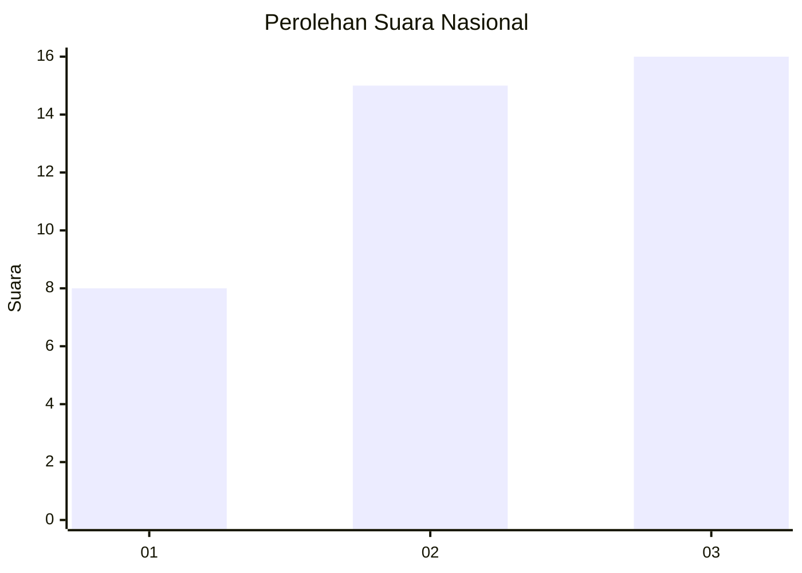
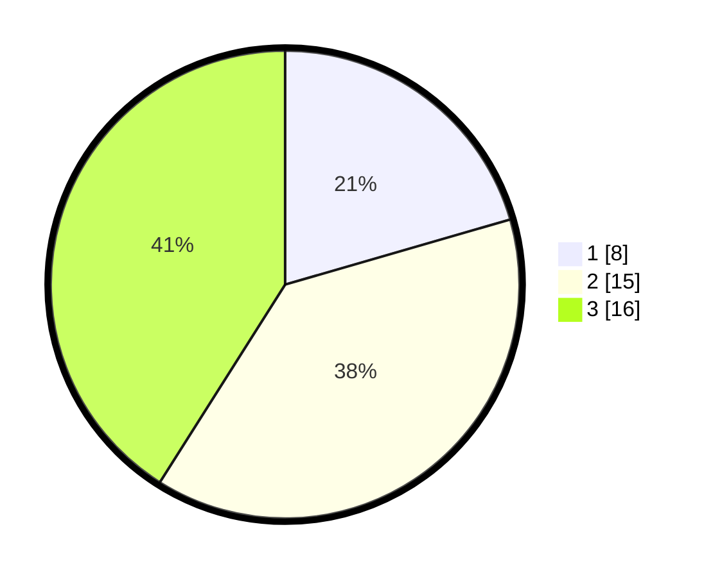

# Hasil

## Grafik

## Tabel

| No. | Nama Paslon    | Suara | Suara (raw) | Persentase |
|:--- |:-------------- | -----:| -----------:| ----------:|
| 1   | ANIES MUHAIMIN | 8     | [8][p-1]    | 20,51      |
| 2   | PRABOWO GIBRAN | 15    | [15][p-2]   | 38,46      |
| 3   | GANJAR MAHFUD  | 16    | [16][p-3]   | 41,03      |

[p-1]: https://github.com/gigit-pemilu/pemilu-2024/blob/main/pilpres/hitung-suara/sub/91-papua/sub/06-biak-numfor/sub/19-aimando-padaido/sub/2006-karabai/sub/001-tps/sub/paslon-1.txt
[p-2]: https://github.com/gigit-pemilu/pemilu-2024/blob/main/pilpres/hitung-suara/sub/91-papua/sub/06-biak-numfor/sub/19-aimando-padaido/sub/2006-karabai/sub/001-tps/sub/paslon-2.txt
[p-3]: https://github.com/gigit-pemilu/pemilu-2024/blob/main/pilpres/hitung-suara/sub/91-papua/sub/06-biak-numfor/sub/19-aimando-padaido/sub/2006-karabai/sub/001-tps/sub/paslon-3.txt

## Foto C Plano

https://sirekap-obj-formc.kpu.go.id/06a4/pemilu/ppwp/91/06/19/20/06/9106192006001-20240215-234528--e48561ee-2ac1-475a-b296-5cfef25a07bd.jpg

https://sirekap-obj-formc.kpu.go.id/06a4/pemilu/ppwp/91/06/19/20/06/9106192006001-20240215-234027--9928a659-5ce6-492e-bf15-c24b4ee2af45.jpg

https://sirekap-obj-formc.kpu.go.id/06a4/pemilu/ppwp/91/06/19/20/06/9106192006001-20240215-234259--e5469427-d2f0-4ade-bbd3-05756b40eb62.jpg

## Metadata

| Key        | Value               |
| ---------- | ------------------- |
| Time Stamp | 2024-02-19 17:00:00 |

## DATA PEMILIH TETAP

Jumlah pemilih dalam DPT: **39**.
 * L: **18**.
 * P: **21**.

## DATA PENGGUNA HAK PILIH

Jumlah pengguna hak pilih dalam DPT: **37**.
 * L: **17**.
 * P: **20**.

Jumlah pengguna hak pilih dalam DPTb: **2**.
 * L: **1**.
 * P: **1**.

Jumlah pengguna hak pilih dalam DPK: **0**.
 * L: **0**.
 * P: **0**.

Jumlah pengguna hak pilih: **39**.
 * L: **18**.
 * P: **21**.

## JUMLAH SUARA SAH DAN TIDAK SAH

JUMLAH SELURUH SUARA SAH: **39**.

JUMLAH SUARA TIDAK SAH: **0**.

JUMLAH SELURUH SUARA SAH DAN SUARA TIDAK SAH: **39**.

