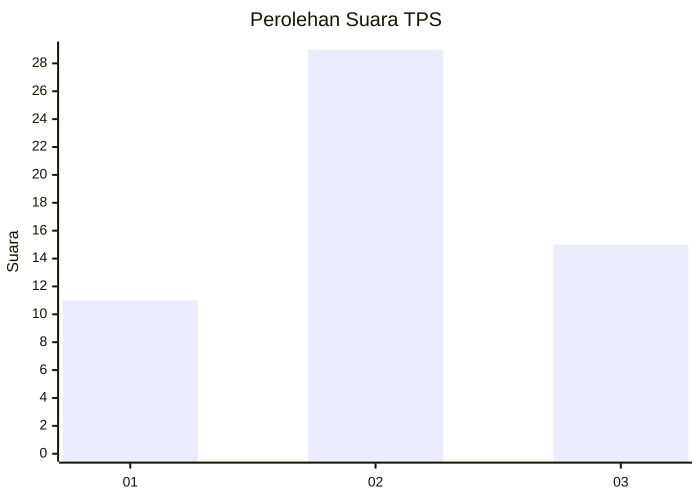
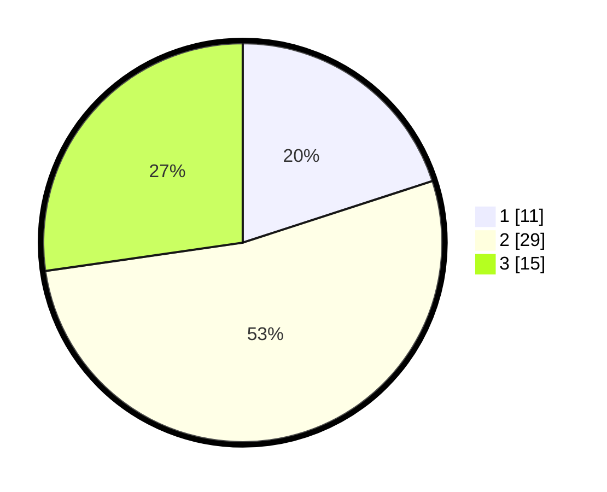

# Hasil

## Grafik

## Tabel

| No. | Nama Paslon    | Suara | Suara (raw) | Persentase |
|:--- |:-------------- | -----:| -----------:| ----------:|
| 1   | ANIES MUHAIMIN | 11    | [11][p-1]   | 20,00      |
| 2   | PRABOWO GIBRAN | 29    | [29][p-2]   | 52,73      |
| 3   | GANJAR MAHFUD  | 15    | [15][p-3]   | 27,27      |

[p-1]: https://github.com/gigit-pemilu/pemilu-2024-91-papua/blob/main/pilpres/hitung-suara/sub/91-papua/sub/06-biak-numfor/sub/19-aimando-padaido/sub/2010-padaido/sub/001-tps/sub/paslon-1.txt
[p-2]: https://github.com/gigit-pemilu/pemilu-2024-91-papua/blob/main/pilpres/hitung-suara/sub/91-papua/sub/06-biak-numfor/sub/19-aimando-padaido/sub/2010-padaido/sub/001-tps/sub/paslon-2.txt
[p-3]: https://github.com/gigit-pemilu/pemilu-2024-91-papua/blob/main/pilpres/hitung-suara/sub/91-papua/sub/06-biak-numfor/sub/19-aimando-padaido/sub/2010-padaido/sub/001-tps/sub/paslon-3.txt

## Foto C Plano

https://sirekap-obj-formc.kpu.go.id/a48a/pemilu/ppwp/91/06/19/20/10/9106192010001-20240214-213419--b8c24f82-fd17-49f9-bc13-163977aaa70f.jpg

https://sirekap-obj-formc.kpu.go.id/a48a/pemilu/ppwp/91/06/19/20/10/9106192010001-20240214-213616--cb4ed9bb-031d-4ab4-a650-75dac7aa109b.jpg

https://sirekap-obj-formc.kpu.go.id/a48a/pemilu/ppwp/91/06/19/20/10/9106192010001-20240214-213742--f28a93e3-901a-447f-a2b3-5aa0270e78a7.jpg

## Metadata

| Key        | Value               |
| ---------- | ------------------- |
| Time Stamp | 2024-02-25 13:00:00 |

