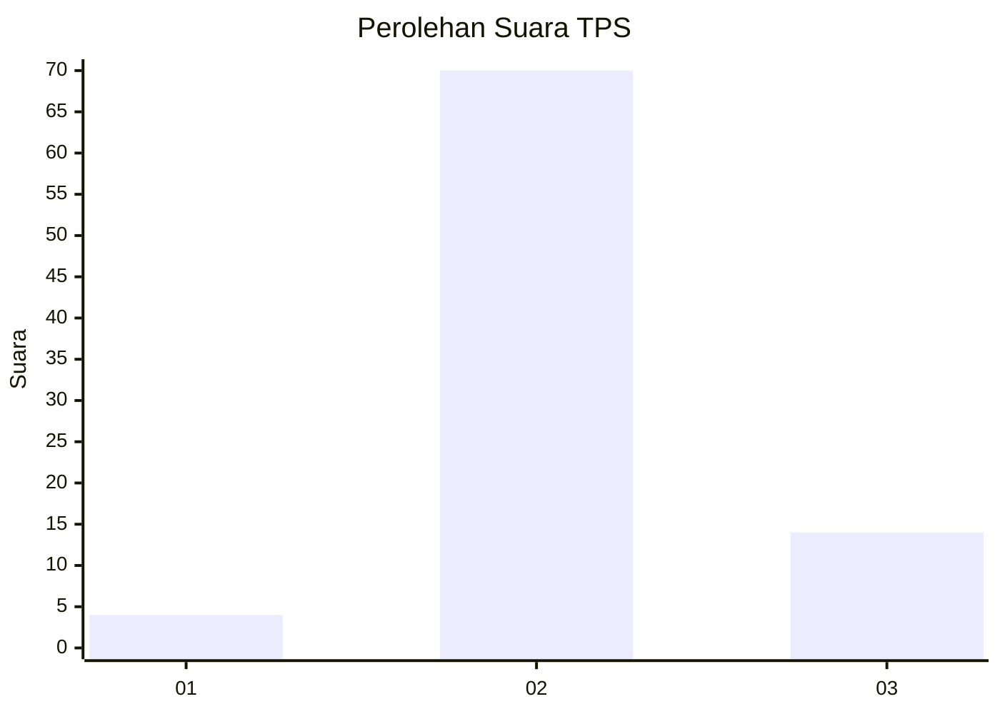
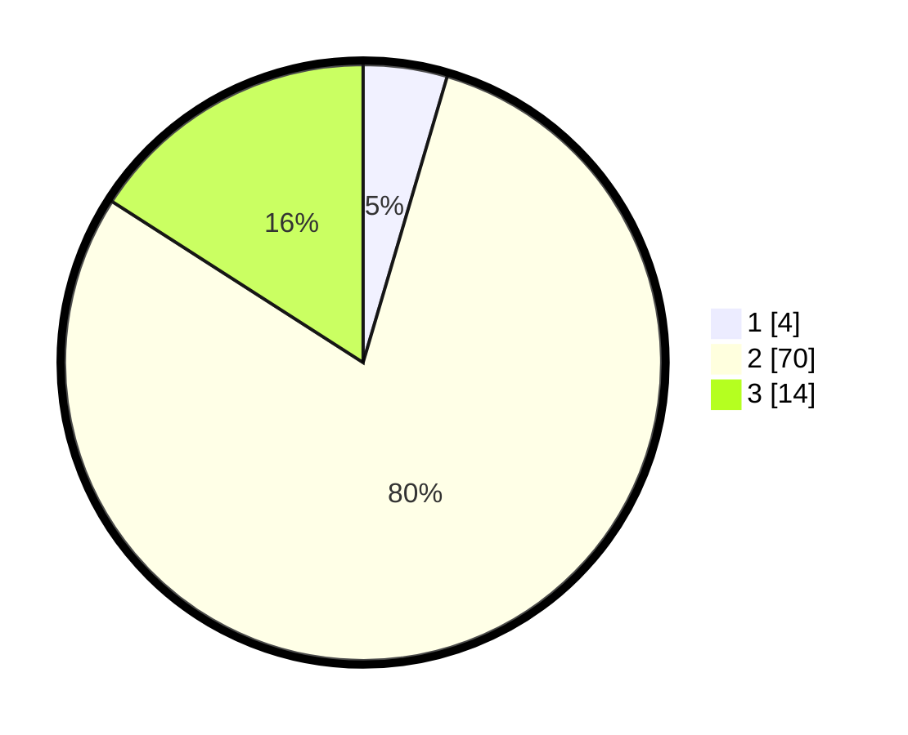

# Hasil

## Grafik

## Tabel

| No. | Nama Paslon    | Suara | Suara (raw) | Persentase |
|:--- |:-------------- | -----:| -----------:| ----------:|
| 1   | ANIES MUHAIMIN | 4     | [4][p-1]    | 4,55       |
| 2   | PRABOWO GIBRAN | 70    | [70][p-2]   | 79,55      |
| 3   | GANJAR MAHFUD  | 14    | [14][p-3]   | 15,91      |

[p-1]: https://github.com/gigit-pemilu/pemilu-2024-91-papua/blob/main/pilpres/hitung-suara/sub/91-papua/sub/06-biak-numfor/sub/19-aimando-padaido/sub/2011-yeri/sub/001-tps/sub/paslon-1.txt
[p-2]: https://github.com/gigit-pemilu/pemilu-2024-91-papua/blob/main/pilpres/hitung-suara/sub/91-papua/sub/06-biak-numfor/sub/19-aimando-padaido/sub/2011-yeri/sub/001-tps/sub/paslon-2.txt
[p-3]: https://github.com/gigit-pemilu/pemilu-2024-91-papua/blob/main/pilpres/hitung-suara/sub/91-papua/sub/06-biak-numfor/sub/19-aimando-padaido/sub/2011-yeri/sub/001-tps/sub/paslon-3.txt

## Foto C Plano

https://sirekap-obj-formc.kpu.go.id/ae01/pemilu/ppwp/91/06/19/20/11/9106192011001-20240215-155841--9d7d6af8-53f4-443f-89a4-bf147007ddf4.jpg

https://sirekap-obj-formc.kpu.go.id/ae01/pemilu/ppwp/91/06/19/20/11/9106192011001-20240215-160318--a7c37d0b-fba5-4148-857e-5db34a50b445.jpg

https://sirekap-obj-formc.kpu.go.id/ae01/pemilu/ppwp/91/06/19/20/11/9106192011001-20240215-161221--37d42b91-a83d-4df0-9f24-70d3aebbd77b.jpg

## Metadata

| Key        | Value               |
| ---------- | ------------------- |
| Time Stamp | 2024-02-24 22:31:28 |

