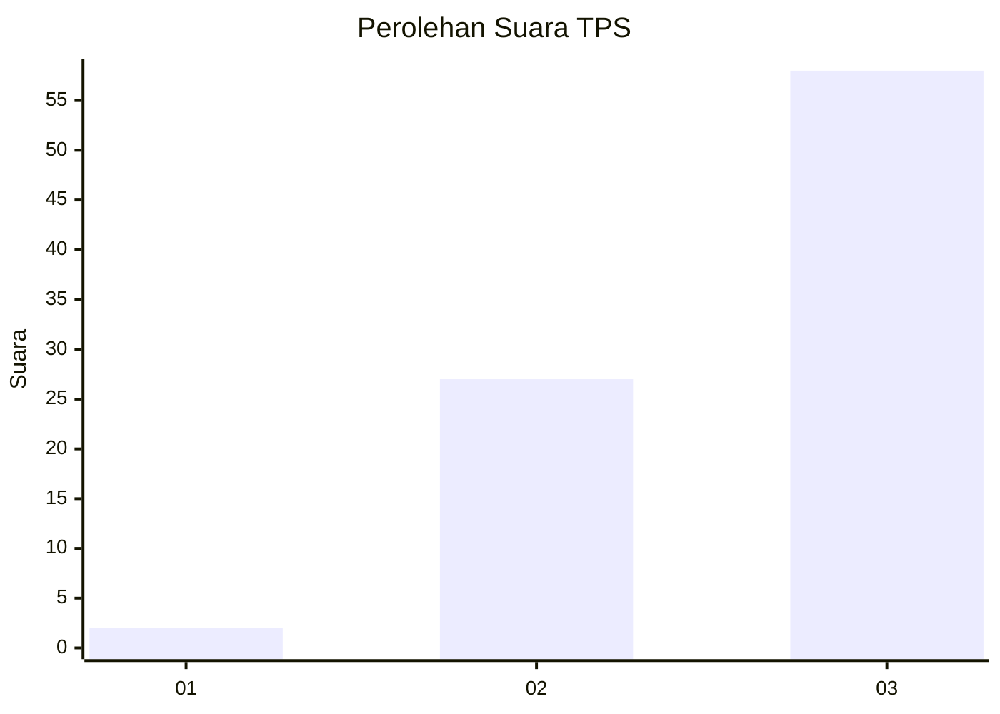
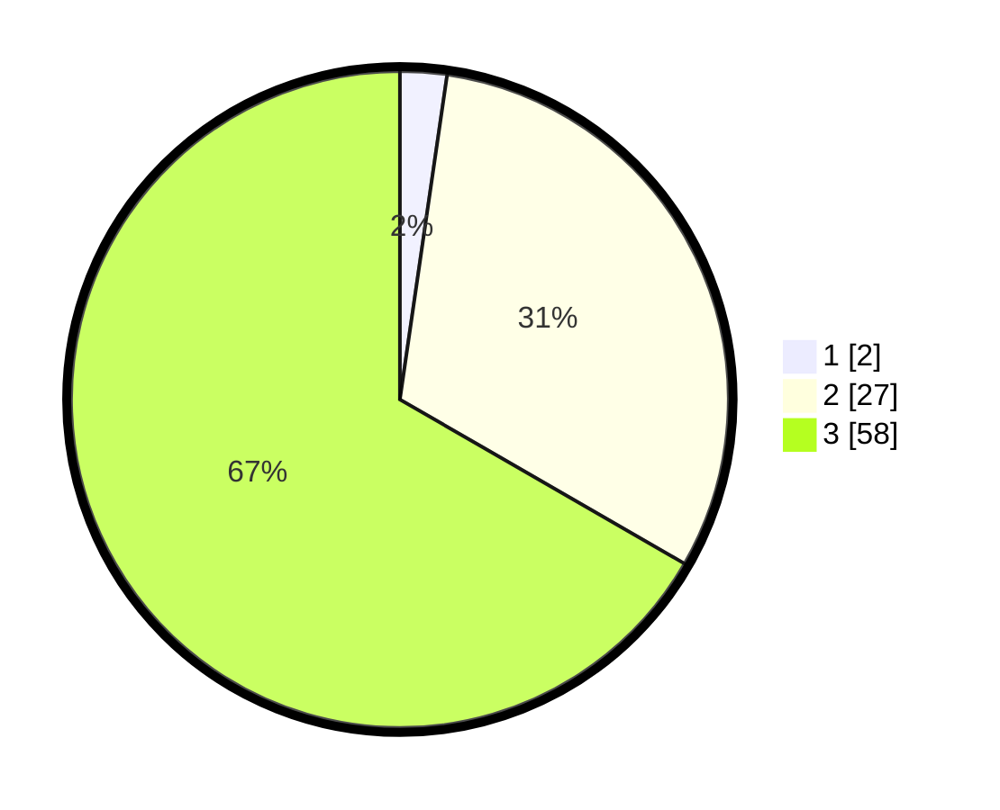

# Hasil

## Grafik

## Tabel

| No. | Nama Paslon    | Suara | Suara (raw) | Persentase |
|:--- |:-------------- | -----:| -----------:| ----------:|
| 1   | ANIES MUHAIMIN | 2     | [2][p-1]    | 2,30       |
| 2   | PRABOWO GIBRAN | 27    | [27][p-2]   | 31,03      |
| 3   | GANJAR MAHFUD  | 58    | [58][p-3]   | 66,67      |

[p-1]: https://github.com/gigit-pemilu/pemilu-2024-91-papua/blob/main/pilpres/hitung-suara/sub/91-papua/sub/06-biak-numfor/sub/19-aimando-padaido/sub/2012-anobo/sub/001-tps/sub/paslon-1.txt
[p-2]: https://github.com/gigit-pemilu/pemilu-2024-91-papua/blob/main/pilpres/hitung-suara/sub/91-papua/sub/06-biak-numfor/sub/19-aimando-padaido/sub/2012-anobo/sub/001-tps/sub/paslon-2.txt
[p-3]: https://github.com/gigit-pemilu/pemilu-2024-91-papua/blob/main/pilpres/hitung-suara/sub/91-papua/sub/06-biak-numfor/sub/19-aimando-padaido/sub/2012-anobo/sub/001-tps/sub/paslon-3.txt

## Foto C Plano

https://sirekap-obj-formc.kpu.go.id/87b6/pemilu/ppwp/91/06/19/20/12/9106192012001-20240215-092445--d80a4fa7-a6c7-4432-a40f-9fe069a23be9.jpg

https://sirekap-obj-formc.kpu.go.id/87b6/pemilu/ppwp/91/06/19/20/12/9106192012001-20240215-092554--12b43a34-d680-4f71-b777-d4d5c4992e95.jpg

https://sirekap-obj-formc.kpu.go.id/87b6/pemilu/ppwp/91/06/19/20/12/9106192012001-20240215-092715--171ff660-bf17-491d-b257-adbe4d55b6ba.jpg

## Metadata

| Key        | Value               |
| ---------- | ------------------- |
| Time Stamp | 2024-02-25 13:00:00 |

