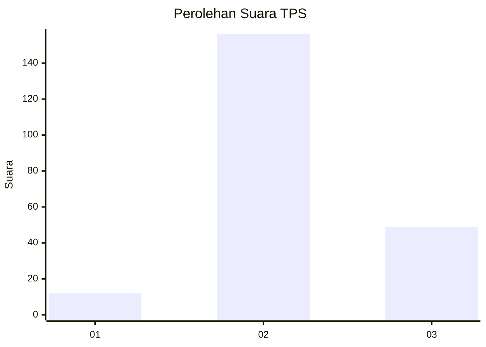
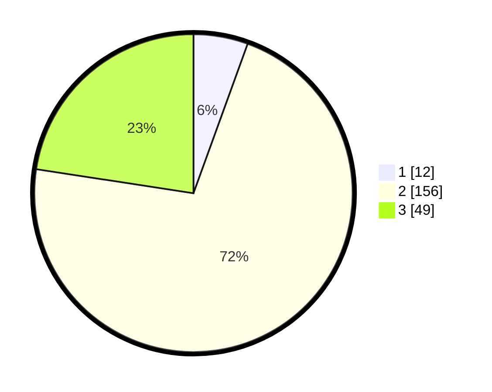

# Hasil

## Grafik

## Tabel

| No. | Nama Paslon    | Suara | Suara (raw) | Persentase |
|:--- |:-------------- | -----:| -----------:| ----------:|
| 1   | ANIES MUHAIMIN | 12    | [12][p-1]   | 5,53       |
| 2   | PRABOWO GIBRAN | 156   | [156][p-2]  | 71,89      |
| 3   | GANJAR MAHFUD  | 49    | [49][p-3]   | 22,58      |

[p-1]: https://github.com/gigit-pemilu/pemilu-2024-91-papua/blob/main/pilpres/hitung-suara/sub/91-papua/sub/06-biak-numfor/sub/20-oridek/sub/2002-bakribo/sub/001-tps/sub/paslon-1.txt
[p-2]: https://github.com/gigit-pemilu/pemilu-2024-91-papua/blob/main/pilpres/hitung-suara/sub/91-papua/sub/06-biak-numfor/sub/20-oridek/sub/2002-bakribo/sub/001-tps/sub/paslon-2.txt
[p-3]: https://github.com/gigit-pemilu/pemilu-2024-91-papua/blob/main/pilpres/hitung-suara/sub/91-papua/sub/06-biak-numfor/sub/20-oridek/sub/2002-bakribo/sub/001-tps/sub/paslon-3.txt

## Foto C Plano

https://sirekap-obj-formc.kpu.go.id/2dff/pemilu/ppwp/91/06/20/20/02/9106202002001-20240215-194509--e70b0937-e206-4f20-aac3-fd018b1b704d.jpg

https://sirekap-obj-formc.kpu.go.id/2dff/pemilu/ppwp/91/06/20/20/02/9106202002001-20240215-194553--c9ab5b4a-cdbf-4397-9c59-ba0e8d233def.jpg

https://sirekap-obj-formc.kpu.go.id/2dff/pemilu/ppwp/91/06/20/20/02/9106202002001-20240215-194626--5923248a-4ba8-4714-bd44-ecfa15d5f045.jpg

## Metadata

| Key        | Value               |
| ---------- | ------------------- |
| Time Stamp | 2024-02-24 22:31:28 |

