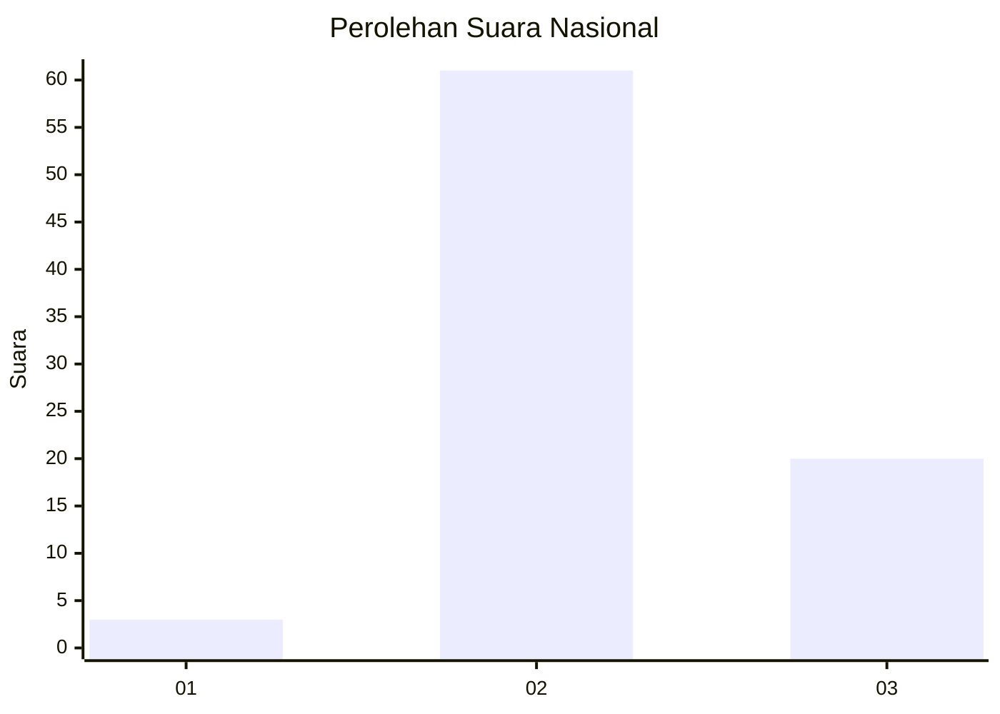
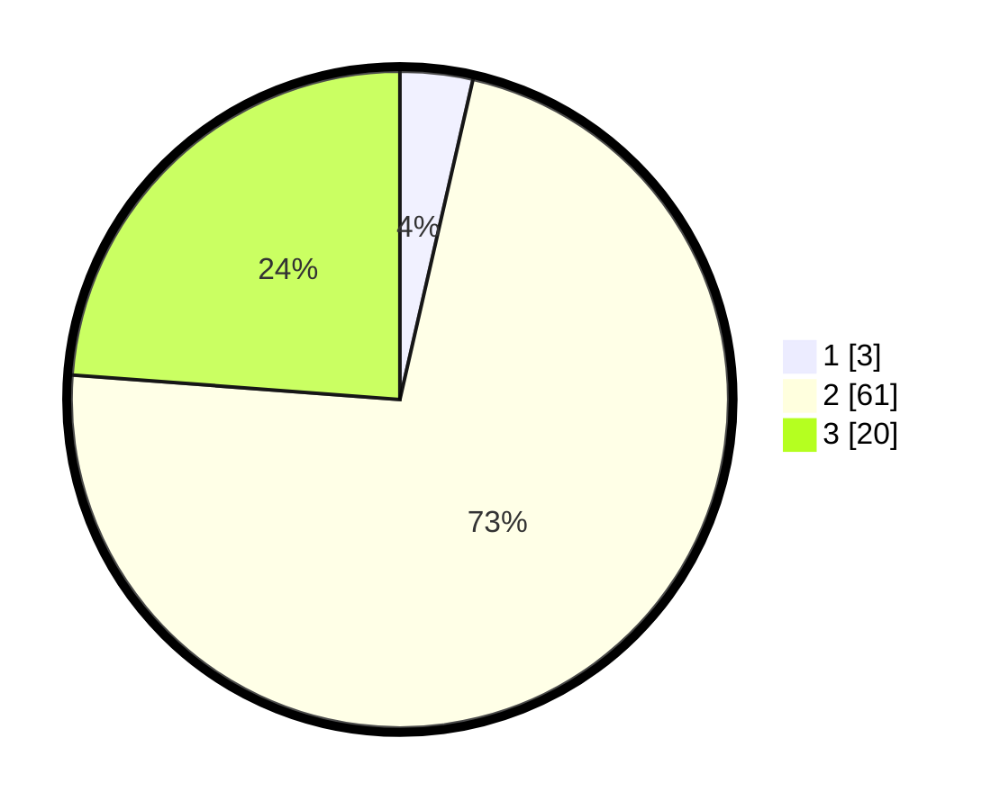

# Hasil

## Grafik

## Tabel

| No. | Nama Paslon    | Suara | Suara (raw) | Persentase |
|:--- |:-------------- | -----:| -----------:| ----------:|
| 1   | ANIES MUHAIMIN | 3     | [3][p-1]    | 3,57       |
| 2   | PRABOWO GIBRAN | 61    | [61][p-2]   | 72,62      |
| 3   | GANJAR MAHFUD  | 20    | [20][p-3]   | 23,81      |

[p-1]: https://github.com/gigit-pemilu/pemilu-2024/blob/main/pilpres/hitung-suara/sub/91-papua/sub/06-biak-numfor/sub/20-oridek/sub/2004-marauw/sub/001-tps/sub/paslon-1.txt
[p-2]: https://github.com/gigit-pemilu/pemilu-2024/blob/main/pilpres/hitung-suara/sub/91-papua/sub/06-biak-numfor/sub/20-oridek/sub/2004-marauw/sub/001-tps/sub/paslon-2.txt
[p-3]: https://github.com/gigit-pemilu/pemilu-2024/blob/main/pilpres/hitung-suara/sub/91-papua/sub/06-biak-numfor/sub/20-oridek/sub/2004-marauw/sub/001-tps/sub/paslon-3.txt

## Foto C Plano

https://sirekap-obj-formc.kpu.go.id/5030/pemilu/ppwp/91/06/20/20/04/9106202004001-20240215-143353--bbe90994-ca3c-4cf5-9eb9-fc02ce5d912f.jpg

https://sirekap-obj-formc.kpu.go.id/5030/pemilu/ppwp/91/06/20/20/04/9106202004001-20240215-143558--ce36c271-c1c4-4953-9573-7c62008acb7d.jpg

https://sirekap-obj-formc.kpu.go.id/5030/pemilu/ppwp/91/06/20/20/04/9106202004001-20240215-200330--2cd055a8-5d99-497c-8c4d-4456675bd6da.jpg

## Metadata

| Key        | Value               |
| ---------- | ------------------- |
| Time Stamp | 2024-02-24 23:00:00 |

