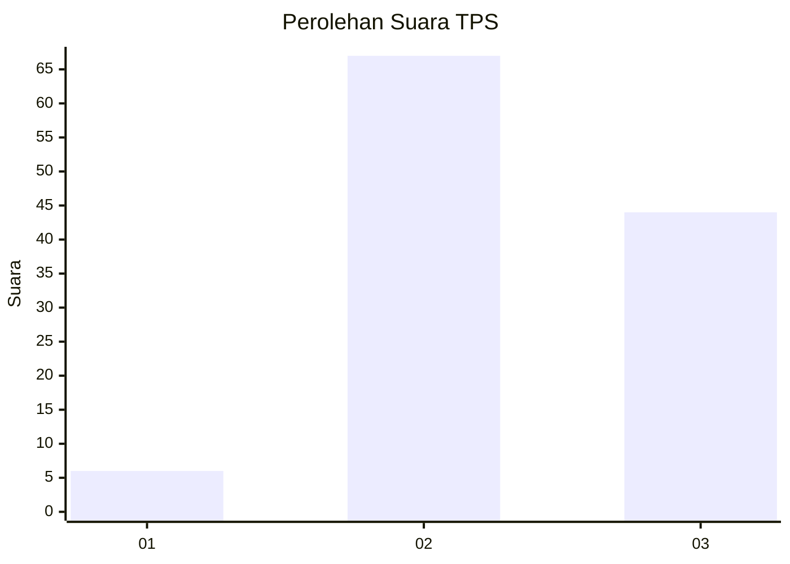
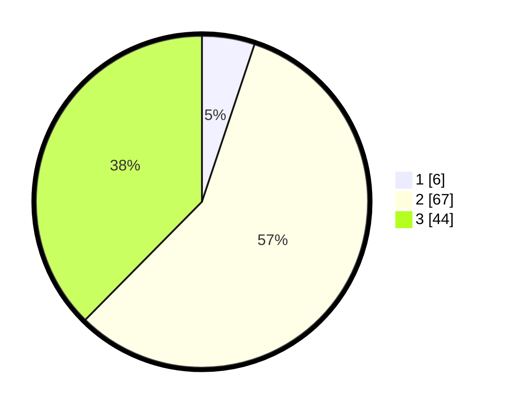

# Hasil

## Grafik

## Tabel

| No. | Nama Paslon    | Suara | Suara (raw) | Persentase |
|:--- |:-------------- | -----:| -----------:| ----------:|
| 1   | ANIES MUHAIMIN | 6     | [6][p-1]    | 5,13       |
| 2   | PRABOWO GIBRAN | 67    | [67][p-2]   | 57,26      |
| 3   | GANJAR MAHFUD  | 44    | [44][p-3]   | 37,61      |

[p-1]: https://github.com/gigit-pemilu/pemilu-2024-91-papua/blob/main/pilpres/hitung-suara/sub/91-papua/sub/06-biak-numfor/sub/20-oridek/sub/2007-anggaduber/sub/001-tps/sub/paslon-1.txt
[p-2]: https://github.com/gigit-pemilu/pemilu-2024-91-papua/blob/main/pilpres/hitung-suara/sub/91-papua/sub/06-biak-numfor/sub/20-oridek/sub/2007-anggaduber/sub/001-tps/sub/paslon-2.txt
[p-3]: https://github.com/gigit-pemilu/pemilu-2024-91-papua/blob/main/pilpres/hitung-suara/sub/91-papua/sub/06-biak-numfor/sub/20-oridek/sub/2007-anggaduber/sub/001-tps/sub/paslon-3.txt

## Foto C Plano

https://sirekap-obj-formc.kpu.go.id/8374/pemilu/ppwp/91/06/20/20/07/9106202007001-20240215-162408--32f666f2-216e-488e-a64c-8096d4692c40.jpg

https://sirekap-obj-formc.kpu.go.id/8374/pemilu/ppwp/91/06/20/20/07/9106202007001-20240215-194456--1f8f42aa-4d87-49ce-8609-f131b33a7ff5.jpg

https://sirekap-obj-formc.kpu.go.id/8374/pemilu/ppwp/91/06/20/20/07/9106202007001-20240215-194817--893281f4-9cc3-4229-83df-6b000190a6da.jpg

## Metadata

| Key        | Value               |
| ---------- | ------------------- |
| Time Stamp | 2024-02-25 21:00:00 |

