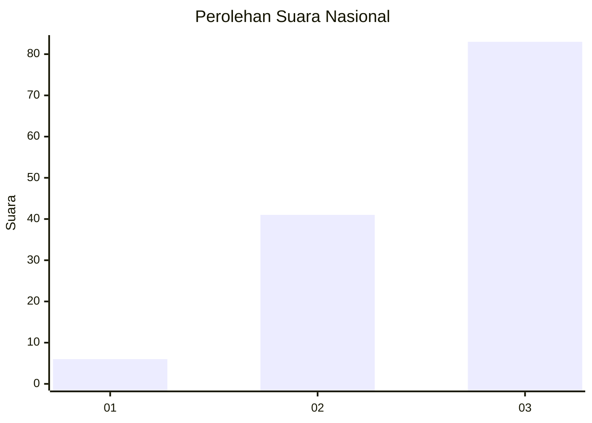
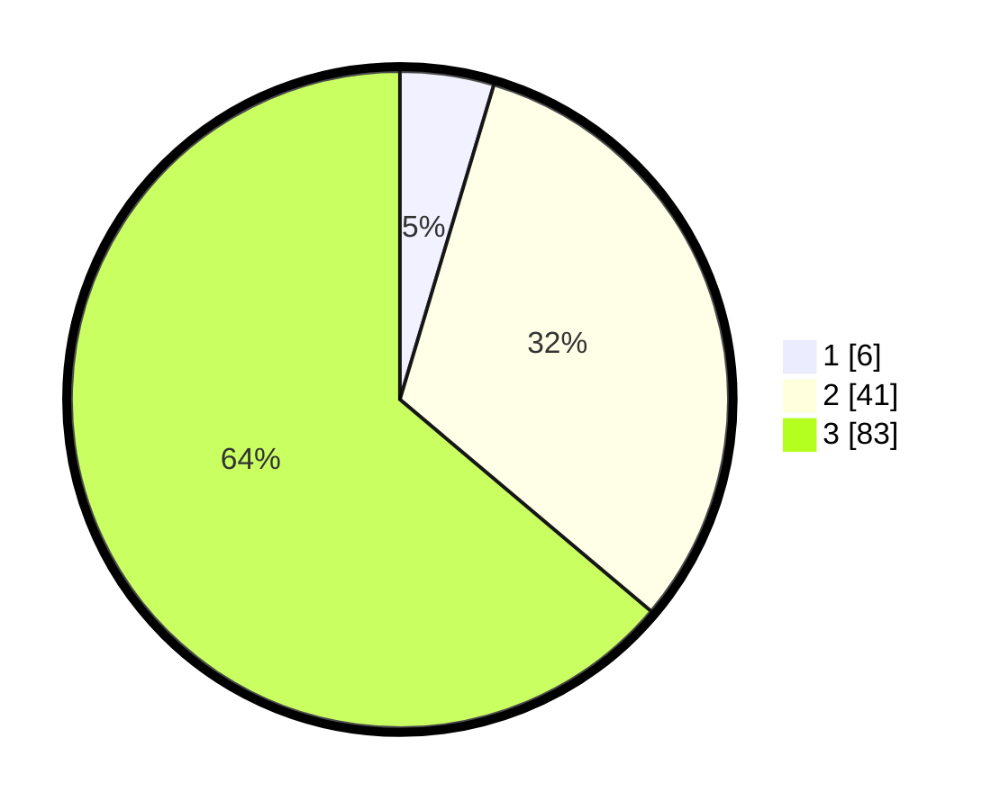

# Hasil

## Grafik

## Tabel

| No. | Nama Paslon    | Suara | Suara (raw) | Persentase |
|:--- |:-------------- | -----:| -----------:| ----------:|
| 1   | ANIES MUHAIMIN | 6     | [6][p-1]    | 4,62       |
| 2   | PRABOWO GIBRAN | 41    | [41][p-2]   | 31,54      |
| 3   | GANJAR MAHFUD  | 83    | [83][p-3]   | 63,85      |

[p-1]: https://github.com/gigit-pemilu/pemilu-2024/blob/main/pilpres/hitung-suara/sub/91-papua/sub/06-biak-numfor/sub/20-oridek/sub/2008-animi/sub/001-tps/sub/paslon-1.txt
[p-2]: https://github.com/gigit-pemilu/pemilu-2024/blob/main/pilpres/hitung-suara/sub/91-papua/sub/06-biak-numfor/sub/20-oridek/sub/2008-animi/sub/001-tps/sub/paslon-2.txt
[p-3]: https://github.com/gigit-pemilu/pemilu-2024/blob/main/pilpres/hitung-suara/sub/91-papua/sub/06-biak-numfor/sub/20-oridek/sub/2008-animi/sub/001-tps/sub/paslon-3.txt

## Foto C Plano

https://sirekap-obj-formc.kpu.go.id/7046/pemilu/ppwp/91/06/20/20/08/9106202008001-20240215-220359--b0ccdef0-2445-4379-bced-a0380484608e.jpg

https://sirekap-obj-formc.kpu.go.id/7046/pemilu/ppwp/91/06/20/20/08/9106202008001-20240215-221013--8a6302ca-9d0e-49e8-af73-9aaa31eac8c3.jpg

https://sirekap-obj-formc.kpu.go.id/7046/pemilu/ppwp/91/06/20/20/08/9106202008001-20240215-175845--22c754f5-712c-41ad-8ef9-bd2b28d77817.jpg

## Metadata

| Key        | Value               |
| ---------- | ------------------- |
| Time Stamp | 2024-02-24 22:31:28 |

