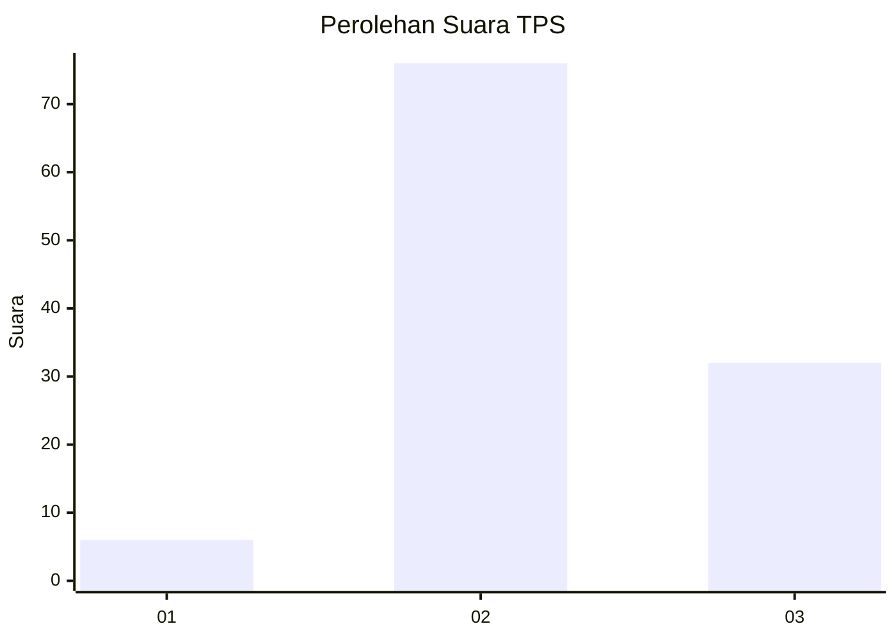
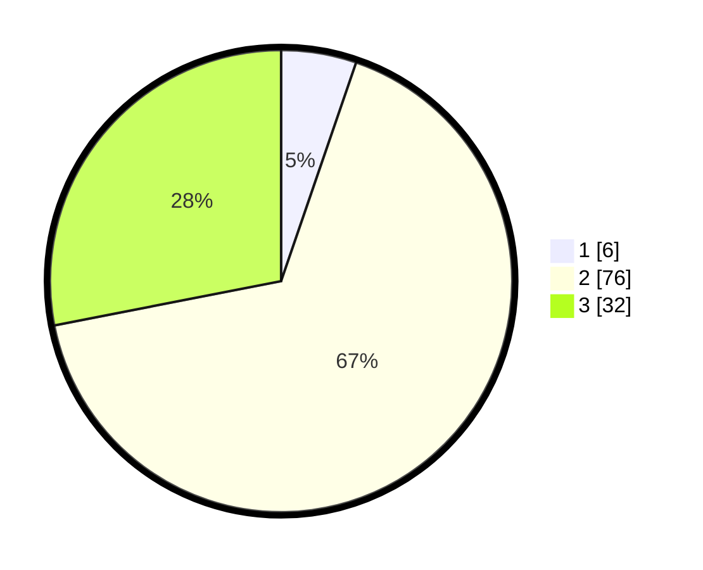

# Hasil

## Grafik

## Tabel

| No. | Nama Paslon    | Suara | Suara (raw) | Persentase |
|:--- |:-------------- | -----:| -----------:| ----------:|
| 1   | ANIES MUHAIMIN | 6     | [6][p-1]    | 5,26       |
| 2   | PRABOWO GIBRAN | 76    | [76][p-2]   | 66,67      |
| 3   | GANJAR MAHFUD  | 32    | [32][p-3]   | 28,07      |

[p-1]: https://github.com/gigit-pemilu/pemilu-2024-91-papua/blob/main/pilpres/hitung-suara/sub/91-papua/sub/06-biak-numfor/sub/20-oridek/sub/2009-kakur/sub/001-tps/sub/paslon-1.txt
[p-2]: https://github.com/gigit-pemilu/pemilu-2024-91-papua/blob/main/pilpres/hitung-suara/sub/91-papua/sub/06-biak-numfor/sub/20-oridek/sub/2009-kakur/sub/001-tps/sub/paslon-2.txt
[p-3]: https://github.com/gigit-pemilu/pemilu-2024-91-papua/blob/main/pilpres/hitung-suara/sub/91-papua/sub/06-biak-numfor/sub/20-oridek/sub/2009-kakur/sub/001-tps/sub/paslon-3.txt

## Foto C Plano

https://sirekap-obj-formc.kpu.go.id/9461/pemilu/ppwp/91/06/20/20/09/9106202009001-20240215-211934--3777704e-118b-448e-b44b-fe4292c4dfcc.jpg

https://sirekap-obj-formc.kpu.go.id/9461/pemilu/ppwp/91/06/20/20/09/9106202009001-20240215-113217--23211c4a-d31d-4374-ab84-1a79e64c94a0.jpg

https://sirekap-obj-formc.kpu.go.id/9461/pemilu/ppwp/91/06/20/20/09/9106202009001-20240215-174928--1c2f9fa6-26a1-454d-969f-923f7b9c0aa4.jpg

## Metadata

| Key        | Value               |
| ---------- | ------------------- |
| Time Stamp | 2024-02-24 22:31:28 |

