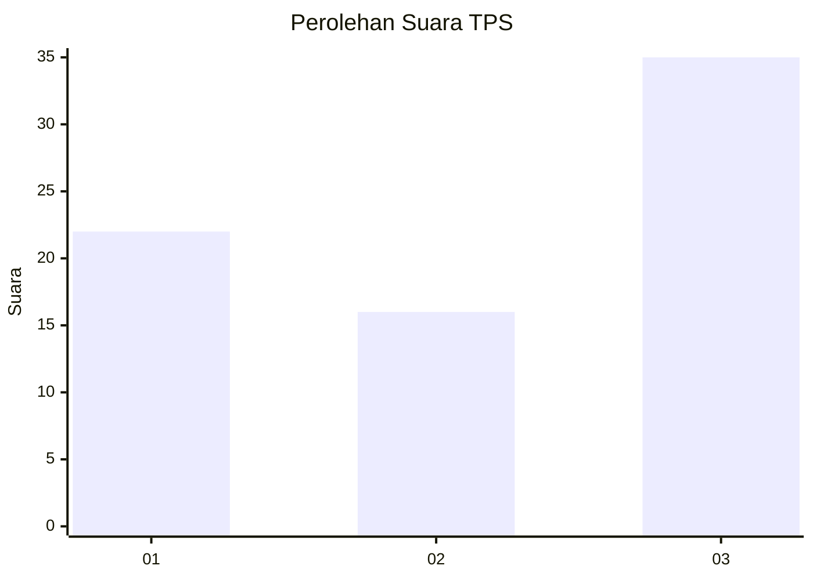
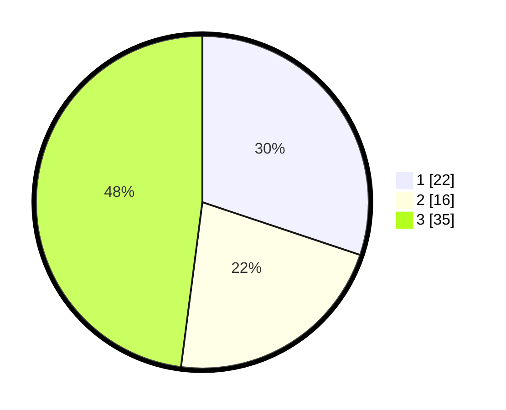

# Hasil

## Grafik

## Tabel

| No. | Nama Paslon    | Suara | Suara (raw) | Persentase |
|:--- |:-------------- | -----:| -----------:| ----------:|
| 1   | ANIES MUHAIMIN | 22    | [22][p-1]   | 30,14      |
| 2   | PRABOWO GIBRAN | 16    | [16][p-2]   | 21,92      |
| 3   | GANJAR MAHFUD  | 35    | [35][p-3]   | 47,95      |

[p-1]: https://github.com/gigit-pemilu/pemilu-2024-91-papua/blob/main/pilpres/hitung-suara/sub/91-papua/sub/06-biak-numfor/sub/21-bondifuar/sub/2001-wopes/sub/001-tps/sub/paslon-1.txt
[p-2]: https://github.com/gigit-pemilu/pemilu-2024-91-papua/blob/main/pilpres/hitung-suara/sub/91-papua/sub/06-biak-numfor/sub/21-bondifuar/sub/2001-wopes/sub/001-tps/sub/paslon-2.txt
[p-3]: https://github.com/gigit-pemilu/pemilu-2024-91-papua/blob/main/pilpres/hitung-suara/sub/91-papua/sub/06-biak-numfor/sub/21-bondifuar/sub/2001-wopes/sub/001-tps/sub/paslon-3.txt

## Foto C Plano

https://sirekap-obj-formc.kpu.go.id/528d/pemilu/ppwp/91/06/21/20/01/9106212001001-20240215-083829--6955e713-53d0-4bb3-983d-bd5a052dc8f8.jpg

https://sirekap-obj-formc.kpu.go.id/528d/pemilu/ppwp/91/06/21/20/01/9106212001001-20240215-084843--a6108ce2-6ac1-4191-b3aa-3895a893548b.jpg

https://sirekap-obj-formc.kpu.go.id/528d/pemilu/ppwp/91/06/21/20/01/9106212001001-20240215-030552--a96649ce-97e7-47f2-9c01-ccc954cf295a.jpg

## Metadata

| Key        | Value               |
| ---------- | ------------------- |
| Time Stamp | 2024-02-24 22:31:28 |

