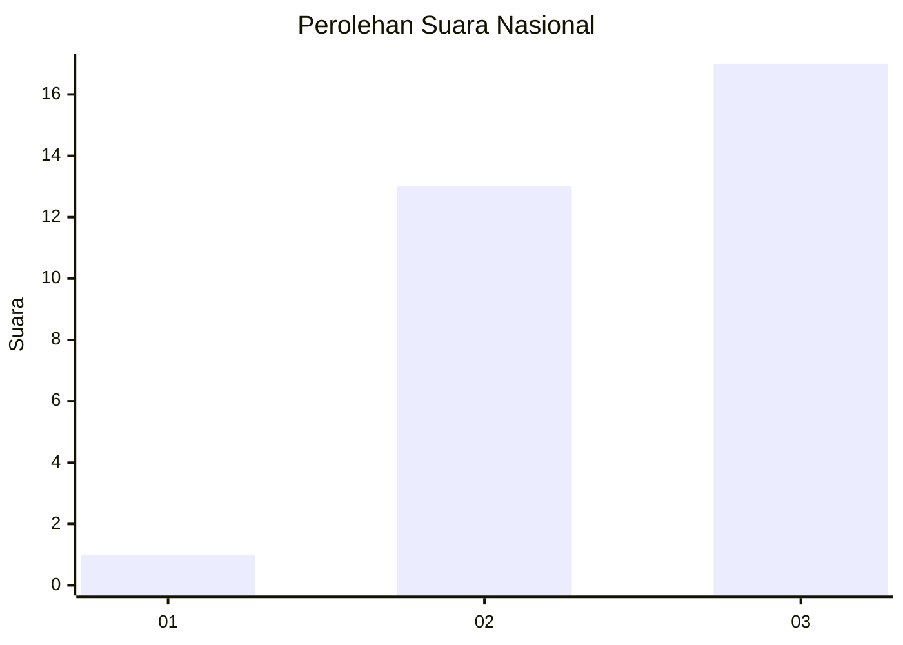
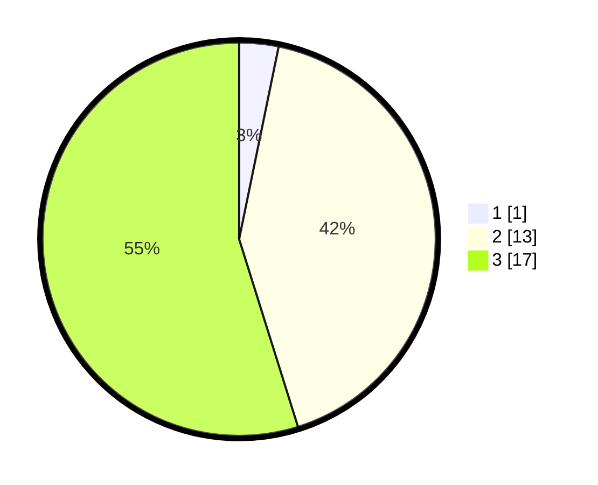

# Hasil

## Grafik

## Tabel

| No. | Nama Paslon    | Suara | Suara (raw) | Persentase |
|:--- |:-------------- | -----:| -----------:| ----------:|
| 1   | ANIES MUHAIMIN | 1     | [1][p-1]    | 3,23       |
| 2   | PRABOWO GIBRAN | 13    | [13][p-2]   | 41,94      |
| 3   | GANJAR MAHFUD  | 17    | [17][p-3]   | 54,84      |

[p-1]: https://github.com/gigit-pemilu/pemilu-2024/blob/main/pilpres/hitung-suara/sub/91-papua/sub/06-biak-numfor/sub/21-bondifuar/sub/2003-doubo/sub/001-tps/sub/paslon-1.txt
[p-2]: https://github.com/gigit-pemilu/pemilu-2024/blob/main/pilpres/hitung-suara/sub/91-papua/sub/06-biak-numfor/sub/21-bondifuar/sub/2003-doubo/sub/001-tps/sub/paslon-2.txt
[p-3]: https://github.com/gigit-pemilu/pemilu-2024/blob/main/pilpres/hitung-suara/sub/91-papua/sub/06-biak-numfor/sub/21-bondifuar/sub/2003-doubo/sub/001-tps/sub/paslon-3.txt

## Foto C Plano

https://sirekap-obj-formc.kpu.go.id/4347/pemilu/ppwp/91/06/21/20/03/9106212003001-20240214-200649--463589c9-6380-44e1-a3cf-48426b921955.jpg

https://sirekap-obj-formc.kpu.go.id/4347/pemilu/ppwp/91/06/21/20/03/9106212003001-20240214-201004--09481eb7-8b10-4b74-be4b-126765ef3b27.jpg

https://sirekap-obj-formc.kpu.go.id/4347/pemilu/ppwp/91/06/21/20/03/9106212003001-20240214-201443--7f3a8bcb-07aa-4b52-b794-8c8ff9e1c5f8.jpg

## Metadata

| Key        | Value               |
| ---------- | ------------------- |
| Time Stamp | 2024-02-25 13:00:00 |

