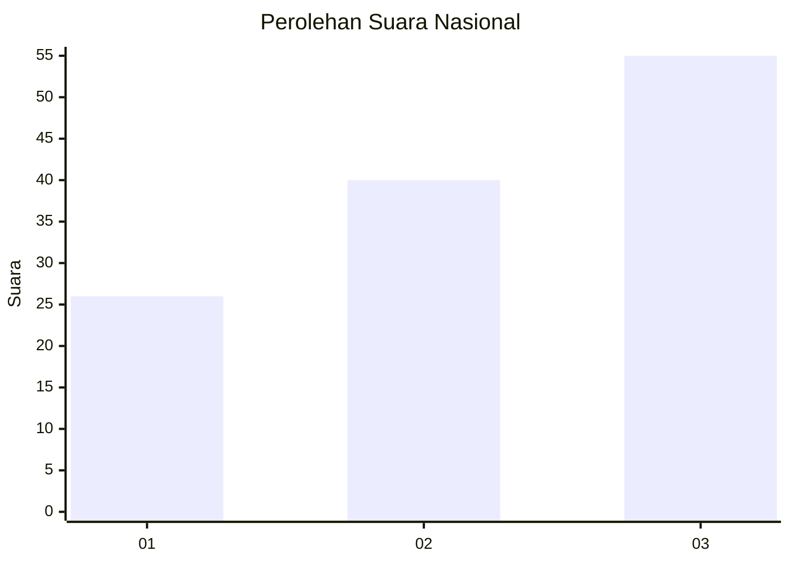
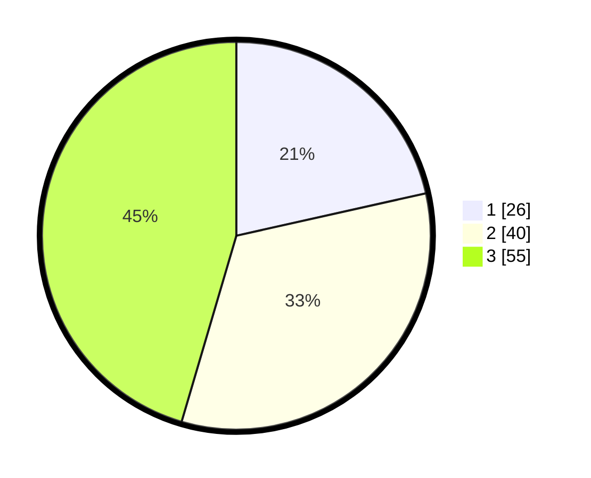

# Hasil

## Grafik

## Tabel

| No. | Nama Paslon    | Suara | Suara (raw) | Persentase |
|:--- |:-------------- | -----:| -----------:| ----------:|
| 1   | ANIES MUHAIMIN | 26    | [26][p-1]   | 21,49      |
| 2   | PRABOWO GIBRAN | 40    | [40][p-2]   | 33,06      |
| 3   | GANJAR MAHFUD  | 55    | [55][p-3]   | 45,45      |

[p-1]: https://github.com/gigit-pemilu/pemilu-2024/blob/main/pilpres/hitung-suara/sub/91-papua/sub/06-biak-numfor/sub/21-bondifuar/sub/2005-sansundi/sub/001-tps/sub/paslon-1.txt
[p-2]: https://github.com/gigit-pemilu/pemilu-2024/blob/main/pilpres/hitung-suara/sub/91-papua/sub/06-biak-numfor/sub/21-bondifuar/sub/2005-sansundi/sub/001-tps/sub/paslon-2.txt
[p-3]: https://github.com/gigit-pemilu/pemilu-2024/blob/main/pilpres/hitung-suara/sub/91-papua/sub/06-biak-numfor/sub/21-bondifuar/sub/2005-sansundi/sub/001-tps/sub/paslon-3.txt

## Foto C Plano

https://sirekap-obj-formc.kpu.go.id/8146/pemilu/ppwp/91/06/21/20/05/9106212005001-20240216-084952--37174af7-3bd5-4094-8b11-36eccb6586dc.jpg

https://sirekap-obj-formc.kpu.go.id/8146/pemilu/ppwp/91/06/21/20/05/9106212005001-20240216-091529--75a69c6f-8777-486a-8038-ff520442a524.jpg

https://sirekap-obj-formc.kpu.go.id/8146/pemilu/ppwp/91/06/21/20/05/9106212005001-20240216-093008--fa492918-68ec-47b1-aa82-802d7a4b50c6.jpg

## Metadata

| Key        | Value               |
| ---------- | ------------------- |
| Time Stamp | 2024-02-16 10:00:28 |

## DATA PEMILIH TETAP

Jumlah pemilih dalam DPT: **128**.
 * L: **67**.
 * P: **61**.

## DATA PENGGUNA HAK PILIH

Jumlah pengguna hak pilih dalam DPT: **121**.
 * L: **65**.
 * P: **56**.

Jumlah pengguna hak pilih dalam DPTb: **0**.
 * L: **0**.
 * P: **0**.

Jumlah pengguna hak pilih dalam DPK: **0**.
 * L: **0**.
 * P: **0**.

Jumlah pengguna hak pilih: **121**.
 * L: **65**.
 * P: **56**.

## JUMLAH SUARA SAH DAN TIDAK SAH

JUMLAH SELURUH SUARA SAH: **121**.

JUMLAH SUARA TIDAK SAH: **0**.

JUMLAH SELURUH SUARA SAH DAN SUARA TIDAK SAH: **121**.

