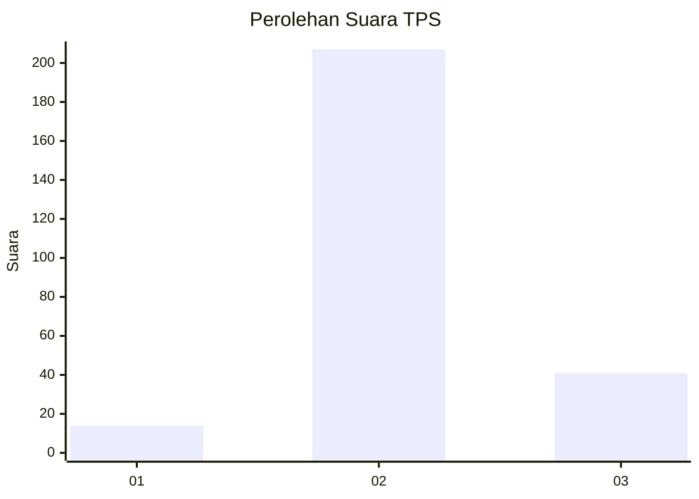
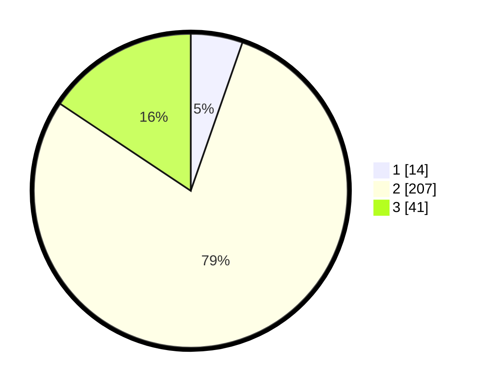

# Hasil

## Grafik

## Tabel

| No. | Nama Paslon    | Suara | Suara (raw) | Persentase |
|:--- |:-------------- | -----:| -----------:| ----------:|
| 1   | ANIES MUHAIMIN | 14    | [14][p-1]   | 5,34       |
| 2   | PRABOWO GIBRAN | 207   | [207][p-2]  | 79,01      |
| 3   | GANJAR MAHFUD  | 41    | [41][p-3]   | 15,65      |

[p-1]: https://github.com/gigit-pemilu/pemilu-2024-91-papua/blob/main/pilpres/hitung-suara/sub/91-papua/sub/10-sarmi/sub/01-sarmi/sub/1001-mararena/sub/004-tps/sub/paslon-1.txt
[p-2]: https://github.com/gigit-pemilu/pemilu-2024-91-papua/blob/main/pilpres/hitung-suara/sub/91-papua/sub/10-sarmi/sub/01-sarmi/sub/1001-mararena/sub/004-tps/sub/paslon-2.txt
[p-3]: https://github.com/gigit-pemilu/pemilu-2024-91-papua/blob/main/pilpres/hitung-suara/sub/91-papua/sub/10-sarmi/sub/01-sarmi/sub/1001-mararena/sub/004-tps/sub/paslon-3.txt

## Foto C Plano

https://sirekap-obj-formc.kpu.go.id/cb49/pemilu/ppwp/91/10/01/10/01/9110011001004-20240215-053012--b594e8f1-7822-4cd7-9a17-efab32d31ae2.jpg

https://sirekap-obj-formc.kpu.go.id/cb49/pemilu/ppwp/91/10/01/10/01/9110011001004-20240215-053152--ac3573d9-8c59-4489-9ce3-e6d87cccd880.jpg

https://sirekap-obj-formc.kpu.go.id/cb49/pemilu/ppwp/91/10/01/10/01/9110011001004-20240215-053310--07eea7f2-f129-406d-ab96-bb80dab6207c.jpg

## Metadata

| Key        | Value               |
| ---------- | ------------------- |
| Time Stamp | 2024-02-15 21:30:27 |

