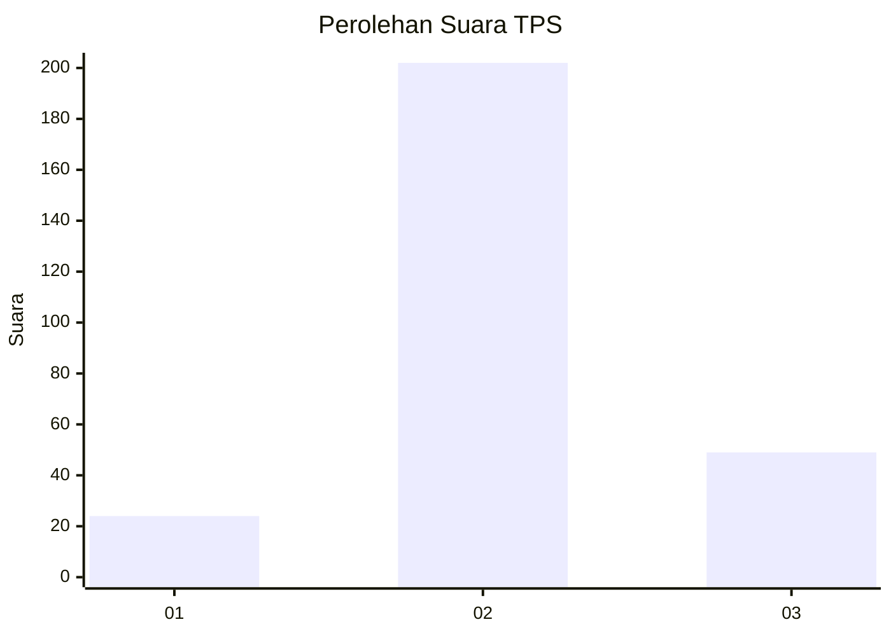

# Hasil

## Grafik

## Tabel

| No. | Nama Paslon    | Suara | Suara (raw) | Persentase |
|:--- |:-------------- | -----:| -----------:| ----------:|
| 1   | ANIES MUHAIMIN | 24    | [24][p-1]   | 8,73       |
| 2   | PRABOWO GIBRAN | 202   | [202][p-2]  | 73,45      |
| 3   | GANJAR MAHFUD  | 49    | [49][p-3]   | 17,82      |

[p-1]: https://github.com/gigit-pemilu/pemilu-2024-91-papua/blob/main/pilpres/hitung-suara/sub/91-papua/sub/10-sarmi/sub/01-sarmi/sub/1001-mararena/sub/005-tps/sub/paslon-1.txt
[p-2]: https://github.com/gigit-pemilu/pemilu-2024-91-papua/blob/main/pilpres/hitung-suara/sub/91-papua/sub/10-sarmi/sub/01-sarmi/sub/1001-mararena/sub/005-tps/sub/paslon-2.txt
[p-3]: https://github.com/gigit-pemilu/pemilu-2024-91-papua/blob/main/pilpres/hitung-suara/sub/91-papua/sub/10-sarmi/sub/01-sarmi/sub/1001-mararena/sub/005-tps/sub/paslon-3.txt

## Foto C Plano

https://sirekap-obj-formc.kpu.go.id/4ff4/pemilu/ppwp/91/10/01/10/01/9110011001005-20240215-145209--ae19398c-0a41-40ac-b280-942c7d053bf1.jpg

https://sirekap-obj-formc.kpu.go.id/4ff4/pemilu/ppwp/91/10/01/10/01/9110011001005-20240215-145434--81da2658-16b0-4282-87f5-13a5dc0981d0.jpg

https://sirekap-obj-formc.kpu.go.id/4ff4/pemilu/ppwp/91/10/01/10/01/9110011001005-20240215-145511--70973836-b25a-46ed-a382-2ae2067f72a9.jpg

## Metadata

| Key        | Value               |
| ---------- | ------------------- |
| Time Stamp | 2024-02-15 21:30:27 |

