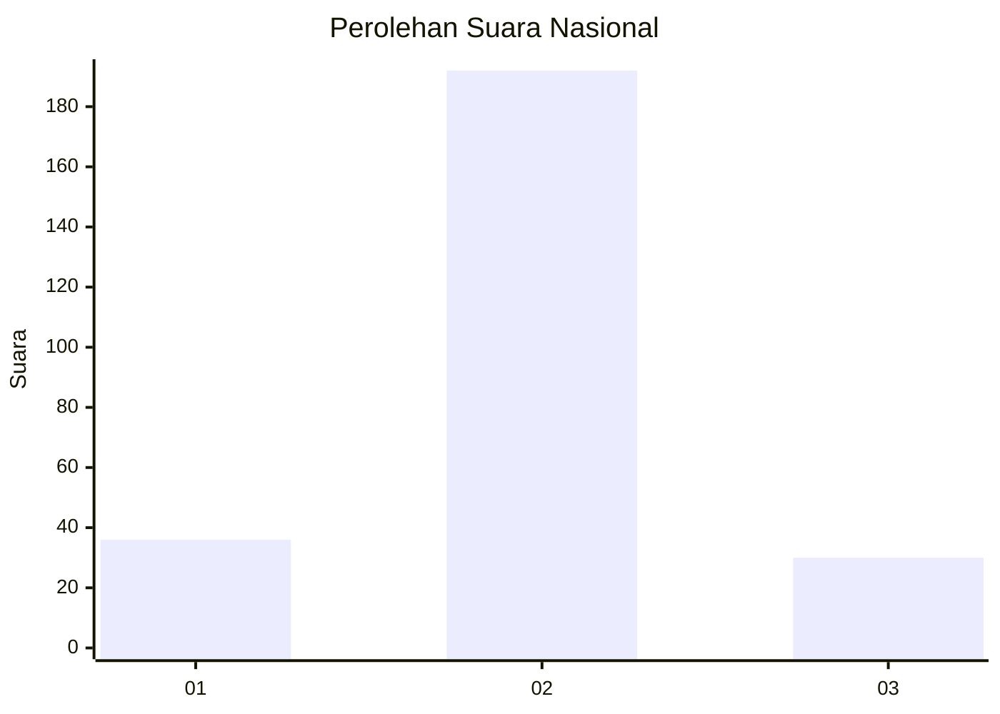
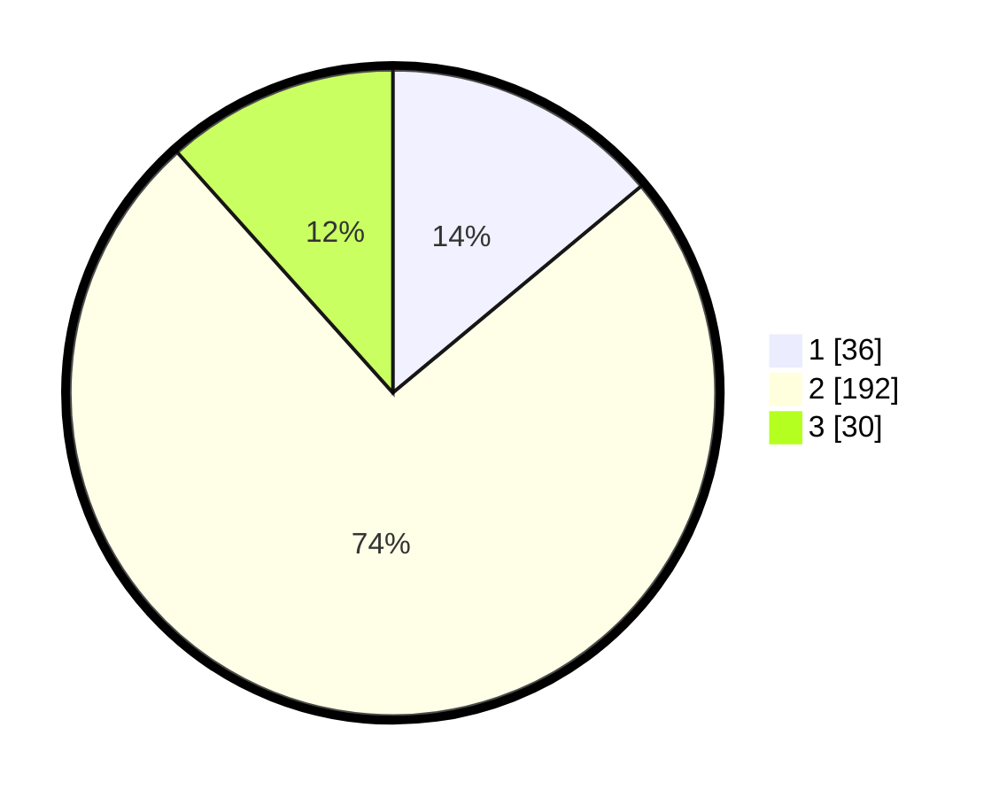

# Hasil

## Grafik

## Tabel

| No. | Nama Paslon    | Suara | Suara (raw) | Persentase |
|:--- |:-------------- | -----:| -----------:| ----------:|
| 1   | ANIES MUHAIMIN | 36    | [36][p-1]   | 13,95      |
| 2   | PRABOWO GIBRAN | 192   | [192][p-2]  | 74,42      |
| 3   | GANJAR MAHFUD  | 30    | [30][p-3]   | 11,63      |

[p-1]: https://github.com/gigit-pemilu/pemilu-2024/blob/main/pilpres/hitung-suara/sub/91-papua/sub/10-sarmi/sub/01-sarmi/sub/1002-sarmi-kota/sub/008-tps/sub/paslon-1.txt
[p-2]: https://github.com/gigit-pemilu/pemilu-2024/blob/main/pilpres/hitung-suara/sub/91-papua/sub/10-sarmi/sub/01-sarmi/sub/1002-sarmi-kota/sub/008-tps/sub/paslon-2.txt
[p-3]: https://github.com/gigit-pemilu/pemilu-2024/blob/main/pilpres/hitung-suara/sub/91-papua/sub/10-sarmi/sub/01-sarmi/sub/1002-sarmi-kota/sub/008-tps/sub/paslon-3.txt

## Foto C Plano

https://sirekap-obj-formc.kpu.go.id/aac4/pemilu/ppwp/91/10/01/10/02/9110011002008-20240215-034818--55d8622f-c3be-454b-b8b9-ed34e71b65fc.jpg

https://sirekap-obj-formc.kpu.go.id/aac4/pemilu/ppwp/91/10/01/10/02/9110011002008-20240215-034438--2bb3b955-948c-4b54-9bb2-a526cefe6c50.jpg

https://sirekap-obj-formc.kpu.go.id/aac4/pemilu/ppwp/91/10/01/10/02/9110011002008-20240215-034548--c270c359-9899-47b6-92e2-db69f92b45fc.jpg

## Metadata

| Key        | Value               |
| ---------- | ------------------- |
| Time Stamp | 2024-02-15 21:30:27 |

