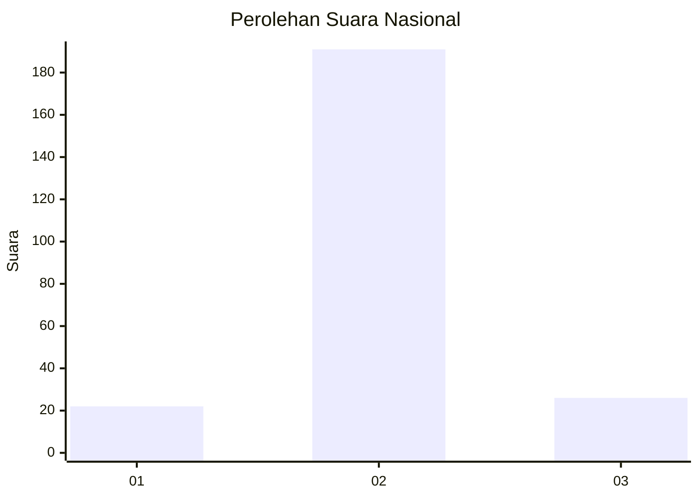
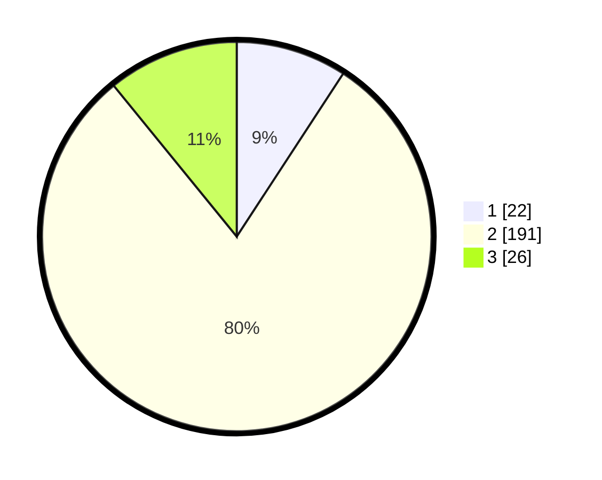

# Hasil

## Grafik

## Tabel

| No. | Nama Paslon    | Suara | Suara (raw) | Persentase |
|:--- |:-------------- | -----:| -----------:| ----------:|
| 1   | ANIES MUHAIMIN | 22    | [22][p-1]   | 9,21       |
| 2   | PRABOWO GIBRAN | 191   | [191][p-2]  | 79,92      |
| 3   | GANJAR MAHFUD  | 26    | [26][p-3]   | 10,88      |

[p-1]: https://github.com/gigit-pemilu/pemilu-2024/blob/main/pilpres/hitung-suara/sub/91-papua/sub/10-sarmi/sub/01-sarmi/sub/1002-sarmi-kota/sub/009-tps/sub/paslon-1.txt
[p-2]: https://github.com/gigit-pemilu/pemilu-2024/blob/main/pilpres/hitung-suara/sub/91-papua/sub/10-sarmi/sub/01-sarmi/sub/1002-sarmi-kota/sub/009-tps/sub/paslon-2.txt
[p-3]: https://github.com/gigit-pemilu/pemilu-2024/blob/main/pilpres/hitung-suara/sub/91-papua/sub/10-sarmi/sub/01-sarmi/sub/1002-sarmi-kota/sub/009-tps/sub/paslon-3.txt

## Foto C Plano

https://sirekap-obj-formc.kpu.go.id/a3df/pemilu/ppwp/91/10/01/10/02/9110011002009-20240214-191032--283da083-7fe9-459a-aa40-42e9f1d7e089.jpg

https://sirekap-obj-formc.kpu.go.id/a3df/pemilu/ppwp/91/10/01/10/02/9110011002009-20240214-191358--4bb055be-6915-4fd9-bcfc-10043ba676a1.jpg

https://sirekap-obj-formc.kpu.go.id/a3df/pemilu/ppwp/91/10/01/10/02/9110011002009-20240214-192138--cab6fcce-6382-4a01-bfe4-8be67c422264.jpg

## Metadata

| Key        | Value               |
| ---------- | ------------------- |
| Time Stamp | 2024-02-15 22:00:27 |

