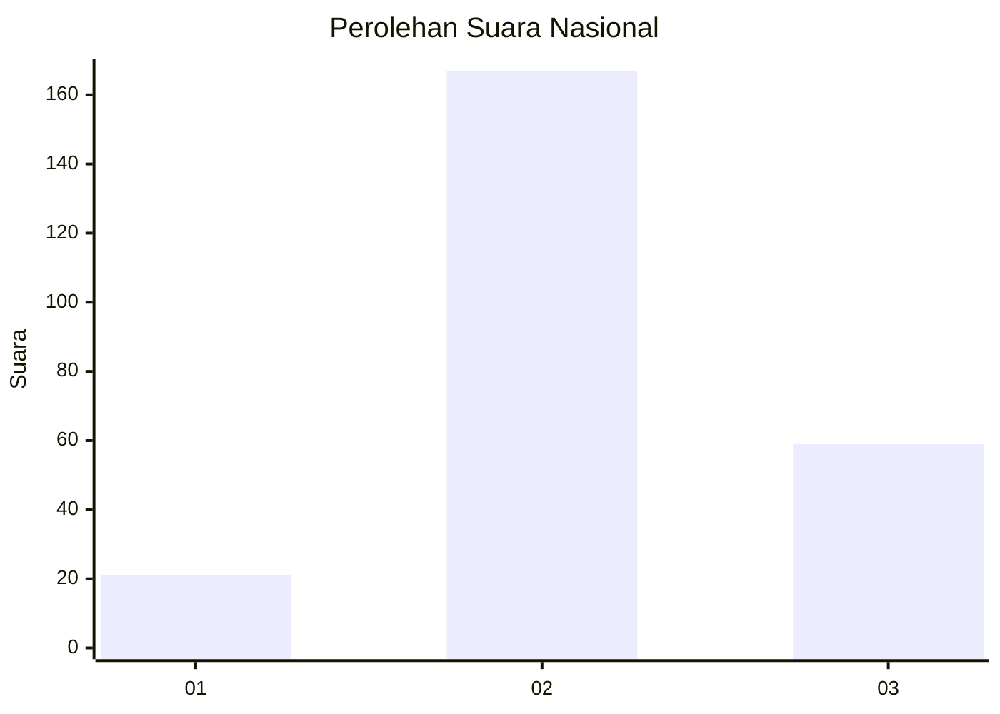
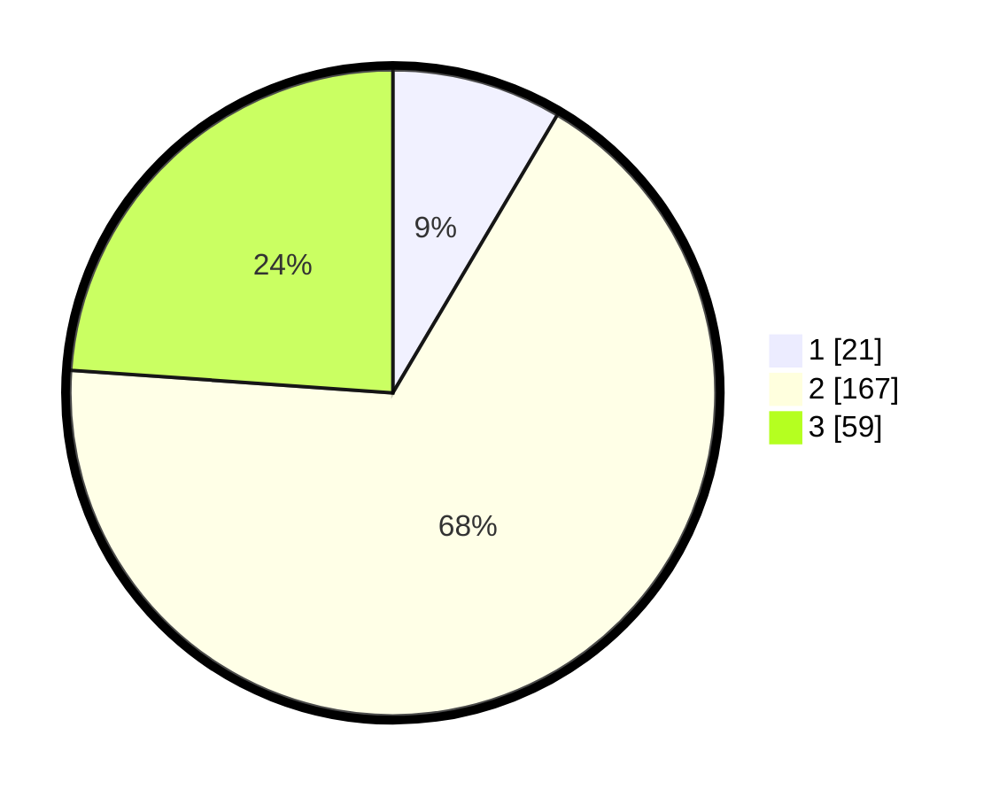

# Hasil

## Grafik

## Tabel

| No. | Nama Paslon    | Suara | Suara (raw) | Persentase |
|:--- |:-------------- | -----:| -----------:| ----------:|
| 1   | ANIES MUHAIMIN | 21    | [21][p-1]   | 8,50       |
| 2   | PRABOWO GIBRAN | 167   | [167][p-2]  | 67,61      |
| 3   | GANJAR MAHFUD  | 59    | [59][p-3]   | 23,89      |

[p-1]: https://github.com/gigit-pemilu/pemilu-2024/blob/main/pilpres/hitung-suara/sub/91-papua/sub/10-sarmi/sub/01-sarmi/sub/1002-sarmi-kota/sub/010-tps/sub/paslon-1.txt
[p-2]: https://github.com/gigit-pemilu/pemilu-2024/blob/main/pilpres/hitung-suara/sub/91-papua/sub/10-sarmi/sub/01-sarmi/sub/1002-sarmi-kota/sub/010-tps/sub/paslon-2.txt
[p-3]: https://github.com/gigit-pemilu/pemilu-2024/blob/main/pilpres/hitung-suara/sub/91-papua/sub/10-sarmi/sub/01-sarmi/sub/1002-sarmi-kota/sub/010-tps/sub/paslon-3.txt

## Foto C Plano

https://sirekap-obj-formc.kpu.go.id/ba70/pemilu/ppwp/91/10/01/10/02/9110011002010-20240214-194443--4e9c9fed-251d-4fc2-8325-e8b4569c5fe8.jpg

https://sirekap-obj-formc.kpu.go.id/ba70/pemilu/ppwp/91/10/01/10/02/9110011002010-20240214-194703--869667a1-e48e-403b-9164-bb6f9a16baa9.jpg

## Metadata

| Key        | Value               |
| ---------- | ------------------- |
| Time Stamp | 2024-02-15 21:30:27 |

