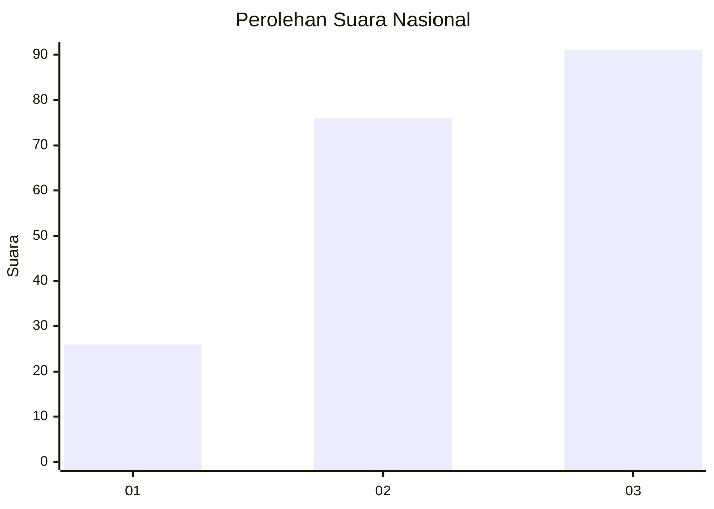
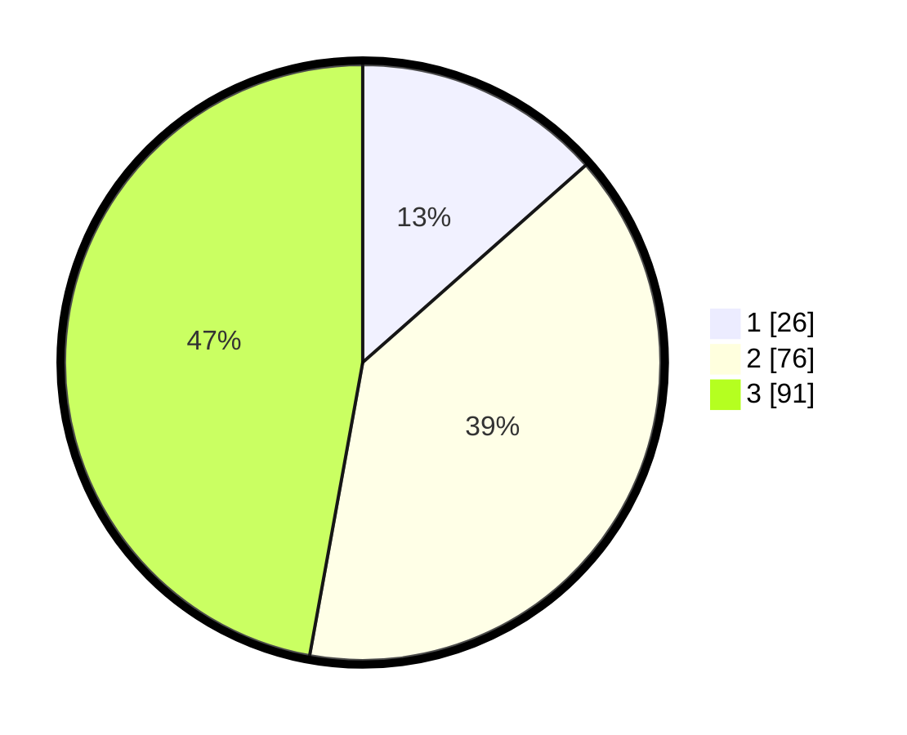

# Hasil

## Grafik

## Tabel

| No. | Nama Paslon    | Suara | Suara (raw) | Persentase |
|:--- |:-------------- | -----:| -----------:| ----------:|
| 1   | ANIES MUHAIMIN | 26    | [26][p-1]   | 13,47      |
| 2   | PRABOWO GIBRAN | 76    | [76][p-2]   | 39,38      |
| 3   | GANJAR MAHFUD  | 91    | [91][p-3]   | 47,15      |

[p-1]: https://github.com/gigit-pemilu/pemilu-2024/blob/main/pilpres/hitung-suara/sub/91-papua/sub/10-sarmi/sub/04-pantai-timur/sub/2002-betaf/sub/001-tps/sub/paslon-1.txt
[p-2]: https://github.com/gigit-pemilu/pemilu-2024/blob/main/pilpres/hitung-suara/sub/91-papua/sub/10-sarmi/sub/04-pantai-timur/sub/2002-betaf/sub/001-tps/sub/paslon-2.txt
[p-3]: https://github.com/gigit-pemilu/pemilu-2024/blob/main/pilpres/hitung-suara/sub/91-papua/sub/10-sarmi/sub/04-pantai-timur/sub/2002-betaf/sub/001-tps/sub/paslon-3.txt

## Foto C Plano

https://sirekap-obj-formc.kpu.go.id/6425/pemilu/ppwp/91/10/04/20/02/9110042002001-20240215-115908--081b39d0-853d-4014-aeac-69a18a4baece.jpg

https://sirekap-obj-formc.kpu.go.id/6425/pemilu/ppwp/91/10/04/20/02/9110042002001-20240217-113619--fb343460-1eff-4b8a-a731-b0abd45baa35.jpg

https://sirekap-obj-formc.kpu.go.id/6425/pemilu/ppwp/91/10/04/20/02/9110042002001-20240215-112219--2483bc28-cd9e-4fce-b21f-1ae06443117f.jpg

## Metadata

| Key        | Value               |
| ---------- | ------------------- |
| Time Stamp | 2024-02-21 12:00:00 |

## DATA PEMILIH TETAP

Jumlah pemilih dalam DPT: **288**.
 * L: **149**.
 * P: **139**.

## DATA PENGGUNA HAK PILIH

Jumlah pengguna hak pilih dalam DPT: **185**.
 * L: **98**.
 * P: **87**.

Jumlah pengguna hak pilih dalam DPTb: **0**.
 * L: **0**.
 * P: **0**.

Jumlah pengguna hak pilih dalam DPK: **13**.
 * L: **7**.
 * P: **6**.

Jumlah pengguna hak pilih: **198**.
 * L: **105**.
 * P: **93**.

## JUMLAH SUARA SAH DAN TIDAK SAH

JUMLAH SELURUH SUARA SAH: **193**.

JUMLAH SUARA TIDAK SAH: **5**.

JUMLAH SELURUH SUARA SAH DAN SUARA TIDAK SAH: **198**.

