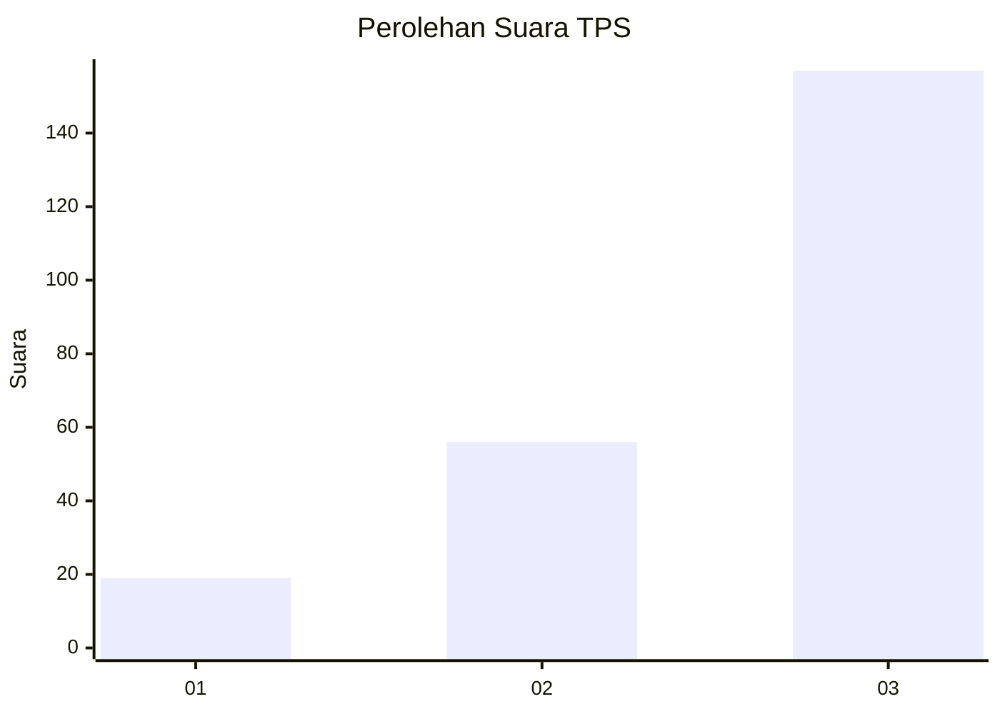
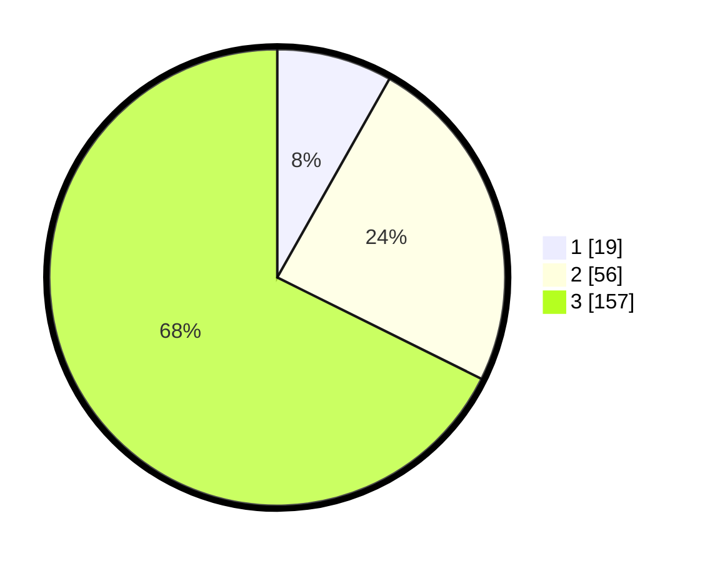

# Hasil

## Grafik

## Tabel

| No. | Nama Paslon    | Suara | Suara (raw) | Persentase |
|:--- |:-------------- | -----:| -----------:| ----------:|
| 1   | ANIES MUHAIMIN | 19    | [19][p-1]   | 8,19       |
| 2   | PRABOWO GIBRAN | 56    | [56][p-2]   | 24,14      |
| 3   | GANJAR MAHFUD  | 157   | [157][p-3]  | 67,67      |

[p-1]: https://github.com/gigit-pemilu/pemilu-2024-91-papua/blob/main/pilpres/hitung-suara/sub/91-papua/sub/10-sarmi/sub/04-pantai-timur/sub/2003-yamben/sub/002-tps/sub/paslon-1.txt
[p-2]: https://github.com/gigit-pemilu/pemilu-2024-91-papua/blob/main/pilpres/hitung-suara/sub/91-papua/sub/10-sarmi/sub/04-pantai-timur/sub/2003-yamben/sub/002-tps/sub/paslon-2.txt
[p-3]: https://github.com/gigit-pemilu/pemilu-2024-91-papua/blob/main/pilpres/hitung-suara/sub/91-papua/sub/10-sarmi/sub/04-pantai-timur/sub/2003-yamben/sub/002-tps/sub/paslon-3.txt

## Foto C Plano

https://sirekap-obj-formc.kpu.go.id/8dda/pemilu/ppwp/91/10/04/20/03/9110042003002-20240216-150636--4859e2e7-51b1-4492-8ee9-30fb791953f0.jpg

https://sirekap-obj-formc.kpu.go.id/8dda/pemilu/ppwp/91/10/04/20/03/9110042003002-20240216-153225--5cf48f84-0418-44ef-8fe8-0d7675cc29cf.jpg

https://sirekap-obj-formc.kpu.go.id/8dda/pemilu/ppwp/91/10/04/20/03/9110042003002-20240216-160021--bc7909a8-2158-4ac0-80a8-b5216c784737.jpg

## Metadata

| Key        | Value               |
| ---------- | ------------------- |
| Time Stamp | 2024-02-17 03:00:02 |

## DATA PEMILIH TETAP

Jumlah pemilih dalam DPT: **260**.
 * L: **157**.
 * P: **103**.

## DATA PENGGUNA HAK PILIH

Jumlah pengguna hak pilih dalam DPT: **0**.
 * L: **0**.
 * P: **0**.

Jumlah pengguna hak pilih dalam DPTb: **0**.
 * L: **0**.
 * P: **0**.

Jumlah pengguna hak pilih dalam DPK: **0**.
 * L: **0**.
 * P: **0**.

Jumlah pengguna hak pilih: **0**.
 * L: **0**.
 * P: **0**.

## JUMLAH SUARA SAH DAN TIDAK SAH

JUMLAH SELURUH SUARA SAH: **247**.

JUMLAH SUARA TIDAK SAH: **19**.

JUMLAH SELURUH SUARA SAH DAN SUARA TIDAK SAH: **266**.

