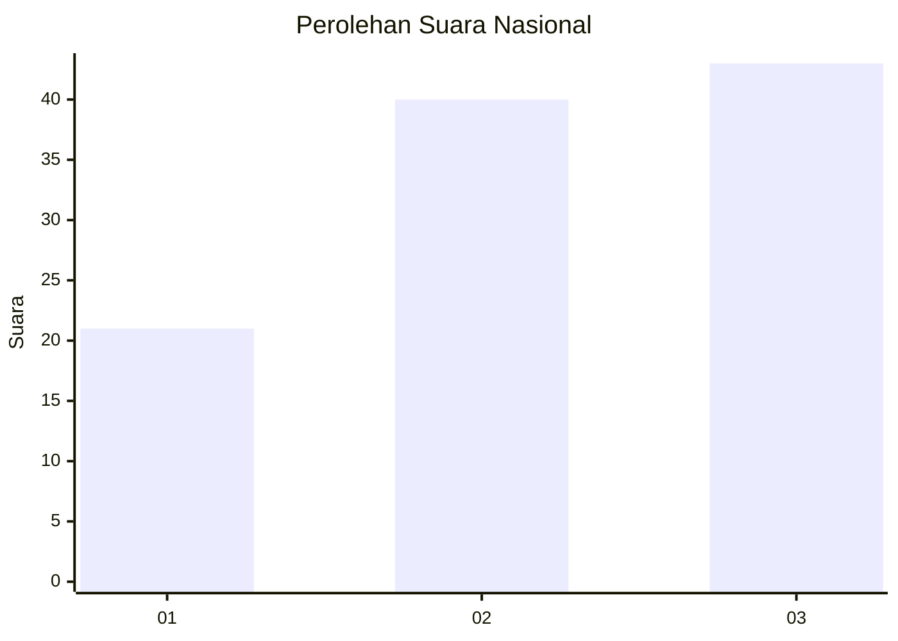
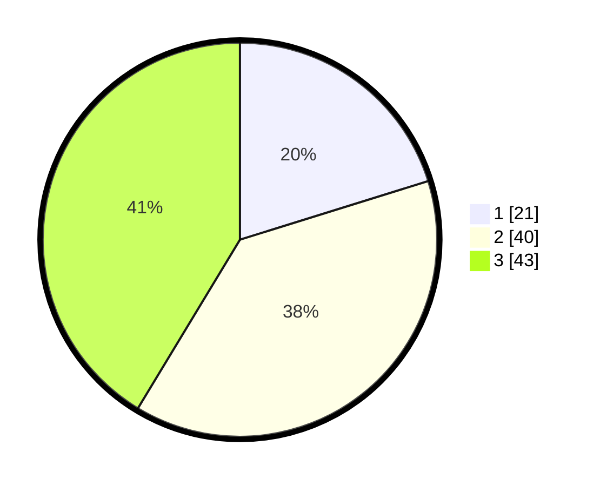

# Hasil

## Grafik

## Tabel

| No. | Nama Paslon    | Suara | Suara (raw) | Persentase |
|:--- |:-------------- | -----:| -----------:| ----------:|
| 1   | ANIES MUHAIMIN | 21    | [21][p-1]   | 20,19      |
| 2   | PRABOWO GIBRAN | 40    | [40][p-2]   | 38,46      |
| 3   | GANJAR MAHFUD  | 43    | [43][p-3]   | 41,35      |

[p-1]: https://github.com/gigit-pemilu/pemilu-2024/blob/main/pilpres/hitung-suara/sub/91-papua/sub/10-sarmi/sub/04-pantai-timur/sub/2011-komra/sub/001-tps/sub/paslon-1.txt
[p-2]: https://github.com/gigit-pemilu/pemilu-2024/blob/main/pilpres/hitung-suara/sub/91-papua/sub/10-sarmi/sub/04-pantai-timur/sub/2011-komra/sub/001-tps/sub/paslon-2.txt
[p-3]: https://github.com/gigit-pemilu/pemilu-2024/blob/main/pilpres/hitung-suara/sub/91-papua/sub/10-sarmi/sub/04-pantai-timur/sub/2011-komra/sub/001-tps/sub/paslon-3.txt

## Foto C Plano

https://sirekap-obj-formc.kpu.go.id/0dbb/pemilu/ppwp/91/10/04/20/11/9110042011001-20240216-131714--cc3d9b18-ff80-45af-98de-5a6fc6c9caa7.jpg

https://sirekap-obj-formc.kpu.go.id/0dbb/pemilu/ppwp/91/10/04/20/11/9110042011001-20240216-154951--fb5f4a39-f867-49d8-9082-68075baa95dc.jpg

https://sirekap-obj-formc.kpu.go.id/0dbb/pemilu/ppwp/91/10/04/20/11/9110042011001-20240216-131918--f26d4ef8-b61b-4740-b642-a500d00aa068.jpg

## Metadata

| Key        | Value               |
| ---------- | ------------------- |
| Time Stamp | 2024-02-16 16:25:10 |

## DATA PEMILIH TETAP

Jumlah pemilih dalam DPT: **242**.
 * L: **137**.
 * P: **105**.

## DATA PENGGUNA HAK PILIH

Jumlah pengguna hak pilih dalam DPT: **130**.
 * L: **69**.
 * P: **61**.

Jumlah pengguna hak pilih dalam DPTb: **11**.
 * L: **7**.
 * P: **4**.

Jumlah pengguna hak pilih dalam DPK: **6**.
 * L: **3**.
 * P: **3**.

Jumlah pengguna hak pilih: **147**.
 * L: **79**.
 * P: **68**.

## JUMLAH SUARA SAH DAN TIDAK SAH

JUMLAH SELURUH SUARA SAH: **144**.

JUMLAH SUARA TIDAK SAH: **3**.

JUMLAH SELURUH SUARA SAH DAN SUARA TIDAK SAH: **147**.

