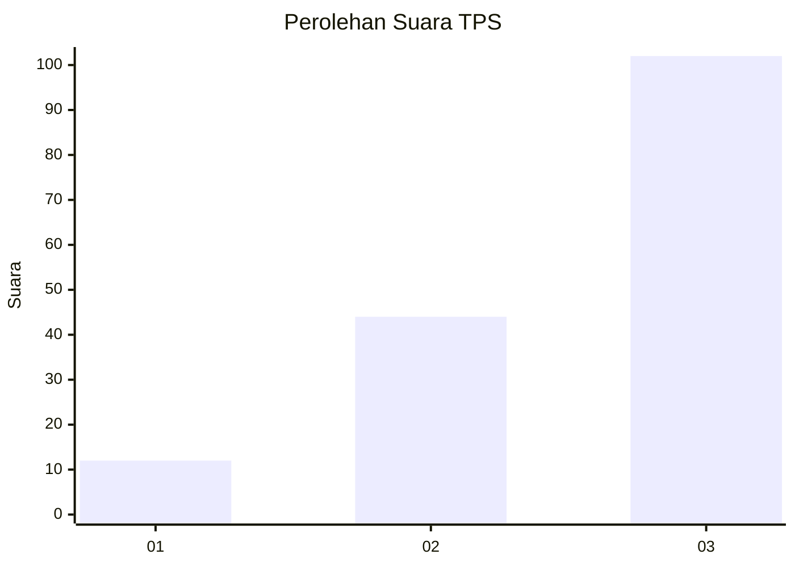
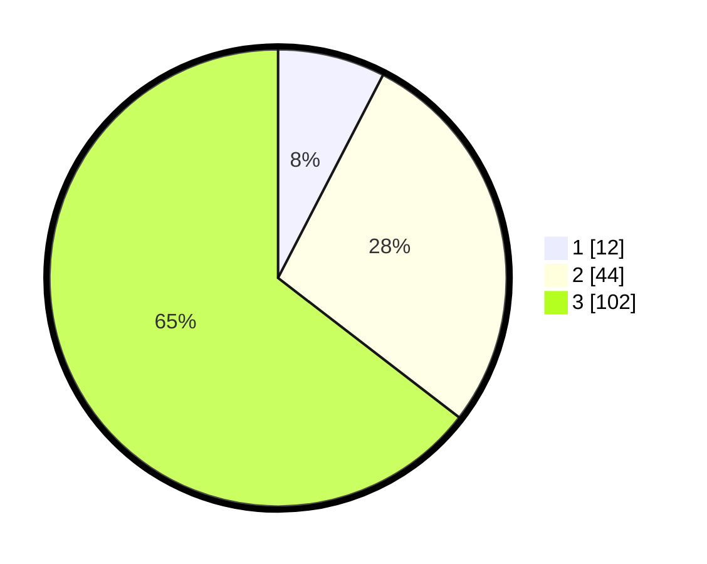

# Hasil

## Grafik

## Tabel

| No. | Nama Paslon    | Suara | Suara (raw) | Persentase |
|:--- |:-------------- | -----:| -----------:| ----------:|
| 1   | ANIES MUHAIMIN | 12    | [12][p-1]   | 7,59       |
| 2   | PRABOWO GIBRAN | 44    | [44][p-2]   | 27,85      |
| 3   | GANJAR MAHFUD  | 102   | [102][p-3]  | 64,56      |

[p-1]: https://github.com/gigit-pemilu/pemilu-2024-91-papua/blob/main/pilpres/hitung-suara/sub/91-papua/sub/10-sarmi/sub/05-bonggo/sub/2006-anus/sub/001-tps/sub/paslon-1.txt
[p-2]: https://github.com/gigit-pemilu/pemilu-2024-91-papua/blob/main/pilpres/hitung-suara/sub/91-papua/sub/10-sarmi/sub/05-bonggo/sub/2006-anus/sub/001-tps/sub/paslon-2.txt
[p-3]: https://github.com/gigit-pemilu/pemilu-2024-91-papua/blob/main/pilpres/hitung-suara/sub/91-papua/sub/10-sarmi/sub/05-bonggo/sub/2006-anus/sub/001-tps/sub/paslon-3.txt

## Foto C Plano

https://sirekap-obj-formc.kpu.go.id/2f8d/pemilu/ppwp/91/10/05/20/06/9110052006001-20240217-101105--8bc7db87-ccbc-4a49-a14b-08604ddfd798.jpg

https://sirekap-obj-formc.kpu.go.id/2f8d/pemilu/ppwp/91/10/05/20/06/9110052006001-20240217-102147--4b35a234-62b9-4d41-ac94-f050dff2bb32.jpg

https://sirekap-obj-formc.kpu.go.id/2f8d/pemilu/ppwp/91/10/05/20/06/9110052006001-20240217-102304--e5d2685c-3b4d-463e-a318-83edd6151449.jpg

## Metadata

| Key        | Value               |
| ---------- | ------------------- |
| Time Stamp | 2024-02-17 10:30:03 |

## DATA PEMILIH TETAP

Jumlah pemilih dalam DPT: **171**.
 * L: **99**.
 * P: **72**.

## DATA PENGGUNA HAK PILIH

Jumlah pengguna hak pilih dalam DPT: **129**.
 * L: **74**.
 * P: **55**.

Jumlah pengguna hak pilih dalam DPTb: **27**.
 * L: **15**.
 * P: **12**.

Jumlah pengguna hak pilih dalam DPK: **3**.
 * L: **1**.
 * P: **2**.

Jumlah pengguna hak pilih: **159**.
 * L: **90**.
 * P: **69**.

## JUMLAH SUARA SAH DAN TIDAK SAH

JUMLAH SELURUH SUARA SAH: **158**.

JUMLAH SUARA TIDAK SAH: **1**.

JUMLAH SELURUH SUARA SAH DAN SUARA TIDAK SAH: **159**.

