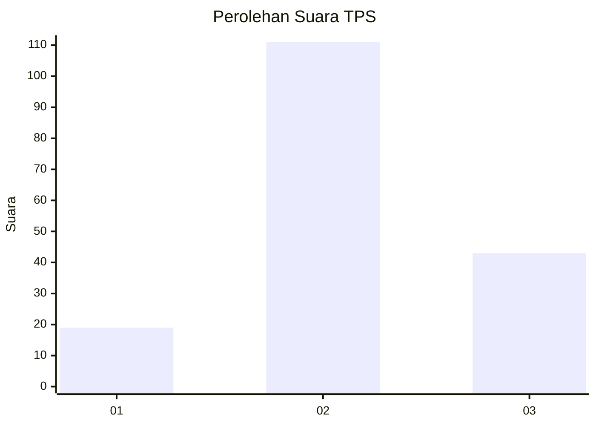
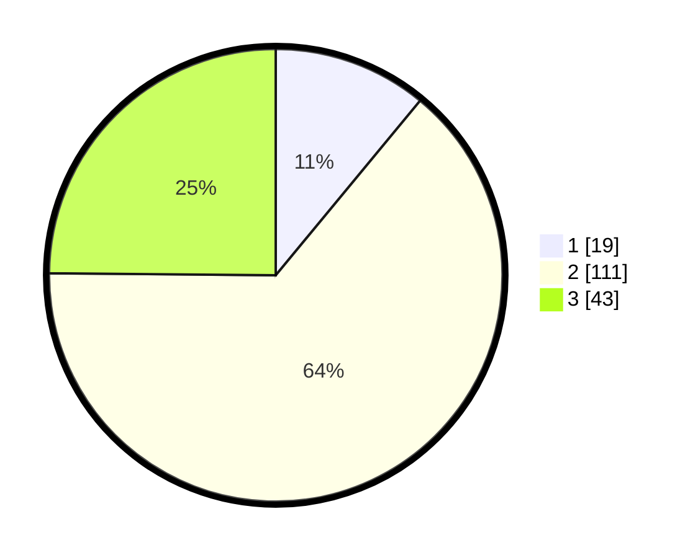

# Hasil

## Grafik

## Tabel

| No. | Nama Paslon    | Suara | Suara (raw) | Persentase |
|:--- |:-------------- | -----:| -----------:| ----------:|
| 1   | ANIES MUHAIMIN | 19    | [19][p-1]   | 10,98      |
| 2   | PRABOWO GIBRAN | 111   | [111][p-2]  | 64,16      |
| 3   | GANJAR MAHFUD  | 43    | [43][p-3]   | 24,86      |

[p-1]: https://github.com/gigit-pemilu/pemilu-2024-91-papua/blob/main/pilpres/hitung-suara/sub/91-papua/sub/10-sarmi/sub/05-bonggo/sub/2007-kiren/sub/002-tps/sub/paslon-1.txt
[p-2]: https://github.com/gigit-pemilu/pemilu-2024-91-papua/blob/main/pilpres/hitung-suara/sub/91-papua/sub/10-sarmi/sub/05-bonggo/sub/2007-kiren/sub/002-tps/sub/paslon-2.txt
[p-3]: https://github.com/gigit-pemilu/pemilu-2024-91-papua/blob/main/pilpres/hitung-suara/sub/91-papua/sub/10-sarmi/sub/05-bonggo/sub/2007-kiren/sub/002-tps/sub/paslon-3.txt

## Foto C Plano

https://sirekap-obj-formc.kpu.go.id/fca7/pemilu/ppwp/91/10/05/20/07/9110052007002-20240214-155730--7adacd9d-7261-4b13-938e-ed066707a57e.jpg

https://sirekap-obj-formc.kpu.go.id/fca7/pemilu/ppwp/91/10/05/20/07/9110052007002-20240214-155402--f5e70b64-3f1c-4d98-8446-74446f229694.jpg

## Metadata

| Key        | Value               |
| ---------- | ------------------- |
| Time Stamp | 2024-02-25 13:00:00 |

