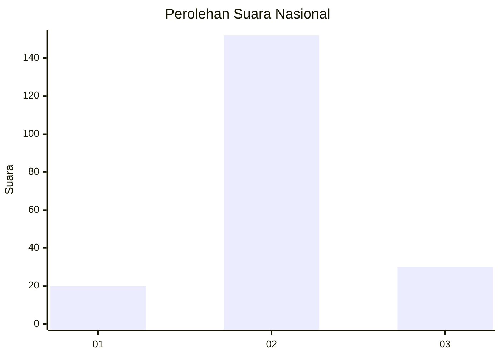

# Hasil

## Grafik

## Tabel

| No. | Nama Paslon    | Suara | Suara (raw) | Persentase |
|:--- |:-------------- | -----:| -----------:| ----------:|
| 1   | ANIES MUHAIMIN | 20    | [20][p-1]   | 9,90       |
| 2   | PRABOWO GIBRAN | 152   | [152][p-2]  | 75,25      |
| 3   | GANJAR MAHFUD  | 30    | [30][p-3]   | 14,85      |

[p-1]: https://github.com/gigit-pemilu/pemilu-2024/blob/main/pilpres/hitung-suara/sub/91-papua/sub/10-sarmi/sub/05-bonggo/sub/2007-kiren/sub/003-tps/sub/paslon-1.txt
[p-2]: https://github.com/gigit-pemilu/pemilu-2024/blob/main/pilpres/hitung-suara/sub/91-papua/sub/10-sarmi/sub/05-bonggo/sub/2007-kiren/sub/003-tps/sub/paslon-2.txt
[p-3]: https://github.com/gigit-pemilu/pemilu-2024/blob/main/pilpres/hitung-suara/sub/91-papua/sub/10-sarmi/sub/05-bonggo/sub/2007-kiren/sub/003-tps/sub/paslon-3.txt

## Foto C Plano

https://sirekap-obj-formc.kpu.go.id/e85d/pemilu/ppwp/91/10/05/20/07/9110052007003-20240215-064312--ff3b1ac1-b1b2-4001-a4e5-97089506dccd.jpg

https://sirekap-obj-formc.kpu.go.id/e85d/pemilu/ppwp/91/10/05/20/07/9110052007003-20240215-063956--3ee1e50b-537b-4df8-ae29-eb52aeb12258.jpg

https://sirekap-obj-formc.kpu.go.id/e85d/pemilu/ppwp/91/10/05/20/07/9110052007003-20240215-063626--2a2525d1-74f0-4b8f-a7ca-ba4783f99119.jpg

## Metadata

| Key        | Value               |
| ---------- | ------------------- |
| Time Stamp | 2024-02-15 21:30:27 |

